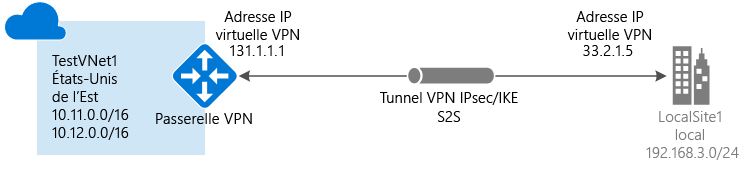

# Créer un réseau virtuel avec une connexion de site à site à l’aide du portail Classic

[!INCLUDE [deployment models](../../includes/vpn-gateway-classic-deployment-model-include.md)]

Cet article vous explique comment utiliser le portail Classic pour créer une connexion de passerelle VPN de site à site à partir de votre réseau local vers le réseau virtuel. Les étapes mentionnées dans cet article s’appliquent au modèle de déploiement classique. Vous pouvez également créer cette configuration à l’aide d’un autre outil ou modèle de déploiement en sélectionnant une option différente dans la liste suivante :

> [!div class="op_single_selector"]
> * [Portail Azure](vpn-gateway-howto-site-to-site-resource-manager-portal.md)
> * [PowerShell](vpn-gateway-create-site-to-site-rm-powershell.md)
> * [INTERFACE DE LIGNE DE COMMANDE](vpn-gateway-howto-site-to-site-resource-manager-cli.md)
> * [Portail Azure (classique)](vpn-gateway-howto-site-to-site-classic-portal.md)
> * [Portail Classic (classique)](vpn-gateway-site-to-site-create.md)
> 
>

Une connexion de passerelle VPN de site à site permet de connecter votre réseau local à un réseau virtuel Azure via un tunnel VPN IPsec/IKE (IKEv1 ou IKEv2). Ce type de connexion requiert un périphérique VPN local disposant d’une adresse IP publique exposée en externe. Pour plus d’informations sur les passerelles VPN, consultez l’article [À propos de la passerelle VPN](vpn-gateway-about-vpngateways.md).

#### Configurations supplémentaires

Si vous souhaitez connecter des réseaux virtuels, consultez [Configurer une connexion de réseau virtuel à réseau virtuel pour le modèle de déploiement classique](virtual-networks-configure-vnet-to-vnet-connection.md). Si vous souhaitez ajouter une connexion de site à site à un réseau virtuel qui possède déjà une connexion, consultez [Connecter plusieurs sites locaux à un réseau virtuel](vpn-gateway-multi-site.md).
## Avant de commencer

[!INCLUDE [deployment models](../../includes/vpn-gateway-deployment-models-include.md)]

Vérifiez que vous disposez des éléments suivants avant de commencer la configuration :

* Un périphérique VPN compatible et une personne qui est en mesure de le configurer. Consultez [À propos des périphériques VPN](vpn-gateway-about-vpn-devices.md). Si vous ne maîtrisez pas la configuration de votre appareil VPN ou les plages d’adresses IP mentionnées dans la configuration de votre réseau local, vous devez contacter une personne qui peut vous fournir ces informations.
* Une adresse IP publique exposée en externe pour votre appareil VPN. Cette adresse IP ne peut pas se trouver derrière un NAT.
* Un abonnement Azure. Si vous ne disposez pas déjà d’un abonnement Azure, vous pouvez activer vos [avantages abonnés MSDN](https://azure.microsoft.com/pricing/member-offers/msdn-benefits-details) ou créer un [compte gratuit](https://azure.microsoft.com/pricing/free-trial).

## Créer votre réseau virtuel
1. Connectez-vous au [portail Azure Classic](https://manage.windowsazure.com/).
2. Dans le coin inférieur gauche de l’écran, cliquez sur **Nouveau**. Dans le volet de navigation, cliquez sur **Services réseau**, puis sur **Réseau virtuel**. Cliquez sur **Custom Create** pour démarrer l’Assistant Configuration.
3. Pour créer votre réseau virtuel, entrez vos paramètres de configuration dans les pages suivantes :

## Page de détails du réseau virtuel
Entrez les informations suivantes :

* **Nom**: nommez votre réseau virtuel. Par exemple, *NordFranceVNet*. Sachant que vous utiliserez ce nom de réseau virtuel au moment de déployer vos machines virtuelles et vos instances PaaS, vous préféreriez probablement avoir un nom qui n’est pas trop compliqué.
* **Emplacement**: l’emplacement est directement associé à l’emplacement physique (région) où vous souhaitez que vos ressources (machines virtuelles) résident. Par exemple, si les machines virtuelles que vous déployez dans ce réseau virtuel doivent être situées physiquement dans le *nord de la France*, sélectionnez cet emplacement. Après avoir créé votre réseau virtuel, vous ne pourrez plus modifier la région qui lui est associée.

## Page des serveurs DNS et connectivité VPN
Saisissez les informations ci-dessous, puis cliquez sur la flèche Suivant située en bas à droite.

* **Serveurs DNS**: entrez le nom et l’adresse IP du serveur DNS, ou sélectionnez un serveur DNS précédemment inscrit dans le menu contextuel. Ce paramètre n’entraîne pas la création de serveur DNS. Il vous permet de spécifier le serveur DNS que vous souhaitez utiliser pour la résolution de noms pour ce réseau virtuel.
* **Configurer une connexion VPN de site à site** : cochez la case **Configuration d’un VPN de site à site**.
* **Réseau local**: un réseau local représente votre emplacement physique local. Vous pouvez sélectionner un réseau local que vous avez précédemment créé, ou vous pouvez créer un nouveau réseau local. Toutefois, si vous choisissez d’utiliser un réseau local que vous avez précédemment créé, accédez à la page de configuration **Réseaux locaux** et vérifiez que l’adresse IP (adresse IPv4 publique) de l’appareil VPN est exacte.

## Page de connectivité de site à site
Si vous créez un nouveau réseau local, la page **Connectivité site à site** s’affiche. Si vous souhaitez utiliser un réseau local que vous avez précédemment créé, cette page n’apparaîtra pas dans l’Assistant ; vous pouvez alors passer à la section suivante.

Entrez les informations ci-dessous, puis cliquez sur la flèche Suivant.

* **Nom**: nom que vous souhaitez donner à votre site de réseau local.
* **Adresse IP du périphérique VPN**: adresse IPv4 publique de votre appareil VPN local que vous utilisez pour vous connecter à Azure. Le périphérique VPN ne peut pas se trouver derrière un traducteur d’adresses réseau.
* **Espace d’adressage**: comprend l’adresse IP de départ et le CIDR (nombre d’adresses). Spécifiez la ou les plages d’adresses que vous voulez envoyer via la passerelle de réseau virtuel à l’emplacement de votre site local. Si une adresse IP de destination se situe dans les plages que vous spécifiez ici, elle est routée via la passerelle de réseau virtuel.
* **Ajouter un espace d’adressage**: si vous souhaitez envoyer plusieurs plages d’adresses via la passerelle de réseau virtuel, spécifiez chacune d’elles. Vous pouvez ajouter ou supprimer des plages par la suite sur la page **Réseau local** .

## Page d’espaces d’adressage du réseau virtuel
Indiquez la plage d’adresses que vous voulez utiliser pour votre réseau virtuel. Il s’agit des adresses IP dynamiques qui seront affectées aux machines virtuelles et aux autres instances de rôle que vous déployez dans ce réseau virtuel.

Il est particulièrement important de sélectionner une plage qui ne chevauche aucune des plages utilisées pour votre réseau local. Vous devez contacter votre administrateur réseau. Pour ce faire, votre administrateur réseau peut avoir besoin d’extraire une plage d’adresses IP de l’espace d’adressage de votre réseau local pour que vous puissiez l’utiliser pour votre réseau virtuel.

Entrez les informations suivantes, puis cliquez sur la coche située dans le coin inférieur droit pour configurer votre réseau.

* **Espace d’adressage**: inclut l’adresse IP de départ et le nombre d’adresses. Vérifiez que les espaces d’adressage que vous spécifiez ne chevauchent pas les espaces d’adressage de votre réseau local.
* **Ajouter un sous-réseau**: inclut l’adresse IP de départ et le nombre d’adresses. Des sous-réseaux supplémentaires ne sont pas requis, mais vous pouvez créer un sous-réseau distinct pour les machines virtuelles qui ont des adresses IP dédiées statiques. Vous pouvez également placer vos machines virtuelles dans un sous-réseau séparé de vos autres instances de rôle.
* **Ajouter un sous-réseau de passerelle**: cliquez sur cette option pour ajouter le sous-réseau de passerelle. Ce sous-réseau est uniquement utilisé pour la passerelle de réseau virtuel et est nécessaire pour cette configuration.

Cliquez sur la coche en bas de la page pour créer votre réseau virtuel. Une fois votre réseau virtuel créé, la mention **Créé** apparaît sous **État** sur la page **Réseaux** du portail Azure Classic. Après avoir créé le réseau virtuel, vous pouvez ensuite configurer votre passerelle de réseau virtuel.

[!INCLUDE [vpn-gateway-no-nsg](../../includes/vpn-gateway-no-nsg-include.md)]

## Configurer votre passerelle de réseau virtuel
Configurez la passerelle du réseau virtuel pour créer une connexion de site à site sécurisée. Consultez [Configurer une passerelle VPN pour le modèle de déploiement classique](vpn-gateway-configure-vpn-gateway-mp.md).

## Étapes suivantes
 Une fois la connexion achevée, vous pouvez ajouter des machines virtuelles à vos réseaux virtuels. Pour plus d’informations, consultez [Machines virtuelles](https://docs.microsoft.com/azure/#pivot=services&panel=Compute).

