<properties linkid="websites-business-application" urlDisplayName="Create a Line-of-Business Application on Azure Web Sites" pageTitle="Create a Line-of-Business Application on Azure Web Sites" metaKeywords="Web Sites" description="This guide provides a technical overview of how to use Azure Web Sites to create intranet, line-of-business applications. This includes authentication strategies, service bus relay, and monitoring." umbracoNaviHide="0" disqusComments="1" editor="mollybos" manager="paulettm" title="Create a Line-of-Business Application on Azure Web Sites" authors="" />

Création d'applications métier dans Sites Web Azure
===================================================

Ce guide fournit un aperçu technique de l'utilisation de Sites Web Azure en vue de créer des applications métier. Pour les besoins de ce document, nous supposerons qu'il s'agit d'applications intranet devant être sécurisées à des fins d'utilisation en interne. Les applications métier présentent deux caractéristiques spécifiques : elles requièrent une authentification, généralement via un annuaire d'entreprise, et nécessitent normalement un accès ou une intégration aux données et services locaux. Ce guide se concentre sur la création d'applications métier dans [Sites Web Azure](/fr-fr/documentation/services/web-sites/). Cependant, dans certains cas, [Azure Cloud Services](/fr-fr/documentation/services/cloud-services/) et [Azure Virtual Machines](/fr-fr/documentation/services/virtual-machines/) constituent une bien meilleure solution. Il est donc important que vous vous renseigniez sur les différences entre ces trois options via la rubrique [Sites Web, services cloud et machines virtuelles Azure : que choisir ?](/en-us/manage/services/web-sites/choose-web-app-service).

Les questions couvertes par ce guide sont les suivantes :

-   [Présentation des avantages](#benefits)
-   [Identification de la stratégie d'authentification](#authentication)
-   [Création d'un site Web Azure nécessitant une authentification](#createintranetsite)
-   [Utilisation de Service Bus à des fins d'intégration aux ressources locales](#servicebusrelay)
-   [Surveillance de l'application](#monitor)

**Remarque**

Ce guide présente les domaines et les tâches parmi les plus courants s'adaptant au développement de sites .COM publics. Cependant, le service Sites Web Azure offre encore d'autres fonctionnalités, que vous pouvez utiliser pour votre implémentation. Pour les découvrir, consultez également les autres guides concernant la [Présence sur le Web à l'international](http://www.windowsazure.com/fr-fr/manage/services/web-sites/global-web-presence-solution-overview/) et les [Campagnes marketing numériques](http://www.windowsazure.com/fr-fr/manage/services/web-sites/digital-marketing-campaign-solution-overview).

Présentation des avantages
--------------------------

Étant donné que les applications métier ciblent généralement des entreprises, il convient de se pencher sur les avantages de l'utilisation du cloud plutôt que de l'infrastructure et des ressources locales. Tout d'abord, il faut tenir compte des avantages classiques du cloud, comme la possibilité d'évolution en fonction de la charge de travail dynamique. Prenons l'exemple d'une application permettant de gérer les bilans de performances annuels. Pendant la plus grande partie de l'année, ce type d'application ne gère qu'un trafic réduit. Mais, dans le cas d'une grande entreprise, ce trafic connaît une très forte augmentation pendant la période des bilans. Azure offre des options de mise à l'échelle permettant à une entreprise d'accroître ses capacités pendant la période de fort trafic tout en réalisant des économies avec des capacités réduites pendant tout le reste de l'année. Le cloud permet également de se concentrer davantage sur le développement de l'application et de passer moins de temps sur l'acquisition et la gestion de l'infrastructure.

Outre ces avantages classiques, placer une application métier dans le cloud permet à tous les employés et partenaires d'une entreprise d'utiliser l'application depuis n'importe où. Les utilisateurs n'ont en effet pas besoin d'être connectés au réseau de l'entreprise pour pouvoir utiliser l'application, et cela évite au service informatique de devoir mettre en place des solutions de proxy inverse complexes. Plusieurs options d'authentification sont disponibles pour protéger l'accès aux applications ; elles sont présentées dans les sections suivantes de ce guide.

Identification de la stratégie d'authentification
-------------------------------------------------

Le choix de la stratégie d'authentification constitue, dans le cadre des applications métier, l'une des décisions les plus importantes. Plusieurs options sont alors possibles :

-   Utiliser le [service Azure Active Directory](/fr-fr/documentation/services/active-directory/) : ce service peut être utilisé en tant qu'annuaire autonome, ou synchronisé avec un annuaire Active Directory local. Dans ce cas, les applications interagissent avec Azure Active Directory pour l'authentification des utilisateurs. Pour plus d'informations sur cette approche, consultez la rubrique [Utilisation d'Azure Active Directory](/en-us/manage/windows/fundamentals/identity/#ad).
-   Utiliser Azure Virtual Machines et Azure Virtual Network pour installer Active Directory : cela permet d'étendre une installation Active Directory locale au cloud. Il est également possible d'utiliser Active Directory Federation Services (AD FS) pour fédérer les demandes d'identification vers l'annuaire Active Directory local. L'authentification pour l'application Azure utilise alors AD FS pour accéder à l'annuaire Active Directory local. Pour plus d'informations sur cette approche, consultez les rubriques [Exécution de Windows Server Active Directory sur les machines virtuelles](/en-us/manage/windows/fundamentals/identity/#adinvm) et [Recommandations en matière de déploiement de Windows Server Active Directory sur des machines virtuelles Azure](http://msdn.microsoft.com/fr-fr/library/windowsazure/jj156090.aspx).
-   Utiliser un service intermédiaire, tel que le [Azure Access Control Service](http://msdn.microsoft.com/library/windowsazure/hh147631.aspx) (ACS), afin d'utiliser plusieurs services d'identification pour authentifier les utilisateurs : cela fournit une abstraction vers l'authentification via Active Directory ou un autre fournisseur d'identité. Pour plus d'informations, consultez la rubrique [Utilisation du contrôle d'accès Azure Active Directory](/en-us/manage/windows/fundamentals/identity/#ac).

Pour notre scénario d'application métier, la première approche avec Azure Active Directory constitue le moyen le plus rapide pour implémenter une stratégie d'authentification. C'est donc l'option à laquelle s'intéresse ce guide. Cependant, en fonction de vos besoins métier, il se peut que vous préfériez adopter l'une des deux autres solutions présentées. Par exemple, si vous n'êtes pas autorisé à synchroniser les informations d'identité avec le cloud, AD FS peut s'avérer être une meilleure option. De même, si vous devez prendre en charge d'autres fournisseurs d'identité, tels que Facebook, ACS serait plus adapté.

Avant que vous ne configuriez un nouvel annuaire Azure Active Directory, notez que certains services, tels qu'Office 365 ou Windows Intune, exploitent déjà le service Azure Active Directory. Dans ce cas, il est préférable d'associer votre abonnement existant à votre abonnement Azure. Pour plus d'informations, consultez la rubrique [Présentation d'Azure AD](http://technet.microsoft.com/en-us/library/jj573650.aspx).

Si vous ne disposez encore d'aucun service utilisant Azure Active Directory, vous pouvez créer un nouvel annuaire, via la section **Active Directory** du portail de gestion.

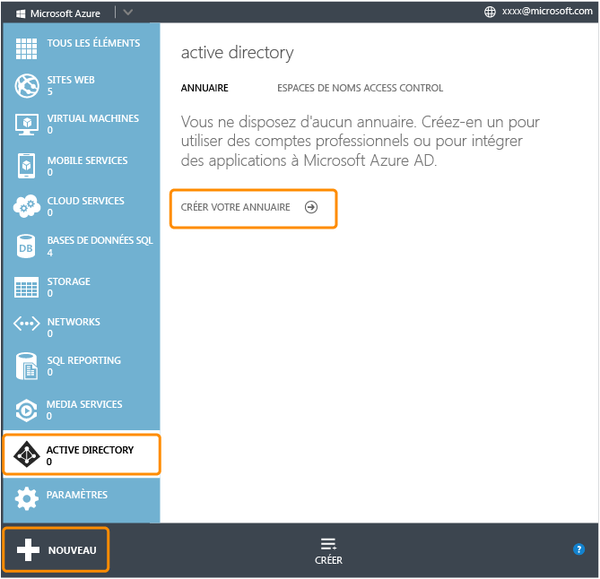

Une fois votre annuaire créé, vous pouvez créer et gérer des utilisateurs, des applications intégrées et des domaines.

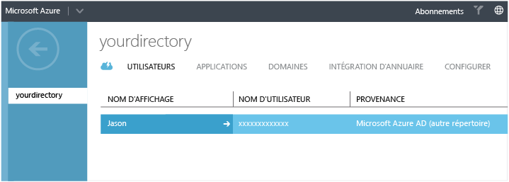

Pour plus d'informations sur la procédure à suivre, consultez la rubrique [Ajout de l'authentification à une application Web à l'aide d'Azure AD](http://msdn.microsoft.com/library/windowsazure/dn151790.aspx). Si vous souhaitez utiliser ce nouvel annuaire en tant que ressource autonome, vous devez à présent développer des applications intégrées. Cependant, si vous disposez d'identités Active Directory locales, il est plus judicieux de les synchroniser avec le nouvel annuaire Azure Active Directory. Pour plus d'informations, consultez la rubrique [Intégration d'un annuaire](http://technet.microsoft.com/en-us/library/jj573653.aspx).

Une fois l'annuaire créé et alimenté, vous devez créer des applications Web nécessitant une authentification afin de les intégrer à l'annuaire. Ces étapes sont présentées dans les sections suivantes.

Création d'un site Web Azure nécessitant une authentification
-------------------------------------------------------------

Dans notre scénario de présence sur le Web à l'international, nous avons passé en revue les différentes options de création et de déploiement d'un site Web. Si vous n'êtes pas familier de Sites Web Azure, nous vous invitons à [consulter ces informations](/en-us/manage/services/web-sites/global-web-presence-solution-overview/). Une application ASP.NET sous Visual Studio constitue un choix classique pour une application Web intranet utilisant l'authentification Windows, notamment en raison de l'étroite intégration et de la prise en charge de ce scénario offertes par ASP.NET et Visual Studio.

Par exemple, lors de la création d'un projet ASP.NET MVC 4 sous Visual Studio, vous pouvez créer une **application intranet** via la boîte de dialogue de création de projet.

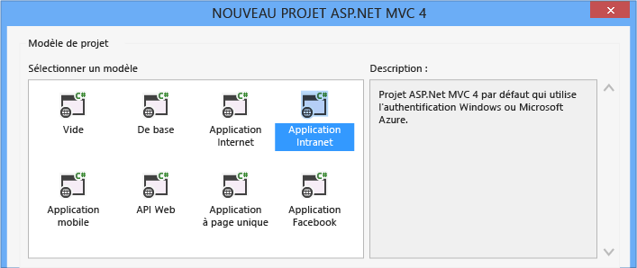

Cela permet d'apporter des modifications aux paramètres du projet en vue de prendre en charge l'authentification Windows. Précisément, l'attribut **node** de l'élément **authentication** est défini sur **Windows** dans le fichier web.config. Vous devez le modifier manuellement si vous souhaitez créer un autre projet ASP.NET, tel qu'un projet Web Forms, ou utiliser un projet existant.

Pour un projet MVC, vous devez également accéder à la fenêtre des propriétés du projet, afin de modifier deux valeurs : définissez **Authentification Windows** sur **Activée** et **Authentification anonyme** sur **Désactivée**.

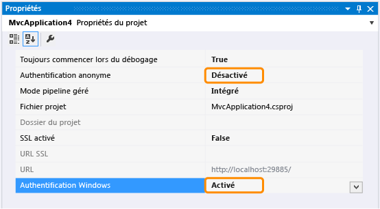

Pour pouvoir utiliser l'authentification via Azure Active Directory, vous devez inscrire l'application auprès de l'annuaire, puis modifier la configuration de l'application à des fins de connexion. Il existe deux méthodes pour ce faire dans Visual Studio :

-   [Identity and Access Tool for Visual Studio](#identityandaccessforvs)
-   [Microsoft ASP.NET Tools for Azure Active Directory](#aspnettoolsforwaad)

### Identity and Access Tool for Visual Studio

Vous pouvez utiliser l'outil [Identity and Access Tool](http://visualstudiogallery.msdn.microsoft.com/e21bf653-dfe1-4d81-b3d3-795cb104066e) (que vous pouvez télécharger et installer), qui s'intègre au menu contextuel du projet, dans Visual Studio. Notez que les instructions et captures d'écran suivantes s'appliquent à Visual Studio 2012. Cliquez avec le bouton droit sur le projet, puis sélectionnez **Identité et accès**. Vous devez alors configurer trois options. Sous l'onglet **Fournisseurs**, indiquez le **chemin d'accès au document de métadonnées STS** ainsi que l'**URI ID de l'application** (consultez la section [Inscription de l'application auprès d'Azure Active Directory](#registerwaadapp) ci-après pour savoir où trouver ces informations).

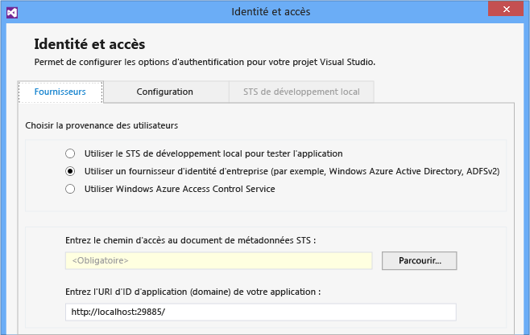

La dernière modification à apporter à la configuration concerne l'onglet **Configuration** de la boîte de dialogue **Identité et accès**. Vous devez activer la case à cocher **Enable web farm cookies**. Pour plus d'informations sur la procédure à suivre, consultez la rubrique [Ajout de l'authentification à une application Web à l'aide d'Azure AD](http://msdn.microsoft.com/library/windowsazure/dn151790.aspx).

#### Inscription de l'application auprès d'Azure Active Directory

Pour pouvoir renseigner l'onglet **Fournisseurs**, vous devez inscrire l'application auprès d'Azure Active Directory. Dans la section **Active Directory** du portail de gestion Azure, sélectionnez l'annuaire approprié, puis accédez à l'onglet **Applications**, afin d'ajouter votre site Web Azure à l'aide de son adresse URL. Notez que lors de cette procédure, vous devez initialement définir l'URL sur l'adresse d'hôte local fournie pour le débogage local dans Visual Studio. Vous pourrez ensuite la remplacer par la véritable URL du site Web lors du déploiement.

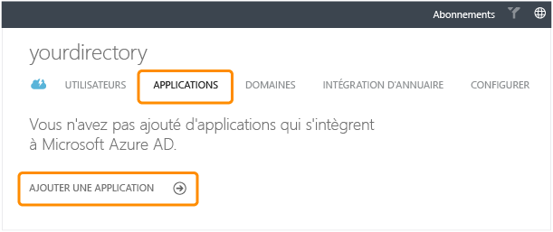

Une fois le site Web ajouté, le portail indique le chemin d'accès au document de métadonnées STS (l'**URL du document de métadonnées Federation**) et l'**URI ID de l'application**. Ces valeurs sont utilisées dans l'onglet **Fournisseurs** de la boîte de dialogue **Identité et accès** de Visual Studio.

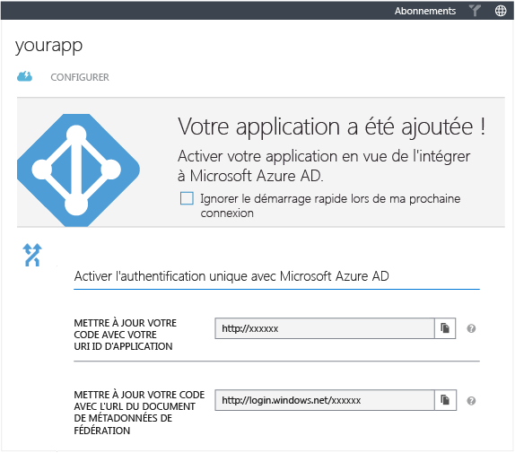

### Microsoft ASP.NET Tools for Azure Active Directory

Vous pouvez également utiliser [Microsoft ASP.NET Tools for Azure Active Directory](http://go.microsoft.com/fwlink/?LinkID=282306). Pour ce faire, sélectionnez **Enable Azure Authentication** dans le menu **Projet** de Visual Studio. Une boîte de dialogue s'affiche alors, vous invitant à entrer l'adresse du domaine Azure Active Directory (et non l'URL de l'application).

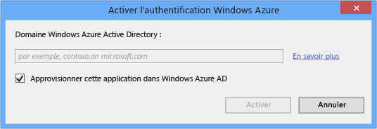

Si vous disposez des droits d'administration sur ce domaine Active Directory, activez la case à cocher **Provision this application in the Azure AD**, afin d'inscrire l'application auprès d'Active Directory. Dans le cas contraire, désactivez cette case à cocher et transmettez les informations affichées à un administrateur. Celui-ci pourra alors utiliser le portail de gestion pour créer une application intégrée à l'aide de la procédure décrite précédemment dans l'outil Identity and Access Tool. Pour plus d'informations sur l'utilisation des outils ASP.NET Tools for Azure Active Directory, consultez la rubrique [Authentification Azure](http://www.asp.net/aspnet/overview/aspnet-and-visual-studio-2012/windows-azure-authentication).

Dans le cadre de la gestion de cette application métier, vous avez la possibilité d'utiliser n'importe quel système de contrôle de code source pris en charge pour le déploiement. Cependant, pour notre scénario, en raison du haut niveau d'intégration Visual Studio, Team Foundation Service (TFS) constitue le système de contrôle le plus adapté. Notez que, dans ce cas, Sites Web Azure offre une intégration avec TFS. Dans le portail de gestion, accédez à l'onglet **Tableau de bord** du site Web. Sélectionnez **Configurer le déploiement à partir du contrôle de code source**, puis suivez les instructions d'utilisation de TFS.

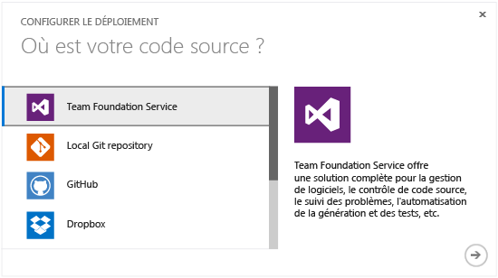

Utilisation de Service Bus à des fins d'intégration aux ressources locales
--------------------------------------------------------------------------

Un grand nombre d'applications métier doivent être intégrées aux données et services locaux. Pour des raisons pratiques ou réglementaires, certaines données ne peuvent être déplacées vers le cloud. Il est donc important, lorsque vous devez déterminer quelles données héberger dans Azure et quelles données conserver en local, de passer en revue les différentes ressources dans le [Centre de gestion de la confidentialité Azure](/en-us/support/trust-center/). Les applications Web hybrides s'exécutent dans Azure et accèdent aux ressources conservées en local.

Avec Azure Virtual Machines ou Cloud Services, vous pouvez utiliser Virtual Network pour connecter les applications dans Azure à un réseau d'entreprise. Cependant, Sites Web ne prenant pas en charge Virtual Networks, le meilleur moyen de procéder à ce type d'intégration dans des sites Web est donc de faire appel au [service de relais Azure Service Bus](http://msdn.microsoft.com/fr-fr/library/windowsazure/jj860549.aspx). Ce service permet d'établir une connexion sécurisée entre les applications dans le cloud et les services WCF exécutés sur un réseau d'entreprise. La communication s'effectue ainsi sans ouvrir de ports de pare-feu.

Dans l'illustration ci-après, l'application dans le cloud et le service WCF local communiquent avec Service Bus via un espace de noms précédemment créé. Le service WCF local a accès aux données et services internes qui ne peuvent être placés dans le cloud, et enregistre un point de terminaison dans l'espace de noms. Le site Web exécuté dans Azure se connecte également à ce point de terminaison au sein de Service Bus. Cette étape ne nécessite que l'envoi continu de requêtes HTTP publiques.

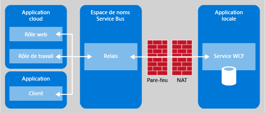

Service Bus connecte ensuite l'application dans le cloud au service WCF local. Cela permet de fournir une architecture de base pour la création d'applications hybrides utilisant à la fois les services et les ressources conservés dans Azure et en local. Pour plus d'informations, consultez la rubrique [Utilisation du service Service Bus Relay](/en-us/develop/net/how-to-guides/service-bus-relay/) et le didacticiel [Didacticiel relatif à la messagerie par relais Service Bus](http://msdn.microsoft.com/fr-fr/library/windowsazure/ee706736.aspx). Vous pouvez également consulter un exemple illustrant cette technique : [Pizzeria - Connexion de sites Web à un réseau local via Service Bus](http://code.msdn.microsoft.com/windowsazure/Enterprise-Pizza-e2d8f2fa).

Surveillance de l'application
-----------------------------

Les applications métier bénéficient des fonctionnalités standard des sites Web, telles que la mise à l'échelle et la surveillance. Pour les applications métier dont la charge varie en fonction des heures ou des jours, la fonction Mise à l'échelle automatique (version préliminaire) peut ainsi faciliter la mise à l'échelle du site, pour une exploitation efficace des ressources. Les options de surveillance incluent la surveillance des points de terminaison et des quotas. Pour plus d'informations sur ces options, consultez les scénarios [Présence sur le Web à l'international](/en-us/manage/services/web-sites/global-web-presence-solution-overview/) et [Campagnes marketing numériques](/en-us/manage/services/web-sites/digital-marketing-campaign-solution-overview).

Les besoins en surveillance varient selon les applications métier, en fonction de leur importance. Pour les applications les plus critiques, envisagez d'investir dans une solution de surveillance tiers, telle que [New Relic](http://newrelic.com/azure).

Les applications métier sont généralement gérées par le service informatique. En cas d'erreur ou de comportement inattendu, il leur est possible d'activer la journalisation détaillée, à des fins d'analyse des données et d'identification du problème. Dans le portail de gestion, accédez à l'onglet **Configuration**, puis passez en revue les options des sections **Diagnostic d'application** et **Diagnostic de site**.

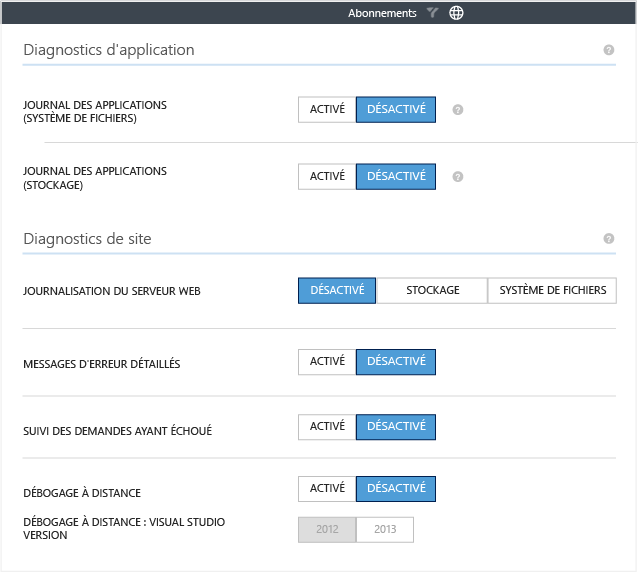

Vous pouvez utiliser les fichiers journaux d'application et de site pour identifier et résoudre les problèmes relatifs à un site Web. Notez que certaines options spécifient **Système de fichiers** ; dans ce cas, les fichiers journaux sont enregistrés dans le système de fichiers du site. Vous pouvez y accéder via FTP, Azure PowerShell ou à l'aide des outils en ligne de commande Azure. D'autres options spécifient quant à elles **Stockage** ; les informations sont alors envoyées au compte de stockage Azure spécifié. Pour l'option **Journalisation du serveur Web**, vous pouvez également indiquer un quota de disque pour le système de fichiers ou une stratégie de rétention pour le stockage. Cela permet de limiter la quantité de données de journalisation stockées.

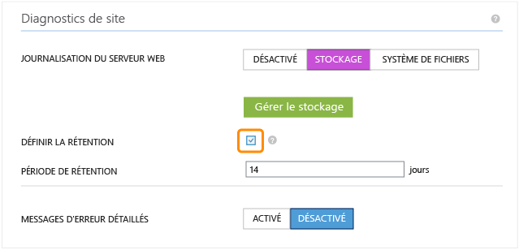

Pour plus d'informations sur ces paramètres de journalisation, consultez la rubrique [Configuration des diagnostics et téléchargement des journaux d'un site Web](/en-us/manage/services/web-sites/how-to-monitor-websites/#howtoconfigdiagnostics).

Vous pouvez consulter les données brutes via FTP ou à l'aide d'utilitaires de stockage, tels qu'Azure Storage Explorer, mais vous pouvez également consulter les informations de journalisation dans Visual Studio. Pour plus d'informations sur l'utilisation de ces fichiers journaux dans le cadre de scénarios de résolution de problèmes, consultez la rubrique [Résolution des problèmes de sites Web Azure dans Visual Studio](/en-us/develop/net/tutorials/troubleshoot-web-sites-in-visual-studio/).

Résumé
------

Azure permet d'héberger des applications intranet sécurisées dans le cloud. Azure Active Directory permet l'authentification des utilisateurs, afin de restreindre l'accès aux applications aux seuls membres autorisés. Le service de relais Service Bus permet d'établir la communication entre les applications Web et les données et services locaux. Cette approche d'application hybride simplifie le processus de publication d'une application métier dans le cloud, supprimant la nécessité de migrer toutes les données et services connexes. Une fois déployées, les applications métier bénéficient des fonctionnalités standard de mise à l'échelle et de surveillance fournies par Sites Web Azure. Pour plus d'informations, consultez les articles techniques répertoriés ci-après.

<table data-morhtml="true" cellspacing="0" border="1">
<tr data-morhtml="true">
   <th data-morhtml="true" align="left" valign="top">Domaine</th>
   <th data-morhtml="true" align="left" valign="top">Ressources</th>
</tr>
<tr data-morhtml="true">
   <td data-morhtml="true" valign="middle"><strong data-morhtml="true">Planification</strong></td>
   <td data-morhtml="true" valign="top">- <a data-morhtml="true" href="http://www.windowsazure.com/fr-fr/manage/services/web-sites/choose-web-app-service">Sites Web, services cloud et machines virtuelles Azure&nbsp;: que choisir&nbsp;?</a></td>
</tr>
<tr data-morhtml="true">
   <td data-morhtml="true" valign="middle"><strong data-morhtml="true">Cr&eacute;ation et d&eacute;ploiement</strong></td>
   <td data-morhtml="true" valign="top">- <a data-morhtml="true" href="http://www.windowsazure.com/fr-fr/develop/net/tutorials/get-started/">D&eacute;ploiement d'une application&nbsp;Web ASP.NET sur un site Web Azure</a> - <a data-morhtml="true" href="http://www.windowsazure.com/fr-fr/develop/net/tutorials/web-site-with-sql-database/">D&eacute;ploiement d'une application ASP.NET MVC s&eacute;curis&eacute;e sur un site Web Azure</a></td>
</tr>
<tr data-morhtml="true">
   <td data-morhtml="true" valign="middle"><strong data-morhtml="true">Authentification</strong></td>
   <td data-morhtml="true" valign="top">- <a data-morhtml="true" href="http://www.windowsazure.com/fr-fr/manage/windows/fundamentals/identity/">Pr&eacute;sentation des options d'identification Azure</a> - <a data-morhtml="true" href="http://www.windowsazure.com/fr-fr/documentation/services/active-directory/">Service Azure Active Directory</a> - <a data-morhtml="true" href="http://technet.microsoft.com/en-us/library/jj573650.aspx">Pr&eacute;sentation d'Azure&nbsp;AD</a> - <a data-morhtml="true" href="http://msdn.microsoft.com/library/windowsazure/dn151790.aspx">Ajout de l'authentification &agrave; une application&nbsp;Web &agrave; l'aide d'Azure AD</a> - <a data-morhtml="true" href="http://www.asp.net/aspnet/overview/aspnet-and-visual-studio-2012/windows-azure-authentication">Didacticiel relatif &agrave; l'authentification Azure</a></td>
</tr>
<tr data-morhtml="true">
   <td data-morhtml="true" valign="middle"><strong data-morhtml="true">Service Bus Relay</strong></td>
   <td data-morhtml="true" valign="top">- <a data-morhtml="true" href="http://www.windowsazure.com/fr-fr/develop/net/how-to-guides/service-bus-relay/">Utilisation du service Service Bus Relay</a> - <a data-morhtml="true" href="http://msdn.microsoft.com/fr-fr/library/windowsazure/ee706736.aspx">Didacticiel relatif &agrave; la messagerie par relais Service Bus</a></td>
</tr>
<tr data-morhtml="true">
   <td data-morhtml="true" valign="middle"><strong data-morhtml="true">Surveillance</strong></td>
   <td data-morhtml="true" valign="top">- <a data-morhtml="true" href="http://www.windowsazure.com/fr-fr/manage/services/web-sites/how-to-monitor-websites/">Surveillance de sites&nbsp;Web</a> - <a data-morhtml="true" href="http://msdn.microsoft.com/library/windowsazure/dn306638.aspx">R&eacute;ception de notifications d'alerte et gestion des r&egrave;gles d'alerte dans Azure</a> - <a data-morhtml="true" href="http://www.windowsazure.com/fr-fr/manage/services/web-sites/how-to-monitor-websites/#howtoconfigdiagnostics">Configuration des diagnostics et t&eacute;l&eacute;chargement des journaux d'un site Web</a> - <a data-morhtml="true" href="http://www.windowsazure.com/fr-fr/develop/net/tutorials/troubleshoot-web-sites-in-visual-studio/">R&eacute;solution des probl&egrave;mes de sites Web Azure dans Visual Studio</a></td>
</tr>
</table>

