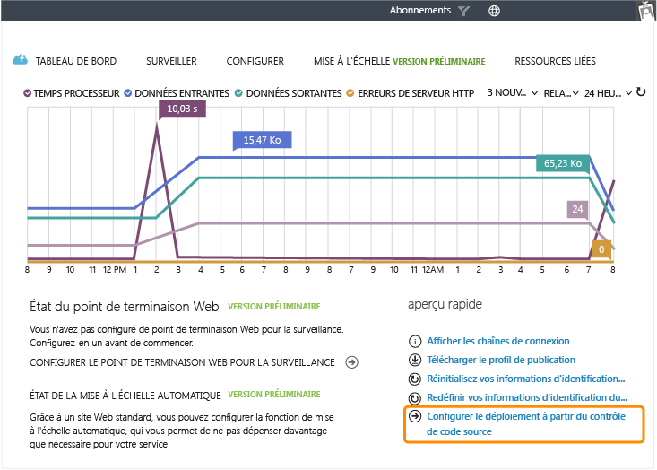
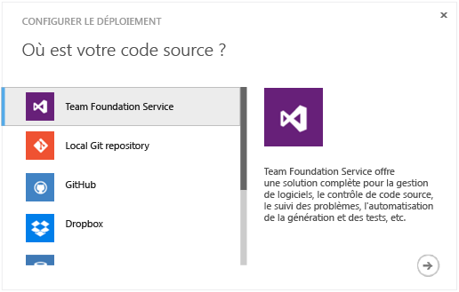
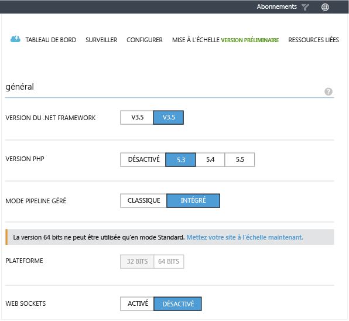
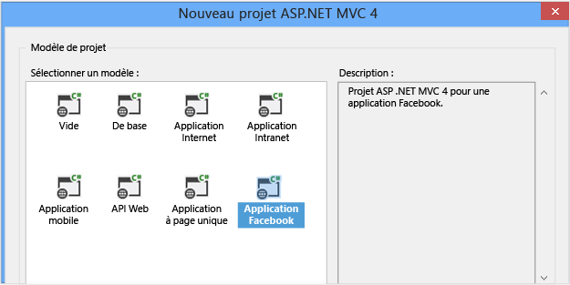
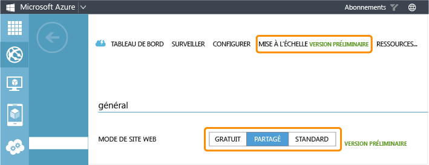
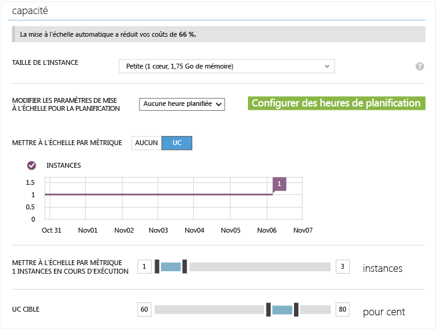
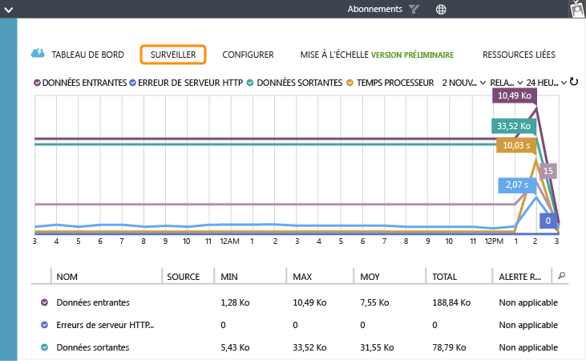
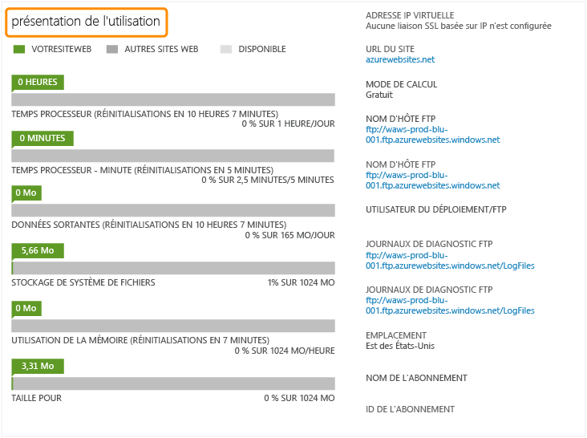

<properties linkid="websites-digital-marketing" urlDisplayName="Resources" pageTitle="Create a Digital Marketing Campaign on Azure Web Sites" metaKeywords="" description="This guide provides a technical overview of how to use Azure Web Sites to create digital marketing campaigns. This includes deployment, social media integration, scaling strategies, and monitoring." metaCanonical="" services="" documentationCenter="" title="Create a Digital Marketing Campaign on Azure Web Sites" authors="jroth" solutions="" manager="paulettm" editor="mollybos" />

Création de campagnes marketing numériques dans Sites Web Azure
===============================================================

Ce guide fournit un aperçu technique de l'utilisation de Sites Web Azure en vue de créer des campagnes marketing numériques. Une campagne marketing numérique est une entité à durée de vie limitée, conçue pour promouvoir un objectif marketing à court terme. Il y a deux scénarios principaux à envisager. Dans le premier scénario, une agence de marketing crée et gère une campagne pour un client pendant toute la durée de la promotion. Dans le second scénario, l'agence de marketing crée une campagne marketing numérique, puis transfère les droits de propriété sur les ressources associées au client. Ce dernier lance et gère ensuite seul la campagne.

Le service [Sites Web Azure](/en-us/documentation/services/web-sites/) est approprié pour ces deux scénarios. Il permet une création rapide, prend en charge plusieurs infrastructures et langages, s'adapte aux besoins des utilisateurs et accepte un grand nombre de systèmes de déploiement et de contrôle de code source. Avec Azure, vous avez également accès à d'autres services Azure, tels que Media Services, utiles dans le cadre d'une campagne marketing.

Bien qu'il soit possible d'utiliser [Azure Cloud Services](/en-us/documentation/services/cloud-services/) ou [Azure Virtual Machines](/en-us/documentation/services/virtual-machines/) pour héberger des sites Web, ces services ne constituent pas la meilleure option pour ce scénario, sauf s'ils proposent une fonctionnalité non proposée par Sites Web Azure. Pour plus d'informations sur ces options, consultez la rubrique [Sites Web, services cloud et machines virtuelles Azure : que choisir ?](/en-us/manage/services/web-sites/choose-web-app-service).

Les questions couvertes par ce guide sont les suivantes :

-   [Déploiement de sites Web existants](#deployexisting)
-   [Intégration au sein de médias sociaux](#socialmedia)
-   [Évolution en fonction de la demande](#scale)
-   [Intégration à d'autres services](#integrate)
-   [Surveillance de la campagne](#monitor)

**Remarque**

Ce guide présente les domaines et les tâches parmi les plus courants s'adaptant au développement de sites .COM publics. Cependant, le service Sites Web Azure offre encore d'autres fonctionnalités, que vous pouvez utiliser pour votre implémentation. Pour les découvrir, consultez les guides relatifs à la [Présence sur le Web à l'international](http://www.windowsazure.com/en-us/manage/services/web-sites/global-web-presence-solution-overview/) et aux [Applications métier](http://www.windowsazure.com/en-us/manage/services/web-sites/business-application-solution-overview).

Déploiement de sites Web existants
----------------------------------

Dans notre scénario de présence sur le Web à l'international, nous avons passé en revue les différentes options de création et de déploiement d'un site Web. Si vous n'êtes pas familier de Sites Web Azure, nous vous invitons à [consulter ces informations](/en-us/manage/services/web-sites/global-web-presence-solution-overview/). Si vous créez fréquemment des campagnes marketing numériques, vous disposez peut-être de composants Web à personnaliser selon les besoins. Dans cette section, nous nous intéresserons aux options de déploiement de différents types de sites Web à partir du contrôle de code source.

Si vous travaillez avec des composants Web réutilisables, nous vous conseillons fortement d'envisager l'adoption d'un système de contrôle de code source, si tel n'est pas encore le cas. Cela permet de conserver des modèles de solutions Web communes pouvant être associées et personnalisées. Le service Sites Web Azure permet en outre une synchronisation avec un grand nombre de référentiels de code source. Dans l'onglet **Tableau de bord**, cliquez sur le lien **Configurer le déploiement à partir du contrôle de code source**.

Une boîte de dialogue s'affiche alors, proposant plusieurs options de contrôle de code source, notamment des systèmes de contrôle de code source complets, tels que TFS, ainsi que des solutions de déploiement simples, telles que Dropbox.

Vous pouvez utiliser différentes techniques de contrôle de code source pour gérer un nouveau projet basé sur un matériel de base existant. Vous pouvez, par exemple, copier un référentiel de base précédemment sauvegardé pour ce projet ou créer une branche, afin de garder une trace des personnalisations réalisées. La rubrique [Environnements multiples avec Sites Web Azure](http://www.bradygaster.com/post/multiple-environments-with-windows-azure-web-sites) fournit un bon exemple d'utilisation de branches pour la gestion de différents déploiements à partir d'un même référentiel de contrôle de code source. Elle explique comment utiliser les branches git à des fins de gestion des environnements intermédiaires et de production.

Une fois le site Web connecté au système de contrôle de code source, vous pouvez configurer et suivre des déploiements à partir du portail. Pour plus d'informations sur l'utilisation du contrôle de code source avec des sites Web, consultez la rubrique [Publication à partir du contrôle de code source dans Sites Web Azure](/en-us/develop/net/common-tasks/publishing-with-git/).

En cas d'utilisation de composants Web existants, il est également important de pouvoir héberger un grand nombre de types de sites Web différents. Dans l'onglet **Configuration**, vous pouvez sélectionner la prise en charge .NET et PHP pour votre site Web.

Outre ces options de configuration, Sites Web Azure prend automatiquement en charge Python 2.7 et Node.js. La version Node.js par défaut est la version 0.10.5.

Un autre avantage du service Sites Web Azure est la vitesse de déploiement des sites intermédiaires sur Internet. Lors des phases de planification, de prototypage et de développement initial d'un site, l'agence et le client peuvent travailler sur des versions fonctionnelles réelles du site de campagne avant de le mettre en ligne. Une fois le site prêt pour production, l'agence peut gérer le déploiement en production pour le client ou lui transmettre l'ensemble des composants Web à des fins de déploiement et de gestion.

Intégration au sein de médias sociaux
-------------------------------------

La plupart des campagnes marketing numériques exploitent les réseaux sociaux, tels que Facebook ou Twitter. L'une des méthodes d'intégration possibles consiste à utiliser les identités des médias sociaux à des fins d'authentification. Pour découvrir un exemple de cette approche avec une application ASP.NET, consultez la rubrique [Déploiement d'une application ASP.NET MVC sécurisée avec une fonctionnalité d'appartenance, OAuth et une base de données SQL vers un site Web Azure](/en-us/develop/net/tutorials/web-site-with-sql-database/).

Cependant, nombre de campagnes marketing numériques vont au-delà de l'authentification et font de l'intégration aux médias sociaux un élément clé de leur stratégie. Les réseaux sociaux incluent généralement une section dédiée aux développeurs, qui explique comment intégrer des applications à leurs services. Les services incluant une API REST peuvent être utilisés à partir de la quasi-totalité des infrastructures Web. Toutefois, les sites intègrent souvent des informations propres aux différents langages. Par exemple, Twitter fournit [la liste des bibliothèques disponibles prenant en charge l'API Twitter](https://dev.twitter.com/docs/twitter-libraries#dotnet), notamment pour les langages .NET, Node.js et PHP. Ce n'est qu'un exemple parmi d'autres, et vous devez rechercher ce type de directives de développement sur chaque site de réseau social ciblé.

Pour les développeurs ASP.NET ciblant Facebook, Visual Studio propose un modèle d'application Facebook MVC 4.

Pour plus d'informations sur l'utilisation de ce modèle pour les sites Web, consultez la rubrique [Création d'une application Facebook à l'aide d'un modèle Facebook ASP.NET MVC et hébergement gratuit de l'application sur des sites Web Azure](http://blogs.msdn.com/b/africaapps/archive/2013/02/20/creating-a-facebook-app-using-asp-net-mvc-facebook-templates-and-hosting-them-for-free-on-windows-azure-websites.aspx). Pour plus d'informations sur la procédure à suivre et pour découvrir un exemple d'application, consultez les rubriques [Application d'anniversaire Facebook ASP.NET MVC](http://www.asp.net/mvc/tutorials/mvc-4/aspnet-mvc-facebook-birthday-app) et [Nouveau modèle d'application Facebook et nouvelle bibliothèque pour ASP.NET MVC](http://blogs.msdn.com/b/webdev/archive/2012/12/13/the-new-facebook-application-template-and-library-for-asp.net-mvc.aspx).

Si vous développez en ASP.NET, il est important de réaliser que l'intégration aux médias sociaux n'est pas limitée par les modèles fournis par Visual Studio. Ces modèles ne visent qu'à simplifier le processus. Mais, comme nous l'avons vu, chaque site de média social fournit des informations sur les différents modes de connexion .NET, ainsi que pour un grand nombre d'autres langages et infrastructures.

Évolution en fonction de la demande
-----------------------------------

Le cloud computing se révèle particulièrement utile en cas de charges de travail non prévisibles. Les campagnes marketing numériques sont un exemple parfait de ce cas de figure. Il est difficile de prévoir la popularité d'un site marketing à durée de vie relativement courte, car cela dépend en grande majorité de la capacité à capter l'intérêt des utilisateurs et des interactions avec les réseaux sociaux associés, qui redirigent le public vers le site. Azure inclut plusieurs options permettant de faire évoluer les sites Web mais également les services cloud.

-   Mise à l'échelle manuelle via le [portail de gestion Azure](http://manage.windowsazure.com/)
-   Mise à l'échelle par programmation via l'[API de gestion des services](http://msdn.microsoft.com/en-us/library/windowsazure/ee460799.aspx) ou des [scripts PowerShell](http://msdn.microsoft.com/en-us/library/windowsazure/jj152841.aspx)
-   Mise à l'échelle automatique via la version préliminaire de la fonctionnalité Mise à l'échelle automatique.

Dans le portail de gestion, accédez à l'onglet **Mettre à l'échelle** du site Web. Plusieurs options de mise à l'échelle sont proposées. La première détermine le mode du site Web : **Gratuit**, **Partagé** ou **Standard**.

Les fonctionnalités et options de mise à l'échelle augmentent avec les niveaux. Par exemple, en mode **Gratuit**, les sites ne peuvent pas être mis à l'échelle pour plusieurs instances, tandis que ceux en mode **Partagé** peuvent l'être pour 6 instances. Il est également possible d'opter pour la mise à l'échelle en mode **Standard**. Ce mode exécute le site sur des machines virtuelles dédiées de petite, moyenne ou grande taille. Outre le choix dans la taille des machines virtuelles, il est également possible d'effectuer une montée en charge vers plusieurs instances. Le mode **Standard** permet ainsi une montée en charge vers 10 instances. Vous trouverez la liste complète des caractéristiques spécifiques à chaque mode dans les [directives de tarification relatives aux sites Web](https://www.windowsazure.com/en-us/pricing/details/web-sites/).

En mode **Standard**, il est également possible d'activer la version préliminaire de la fonctionnalité Mise à l'échelle automatique, qui permet une mise à l'échelle en fonction du processeur. Le pourcentage **UC cible** correspond à la plage d'utilisation du processeur ciblée par Azure pour les instances du site Web. Si l'utilisation UC moyenne est inférieure à ce pourcentage cible, Azure réduit le nombre d'instances, car une charge identique sur un nombre inférieur d'instances entraîne une augmentation de l'utilisation des instances restantes. Notez cependant que le **nombre d'instances** ne peut être réduit au-delà de la valeur minimale définie. De même, si l'utilisation UC moyenne est supérieure au pourcentage **UC cible**, Azure augmente le nombre d'instances. La même charge est alors répartie entre davantage de machines, ce qui a pour effet de réduire l'utilisation UC de chaque machine. Notez que le **nombre d'instances** pouvant être ajoutées est limité par la valeur maximale définie.

La mise à l'échelle automatique permet une exploitation bien plus efficace des ressources, par exemple, dans le cas d'une campagne marketing numérique davantage active pendant la nuit et les week-ends. Cela permet également de couvrir les scénarios dans lesquels la popularité de la campagne augmente de manière inattendue. La mise à l'échelle automatique permet alors de gérer efficacement l'augmentation de charge, puis de réduire le nombre d'instances (et donc les coûts) lorsque la charge diminue.

Pour plus d'informations sur la mise à l'échelle des sites Web, consultez la rubrique [Mise à l'échelle de sites Web](/en-us/manage/services/web-sites/how-to-scale-websites/). Ce sujet est également étroitement lié au concept de surveillance. Pour plus d'informations à ce sujet, consultez la section [Surveillance de la campagne](#monitor) ci-après.

**Remarque**

Pour les applications Web utilisant les services cloud et les rôles Web, il est également possible de procéder à une mise à l'échelle en fonction de la longueur des éléments placés dans la file d'attente. Dans un service cloud, les rôles traitant les files d'attente de serveur principal constituent un modèle d'architecture commun. Pour plus d'informations sur la mise à l'échelle des services cloud, consultez la rubrique [Extension d'un service cloud](http://www.windowsazure.com/en-us/manage/services/cloud-services/how-to-scale-a-cloud-service/).

Intégration à d'autres services
-------------------------------

Un site marketing numérique intègre bien souvent du contenu multimédia enrichi, tel que la diffusion en continu de vidéos. L'hébergement de ces sites dans Azure offre une intégration étroite aux services Azure connexes. Vous pouvez, par exemple, utiliser Azure Media Services pour encoder et diffuser en continu des vidéos pour votre site Web. Pour plus d'informations sur Media Services, consultez la rubrique [Concepts Azure Media Services](http://msdn.microsoft.com/en-us/library/windowsazure/dn223282.aspx).

D'autres services Azure peuvent être utilisés pour créer des applications plus puissantes. Par exemple, les sites Web peuvent utiliser la mise en cache distribuée fournie par le nouveau service [Azure Cache Service (Preview)](http://msdn.microsoft.com/en-us/library/windowsazure/dn386094.aspx). Vous pouvez également utiliser les services Azure Storage pour stocker vos données et ressources d'application. Par exemple, les images, les vidéos ainsi que d'autres fichiers volumineux peuvent être stockés durablement dans des objets blob. Des services de base de données, tels que la base de données SQL Azure et MySQL, sont également disponibles pour les données relationnelles.

Surveillance de la campagne
---------------------------

L'onglet **Surveillance** présente des mesures pouvant vous aider à évaluer l'efficacité et les performances de votre site marketing numérique.

Vous pouvez notamment contrôler les modes et niveaux d'utilisation grâce à des mesures, telles que le **temps processeur**, les **requêtes** et les **données envoyées**. Des valeurs élevées indiquent en effet une grande popularité de la campagne marketing. Vous pouvez ainsi utiliser ces informations sur l'utilisation pour décider quand étendre ou réduire les capacités de votre site. Pour plus d'informations, consultez la page [Surveillance des sites Web](/en-us/manage/services/web-sites/how-to-monitor-websites/).

Pour les modes **Gratuit** et **Partagé**, vous devez également tenir compte des quotas de ressource. L'onglet **Tableau de bord** du portail présente les statistiques d'utilisation de plusieurs quotas, ainsi que leur date de réinitialisation. Notez que les statistiques affichées varient en fonction du mode sélectionné. La capture d'écran ci-après présente les statistiques correspondant au mode **Gratuit**. En mode **Partagé**, par exemple, il n'y a pas de quota pour les **données envoyées**. Et en mode **Standard**, cet onglet indique uniquement le **stockage de système de fichiers** et la **taille**.

Si ces quotas arrivent à saturation, envisagez de passer du mode **Gratuit** au mode **Partagé**, ou du mode **Partagé** au mode **Standard**. En mode **Standard**, les ressources sont dédiées à une ou plusieurs machines virtuelles de petite, moyenne ou grande taille.

Outre le portail de gestion, il existe un certain nombre d'outils tiers fournissant des données de surveillance avancées pour les sites Web. Vous pouvez, par exemple, installer un module complémentaire New Relic à partir de l'Azure Store. Pour plus d'informations sur l'utilisation de New Relic à des fins de surveillance, consultez la rubrique [Gestion des performances des applications New Relic sur Azure](/en-us/develop/net/how-to-guides/new-relic/).

Enfin, en mode Standard, il est possible d'activer des fonctions de surveillance des points de terminaison et d'alerte sur les sites Web. Un point de terminaison surveille régulièrement les tentatives d'accès au site Web et contrôle les temps de réponse. La fonction d'alerte envoie des notifications par courrier électronique lorsque le temps de réponse dépasse le seuil défini. Pour plus d'informations, consultez la section dédiée à la surveillance du scénario [Présence sur le Web à l'international](/en-us/manage/services/web-sites/global-web-presence-solution-overview/) et la rubrique [Réception de notifications d'alerte et gestion des règles d'alerte dans Azure](http://msdn.microsoft.com/library/windowsazure/dn306638.aspx).

Résumé
------

Le service Sites Web Azure constitue un bon choix pour les contenus Web réutilisables personnalisés pour chaque campagne marketing. Il prend en charge un grand nombre de langages, d'infrastructures et de systèmes de contrôle de code source communs, facilitant ainsi la migration de ces composants et flux de travail vers le cloud. Le modèle d'application Facebook ASP.NET permet de créer simplement des applications Facebook, mais vous pouvez utiliser pratiquement n'importe quelle intégration aux médias sociaux tierce prenant en charge les interfaces Web. Azure Media Services ainsi que d'autres services Azure connexes fournissent des outils supplémentaires pour vous aider à concevoir correctement votre site de campagne. Et les nombreuses options de mise à l'échelle manuelle et automatique se révèlent utiles pour gérer la demande, qui peut être difficile à anticiper. Pour plus d'informations, consultez les articles techniques répertoriés ci-après.

<table data-morhtml="true" cellspacing="0" border="1">
<tr data-morhtml="true">
   <th data-morhtml="true" align="left" valign="top">Domaine</th>
   <th data-morhtml="true" align="left" valign="top">Ressources</th>
</tr>
<tr data-morhtml="true">
   <td data-morhtml="true" valign="middle"><strong data-morhtml="true">Planification</strong></td>
   <td data-morhtml="true" valign="top">- <a data-morhtml="true" href="http://www.windowsazure.com/en-us/manage/services/web-sites/choose-web-app-service">Sites Web, services cloud et machines virtuelles Azure&nbsp;: que choisir&nbsp;?</a></td>
</tr>
<tr data-morhtml="true">
   <td data-morhtml="true" valign="middle"><strong data-morhtml="true">Cr&eacute;ation</strong></td>
   <td data-morhtml="true" valign="top">- <a data-morhtml="true" href="http://www.windowsazure.com/en-us/manage/services/web-sites/how-to-create-websites/">Cr&eacute;ation et d&eacute;ploiement d'un site Web</a></td>
</tr>
<tr data-morhtml="true">
   <td data-morhtml="true" valign="middle"><strong data-morhtml="true">D&eacute;ploiement</strong></td>
   <td data-morhtml="true" valign="top">- <a data-morhtml="true" href="http://www.windowsazure.com/en-us/develop/net/common-tasks/publishing-with-git/">Publication &agrave; partir du contr&ocirc;le de code source dans Sites Web Azure</a> - <a data-morhtml="true" href="http://www.windowsazure.com/en-us/manage/services/web-sites/how-to-create-websites/">D&eacute;ploiement d'une application Web ASP.NET sur un site Web Azure</a></td>
</tr>
<tr data-morhtml="true">
   <td data-morhtml="true" valign="middle"><strong data-morhtml="true">M&eacute;dias sociaux</strong></td>
   <td data-morhtml="true" valign="top">- <a data-morhtml="true" href="http://www.windowsazure.com/en-us/develop/net/tutorials/web-site-with-sql-database/">D&eacute;ploiement d'une application ASP.NET MVC s&eacute;curis&eacute;e avec une fonctionnalit&eacute; d'appartenance, OAuth et une base de donn&eacute;es&nbsp;SQL</a> - <a data-morhtml="true" href="http://blogs.msdn.com/b/africaapps/archive/2013/02/20/creating-a-facebook-app-using-asp-net-mvc-facebook-templates-and-hosting-them-for-free-on-windows-azure-websites.aspx">Cr&eacute;ation d'une application Facebook &agrave; l'aide d'un mod&egrave;le Facebook ASP.NET MVC</a> - <a data-morhtml="true" href="http://blogs.msdn.com/b/webdev/archive/2012/12/13/the-new-facebook-application-template-and-library-for-asp.net-mvc.aspx">Mod&egrave;le d'application Facebook et biblioth&egrave;que pour ASP.NET MVC</a></td>
</tr>
<tr data-morhtml="true">
   <td data-morhtml="true" valign="middle"><strong data-morhtml="true">Mise &agrave; l'&eacute;chelle</strong></td>
   <td data-morhtml="true" valign="top">- <a data-morhtml="true" href="http://www.windowsazure.com/en-us/manage/services/web-sites/how-to-scale-websites/">Mise &agrave; l'&eacute;chelle de sites Web</a></td>
</tr>
<tr data-morhtml="true">
   <td data-morhtml="true" valign="middle"><strong data-morhtml="true">Contenu multim&eacute;dia enrichi</strong></td>
   <td data-morhtml="true" valign="top">- <a data-morhtml="true" href="http://msdn.microsoft.com/en-us/library/windowsazure/dn223282.aspx">Concepts Azure Media Services</a></td>
</tr>
<tr data-morhtml="true">
   <td data-morhtml="true" valign="middle"><strong data-morhtml="true">Surveillance</strong></td>
   <td data-morhtml="true" valign="top">- <a data-morhtml="true" href="http://www.windowsazure.com/en-us/manage/services/web-sites/how-to-monitor-websites/">Surveillance de sites&nbsp;Web</a> - <a data-morhtml="true" href="http://msdn.microsoft.com/library/windowsazure/dn306638.aspx">R&eacute;ception de notifications d'alerte et gestion des r&egrave;gles d'alerte dans Azure</a></td>
</tr>
</table>

