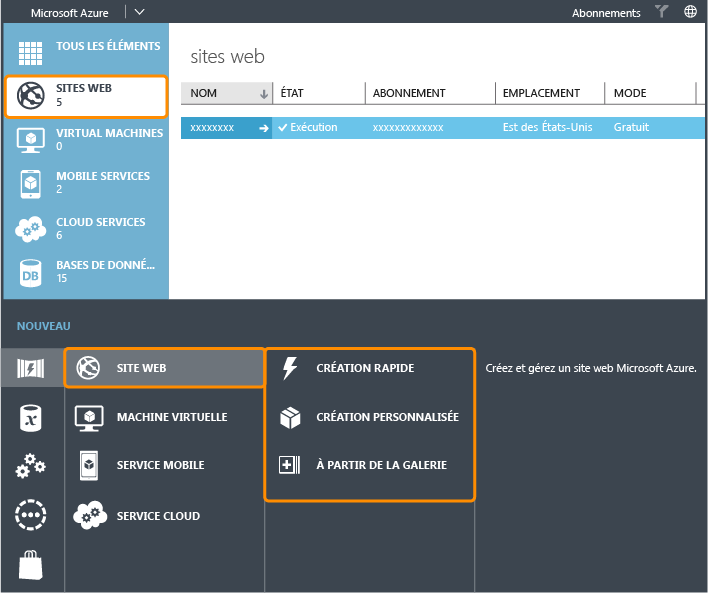
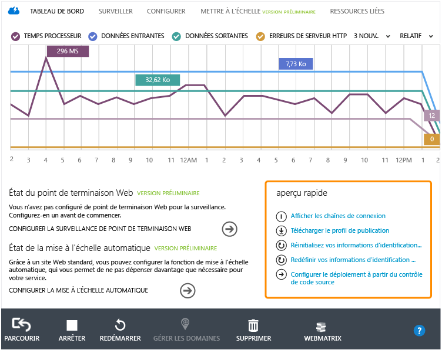
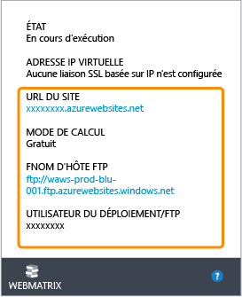
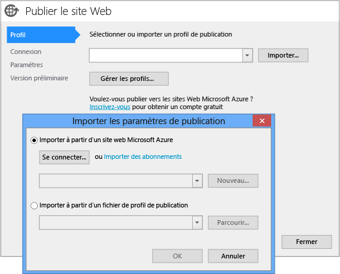
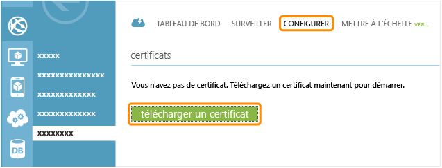
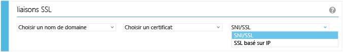
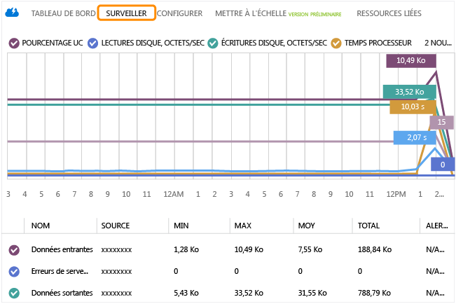
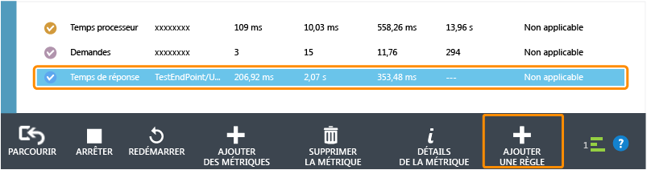
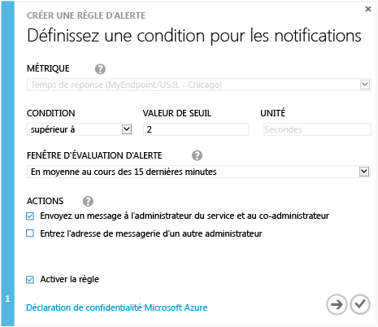

<properties linkid="websites-global-web-presence" urlDisplayName="Create a Global Web Presence on Azure Web Sites" pageTitle="Create a Global Web Presence on Azure Web Sites" metaKeywords="" description="This guide provides a technical overview of how to host your organization's (.COM) site on Azure Web Sites. This includes deployment, custom domains, SSL, and monitoring." metaCanonical="http://www.windowsazure.com/en-us/documentation/articles/web-sites-global-web-presence-solution-overview/" services="" documentationCenter="" title="Create a Global Web Presence on Azure Web Sites" authors="jroth" solutions="" manager="paulettm" editor="mollybos" />

Création d'une présence sur le Web à l'international dans Sites Web Azure
=========================================================================

Ce guide offre un aperçu technique de l'hébergement du site (.COM) de votre organisation sur Azure. Ce scénario est également nommé « présence sur le Web à l'international ». Ce guide se concentre sur l'utilisation de [Sites Web Azure](/en-us/documentation/services/web-sites/), car il s'agit du moyen le plus rapide et le plus simple de créer, de migrer, de mettre à l'échelle et de gérer une application Web sur Azure. Cependant, certaines exigences d'application se prêtent mieux à [Azure Cloud Services](/en-us/documentation/services/cloud-services/) ou à [Azure Virtual Machines](/en-us/documentation/services/virtual-machines/) exécutant IIS, qui représentent également un excellent choix pour l'hébergement d'applications Web. Si vous en êtes aux étapes de planification initiales, consultez le document [Sites Web, services cloud et machines virtuelles Azure : que choisir ?](/en-us/manage/services/web-sites/choose-web-app-service) En l'absence de nécessité de faire appel à Azure Cloud Services ou Azure Virtual Machines, nous vous recommandons de recourir à Sites Web Azure pour héberger votre présence sur le Web à l'international. La suite de ce document fournit des informations concernant l'utilisation du service Sites Web Azure avec ce scénario.

Les questions couvertes par ce guide sont les suivantes :

-   [Création d'un site Web Azure](#createwebsite)
-   [Déploiement du site Web](#deploywebsite)
-   [Ajout d'un domaine personnalisé](#customdomain)
-   [Sécurisation du site Web avec SSL](#ssl)
-   [Surveillance du site](#monitor)

**Remarque**

Ce guide présente les domaines et les tâches parmi les plus courants s'adaptant au développement de sites .COM publics. Cependant, le service Sites Web Azure offre encore d'autres fonctionnalités, que vous pouvez utiliser pour votre implémentation. Pour les découvrir, consultez également les autres guides concernant les [campagnes marketing numériques](http://www.windowsazure.com/en-us/manage/services/web-sites/digital-marketing-campaign-solution-overview) et les [applications métier](http://www.windowsazure.com/en-us/manage/services/web-sites/business-application-solution-overview).

Création d'un site Web Azure
----------------------------

À l'aide du portail de gestion Azure, vous pouvez créer un site Web Azure de plusieurs façons. En cliquant sur le bouton **Nouveau** au bas du portail, la boîte de dialogue suivante s'affiche :

Il existe trois options pour créer un site Web : **Création rapide**, **Création personnalisée** et **À partir de la galerie**. Avec chacune de ces options, vous devez sélectionner une région Azure s'adaptant à la majorité de votre base utilisateur.

Si vous migrez un site Web existant, l'option **Création personnalisée** vous permet de créer ou d'associer une base de données SQL ou MySQL. Cette option offre également la possibilité de spécifier plusieurs options de contrôle du code source pour le déploiement, telles que GitHub ou Team Foundation Server (TFS). Si vous gérez déjà votre site Web à l'aide d'un mécanisme de contrôle du code source, cette option permet de configurer rapidement votre site Web Azure pour un déploiement.

L'option **À partir de la galerie** permet de configurer un nouveau site avec l'une des nombreuses infrastructures, telles que Drupal ou WordPress, ce qui permet de configurer rapidement un nouveau site que vous pouvez ensuite personnaliser dans l'infrastructure choisie.

Comme la plupart des services d'Azure, vous devez sélectionner une région Azure pour votre nouveau site Web. Azure dispose de plusieurs régions réparties dans le monde entier. Une fois votre site Web déployé dans une région, il est accessible mondialement sur Internet. Cependant, plusieurs régions permettent d'obtenir une plus grande flexibilité. Le déploiement de sites dans les régions les plus proches des utilisateurs constitue un avantage évident.

Pour plus d'informations sur les étapes de création d'un site Web, consultez la rubrique [Création et déploiement d’un site Web](/en-us/manage/services/web-sites/how-to-create-websites/).

Déploiement du site Web
-----------------------

Il existe plusieurs façons de déployer votre site Web vers Azure. Si vous avez sélectionné une infrastructure de la galerie, vous disposez déjà d'un site de démarrage déployé. Toutefois, pour avancer, vous devez encore configurer certains types de procédures de modification et de déploiement. Les options de déploiement incluent entre autres :

-   utilisation d'un client FTP ;
-   déploiement à partir d'un contrôle de code source ;
-   publication à partir de Visual Studio ;
-   publication à partir de [WebMatrix](http://www.microsoft.com/web/webmatrix/).

Chacune de ces options présente divers points forts. La possibilité de publier à partir d'un client FTP constitue une solution simple et directe pour envoyer les nouveaux fichiers vers votre site. Cela signifie également que les outils de publication ou les processus existants s'appuyant sur FTP peuvent continuer de fonctionner avec les sites Web Azure. Le contrôle de code source offre le meilleur contrôle sur les versions de contenu de site, les modifications pouvant être suivies, publiées et restaurées à des versions antérieures si nécessaire. Les options pour publier directement depuis Visual Studio ou Web Matrix sont pratiques pour les développeurs utilisant l'un de ces outils. Un scénario utile de cette fonctionnalité intervient lors des étapes préliminaires d'un projet ou pour un prototypage. Dans les deux cas, les publications et les tests fréquents sont potentiellement plus pratiques à partir de l'environnement de développement.

La plupart des tâches de développement ici impliquent l'utilisation d'informations du portail de gestion Azure. Accédez à votre site Web, sélectionnez l'onglet **Tableau de bord**, puis cherchez la section **aperçu rapide**. La capture d'écran qui suit présente plusieurs options.

Certains outils de contrôle de code source et clients FTP nécessitent un accès par nom d'utilisateur/mot de passe. Pour un nouveau site Web, les informations d'identification ne sont pas automatiquement créées. Néanmoins, vous pouvez facilement le faire en cliquant sur **Réinitialisez vos informations d'identification de déploiement**. Lorsque vous avez terminé, vous pouvez utiliser un client FTP pour déployer votre site Web à l'aide de ces informations d'identification avec le **Nom de l'hôte FTP** sur la même page du **Tableau de bord**.

Notez que le nom d'utilisateur de déploiement/FTP correspond à une combinaison du nom de site Web et du nom d'utilisateur que vous avez fournis. Par conséquent, si votre site s'intitulait « http://contoso.azurewebsite.net » et votre nom d'utilisateur « myuser », le nom d'utilisateur du déploiement et FTP correspondra à « contoso\\myuser ».

Vous pouvez également choisir d'effectuer le déploiement via un service de gestion de contrôle de code source, tel que GitHub ou TFS Online. Cliquez sur l'option pour **configurer le déploiement à partir du contrôle de code source**. Suivez ensuite les instructions du système de contrôle de code source ou du service de votre choix. Pour obtenir des instructions pas à pas concernant la publication à partir d'un référentiel Git, consultez la rubrique [Publication à partir du contrôle de code source dans Sites Web Azure](/en-us/develop/net/common-tasks/publishing-with-git/).

Si vous prévoyez d'utiliser Visual Studio pour créer et gérer votre site, vous pouvez choisir de publier directement à partir de Visual Studio. Pour cela, il suffit de cliquer sur l'option **Télécharger le profil de publication**. Cela vous permet d'enregistrer un fichier publishsettings pouvant être importé dans Visual Studio pour une publication Web.

**Remarque**

Il est important de maintenir le fichier *publishsettings* en sécurité et hors du contrôle de code source, puisqu'il contient les noms des utilisateurs et les mots de passe, tant pour le déploiement que pour toute chaîne de connexion à une base de données liée.

Il est également possible d'importer les informations d'abonnement directement dans Visual Studio. Par exemple, imaginez un projet ASP.NET local dans Visual Studio. Cliquez avec le bouton droit sur le projet Web, puis sélectionnez **Publier**. Le bouton **Importer** de la boîte de dialogue **Publier le site Web** vous permet d'importer un fichier contenant vos paramètres d'abonnement Azure ou le fichier publishsettings que vous avez téléchargé depuis le tableau de bord des sites Web. La capture d'écran qui suit présente ces options.

Pour plus d'informations concernant la publication sur Azure à partir de Visual Studio, consultez la page Déploiement d'une application Web ASP.NET sur un site Web Azure.

WebMatrix à partir du portail de gestion Azure est une option supplémentaire pour le développement et le déploiement.

Pour plus d'informations sur cette option, consultez la page [Développement et déploiement d'un site Web avec Microsoft WebMatrix](/en-us/develop/net/tutorials/get-started/).

Bien que ces étapes vous fournissent le nécessaire pour déployer votre site .COM, vous devez créer un plan pour gérer le cycle de publication de contenu en cours. Ces options peuvent aller de regrouper une solution personnalisée, en passant par des redéploiements périodiques pour un site qui change rarement, à un système de gestion de contenu (CMS) complet. Si vous créez un site Web, notez qu'il existe des options dans la galerie permettant d'utiliser les infrastructures CMS existantes, telles que [Drupal](https://drupal.org/) ou [Umbraco](http://umbraco.com/).

Ajout d'un domaine personnalisé
-------------------------------

S'il s'agit de votre présence sur le Web à l'international, vous pouvez associer votre nom de domaine inscrit au site Web. Il existe plusieurs fournisseurs tiers offrant des services d'inscription de domaine. Chacun d'eux prend en charge la création de différents types d'enregistrements DNS pour gérer votre domaine. Un enregistrement DNS permet de mapper une URL conviviale, telle que « www.contoso.com », vers l'URL ou l'adresse IP hébergeant votre site.

**Remarque**

Dans la discussion ci-dessous, il y a deux types d'enregistrement DNS susceptibles de vous intéresser. Le premier, un enregistrement CNAME, peut rediriger une URL, telle que « www.contoso.com », vers une URL différente, telle que « contoso.azurewebsites.net ». Le second, un enregistrement A, peut mapper une URL, telle que « www.contoso.com », vers une adresse IP, telle que 172.16.48.1.

Pour les sites Web Azure, vous devez commencer par créer un enregistrement CNAME sur le site Web Azure. Ce paramètre s'effectue via le site du bureau d'enregistrement tiers. Ce qui suit est un exemple d'enregistrement CNAME.

<table cellspacing="0" border="1">
<tr>
   <th align="left" valign="top">Type</th>
   <th align="left" valign="top">Hôte</th>
   <th align="left" valign="top">Réponse</th>
   <th align="left" valign="top">TTL</th>
</tr>
<tr>
   <td valign="top"><strong>CNAME</strong></td>
   <td valign="top">www.contoso.com</td>
   <td valign="top">contoso.azurewebsites.net</td>
   <td valign="top">8000</td>
</tr>
</table>

Si votre domaine vient d'être inscrit, la résolution du domaine peut nécessiter un ou plusieurs jours sur tous les serveurs DNS, lesquels fonctionnent hors des entrées DNS en cache. Cependant, si votre domaine existe déjà, la modification de CNAME doit se produire en une minute. Notez que l'enregistrement CNAME fournit un mappage entre votre domaine (devant être nommé avec un alias de sous-domaine, tel que « www ») et l'URL de site Web Azure. Aucun côté de l'enregistrement CNAME n'inclut le préfixe « http:// ».

Dans le portail de gestion Azure, vérifiez que vous êtes en mode **Partagé** ou **Standard** dans l'onglet **Mettre à l'échelle** (les domaines personnalisés ne sont pas pris en charge pour les sites Web en mode **Gratuit**). Passez ensuite à l'onglet **Configurer** et cliquez sur le bouton **Gérer les domaines**. Cela vous permet d'associer le site Web au nom de domaine personnalisé.

Avant de placer votre domaine personnalisé dans la liste, vous devez passer par votre fournisseur DNS et créer un enregistrement CNAME de votre domaine personnalisé (www.contoso.com) pointant sur l'URL de votre site Web Azure (contoso.azurewebsites.net). Après cette propagation, vous pouvez entrer le domaine personnalisé dans la boîte de dialogue présentée dans la capture d'écran précédente. La présence de l'enregistrement CNAME pour www.contoso.com, pointant sur ce site Web, garantit que vous disposez de l'autorité pour utiliser ce nom de domaine avec ce site Web. À présent, vous pouvez créer un enregistrement A avec l'adresse IP en bas de la boîte de dialogue.

<table cellspacing="0" border="1">
<tr>
   <th align="left" valign="top">Type</th>
   <th align="left" valign="top">Hôte</th>
   <th align="left" valign="top">Réponse</th>
   <th align="left" valign="top">TTL</th>
</tr>
<tr>
   <td valign="top"><strong>A</strong></td>
   <td valign="top">contoso.com</td>
   <td valign="top">172.16.48.1</td>
   <td valign="top">8000</td>
</tr>
</table>

Pour plus d’informations, consultez la page [Configuration d’un nom de domaine personnalisé pour un site Web Azure](/en-us/develop/net/common-tasks/custom-dns-web-site/).

Sécurisation du site Web avec SSL
---------------------------------

Si votre site contient des informations en lecture seule, il est inutile de fournir un accès sécurisé au site. Néanmoins, si vous collectez des informations d'utilisateur, effectuez un commerce électronique ou gérez d'autres données sensibles, vous devez sécuriser le site. La sécurité est un sujet important, et ce document ne peut pas traiter l'ensemble des meilleures pratiques et techniques. Cependant, il est essentiel de mettre en lumière le processus d'activation de chiffrement de données (SSL) de votre site Web. Le chiffrement de données (SSL) permet aux utilisateurs de se connecter à votre site d'une façon chiffrée avec des adresses HTTPS et non HTTP. Il existe des étapes spécifiques requises pour utiliser SSL avec les sites Web Azure.

Le service Sites Web Azure fournit automatiquement une connexion sécurisée à l'URL de site réelle. Par exemple, si votre site correspondait à http://contoso.azurewebsites.net, vous pouvez vous connecter sur SSL simplement en remplaçant « http » par « https », tel que dans **https**://contoso.azurewebsites.net.

Toutefois, si vous utilisez un nom de domaine personnalisé, vous devez télécharger un certificat et activer SSL via le portail de gestion Azure pour votre site Web. Les étapes suivantes présentent un résumé de ce processus, mais vous pouvez obtenir des instructions détaillées dans la rubrique [Configuration d'un certificat SSL pour un site Web Azure](/en-us/develop/net/common-tasks/enable-ssl-web-site/).

Tout d'abord, obtenez un certificat SSL d'une autorité de certification. Si vous envisagez de sécuriser votre domaine avec plusieurs sous-domaines (par exemple www.contoso.com et staging.contoso.com), vous devez obtenir un certificat avec caractères génériques (\*.contoso.com). Le coût risquant d'être plus élevé, vous devez décider si la flexibilité de ce type de certificat le justifie.

Dès que vous avez obtenu le certificat de l'autorité de certification, vous ne pouvez pas simplement le télécharger sur Azure au même format. Vous devez générer un fichier .pfx à l'aide de la commande openssl qui fait partie du projet OpenSSL. Les sources sont distribuées sur le [site Web OpenSSL](http://www.openssl.org/), mais vous pouvez, en règle générale, également trouver une version précompilée de l'outil sur Internet. Dans l'exemple suivant, le certificat myserver.crt et le fichier de clé privée myserver.key sont utilisés pour créer un fichier .pfx.

    openssl pkcs12 -export -out myserver.pfx -inkey myserver.key -in myserver.crt

Pour télécharger le certificat sur Azure, accédez d'abord à l'onglet **Mettre à l'échelle** et vérifiez que vous êtes en mode **Standard**. SSL pour les domaines personnalisés n'est pas pris en charge pour les modes **Gratuit** ou **Partagé**. Dans l'onglet **Configurer**, cliquez sur le bouton **télécharger un certificat**.

Ensuite, dans la section **liaisons ssl**, mappez le certificat au nom de domaine qu'il sécurise. Il existe deux options pour ce mappage : SSL SNI et SSL basé IP.

L'option **SSL basé IP** est la façon classique de mapper l'adresse IP publique dédiée au nom de domaine. Cela fonctionne avec tous les navigateurs. L'option **SSL SNI** permet à plusieurs domaines de partager la même adresse IP, tout en ayant différents certificats SSL associés à chaque domaine. SSL SNI ne fonctionne pas avec certains navigateurs plus anciens (pour plus d'informations concernant la compatibilité, consultez l'[article de Wikipédia sur SNI SNI](http://en.wikipedia.org/wiki/Server_Name_Indication)). Une facturation mensuelle (au prorata des heures) est associée à chaque certificat SSL, et la tarification varie en fonction du choix du SSL basé IP ou SNI. Pour plus d'informations sur la tarification, consultez la page [Tarification – Sites Web](/en-us/pricing/details/web-sites/#service-ssl). Pour plus d'informations concernant ce processus, consultez la page [Configuration d'un certificat SSL pour un site Web Azure](/en-us/develop/net/common-tasks/enable-ssl-web-site/).

Surveillance du site
--------------------

Une fois que votre site traite activement les requêtes utilisateur, il est important de recourir à une surveillance. Par exemple, vous souhaitez savoir si une charge utilisateur provoque un temps processeur élevé, indiquant probablement la nécessité de mettre à l'échelle le site. Ou bien l'inefficacité d'une application peut augmenter le temps de réponse ou entraîner des erreurs. Cette section présente certaines possibilités de surveillance intégrées au portail de gestion Azure.

L'onglet **Surveillance** contient certaines mesures essentielles de votre site Web sous un format graphique.

Vous pouvez personnaliser les mesures de ce graphique à l'aide du bouton Ajouter des mesures.

Pour les sites s'exécutant en mode **Standard**, vous pouvez également activer une surveillance et des alertes au point de terminaison. Dans l'onglet **Configurer**, passez à la section **surveillance**, puis configurez le point de terminaison. Ce dernier s'exécute à partir d'un ou plusieurs emplacements que vous spécifiez et qui essaie régulièrement d'accéder à votre site Web. Les informations de temps et d'erreurs sont collectées.

Dans l'onglet **Surveillance**, ce point de terminaison apparaît indiquant le temps de réponse. Si vous sélectionnez la mesure de point de terminaison, vous pouvez alors ajouter une règle d'alerte en cliquant sur l'icône **Ajouter une règle**.

La règle peut correspondre à l'envoi d'une notification par courrier électronique aux administrateurs ou à d'autres intervenants lorsque le temps de réponse dépasse le seuil spécifié.

S'il s'avère que le site nécessite une mise à l'échelle, vous pouvez l'effectuer à l'aide de l'onglet **Mettre à l'échelle** manuellement ou via la version préliminaire de la mise à l'échelle automatique. Cet onglet offre la possibilité d'augmenter l'échelle (machines dédiées plus volumineuses) ou de la diminuer (instances partagées supplémentaires ou instances dédiées de même taille). Cependant, la version préliminaire de la mise à l'échelle automatique ne prend en charge que la montée en charge. Pour plus d'informations sur la surveillance des sites Web, consultez la section « Évolution en fonction de la demande » du scénario [Campagnes marketing numériques](/en-us/manage/services/web-sites/digital-marketing-campaign-solution-overview). Consultez également la page [Surveillance de sites Web](/en-us/manage/services/web-sites/how-to-monitor-websites/).

Résumé
------

Pour créer le site (.COM) de votre organisation, les tâches standard incluent le choix d'une infrastructure de développement, la création du site, le déploiement, l'affectation d'un domaine personnalisé et la surveillance. Pour les sites nécessitant de sécuriser les données utilisateur, SSL est fortement recommandé. Cet article a présenté un aperçu des tâches à effectuer lors de l'utilisation du service Sites Web Azure. Pour plus d’informations, consultez les articles techniques suivants référencés dans le document.

<table data-morhtml="true" cellspacing="0" border="1">
<tr data-morhtml="true">
   <th data-morhtml="true" align="left" valign="top">Domaine</th>
   <th data-morhtml="true" align="left" valign="top">Ressources</th>
</tr>
<tr data-morhtml="true">
   <td data-morhtml="true" valign="middle"><strong data-morhtml="true">Planification</strong></td>
   <td data-morhtml="true" valign="top">- <a data-morhtml="true" href="http://www.windowsazure.com/en-us/manage/services/web-sites/choose-web-app-service">Sites Web, services cloud et machines virtuelles Azure&nbsp;: que choisir&nbsp;?</a></td>
</tr>
<tr data-morhtml="true">
   <td data-morhtml="true" valign="middle"><strong data-morhtml="true">Cr&eacute;ation</strong></td>
   <td data-morhtml="true" valign="top">- <a data-morhtml="true" href="http://www.windowsazure.com/en-us/manage/services/web-sites/how-to-create-websites/">Cr&eacute;ation et d&eacute;ploiement d'un site Web</a></td>
</tr>
<tr data-morhtml="true">
   <td data-morhtml="true" valign="middle"><strong data-morhtml="true">D&eacute;ploiement</strong></td>
   <td data-morhtml="true" valign="top">- <a data-morhtml="true" href="http://www.windowsazure.com/en-us/develop/net/common-tasks/publishing-with-git/">Publication &agrave; partir du contr&ocirc;le de code source dans Sites Web Azure</a> - <a data-morhtml="true" href="http://www.windowsazure.com/en-us/develop/net/tutorials/get-started/">D&eacute;ploiement d'une application Web ASP.NET sur un site Web Azure</a> - <a data-morhtml="true" href="http://www.windowsazure.com/en-us/develop/net/tutorials/website-with-webmatrix/">D&eacute;veloppement et d&eacute;ploiement d'un site Web avec Microsoft WebMatrix</a></td>
</tr>
<tr data-morhtml="true">
   <td data-morhtml="true" valign="middle"><strong data-morhtml="true">Domaines personnalis&eacute;</strong></td>
   <td data-morhtml="true" valign="top">- <a data-morhtml="true" href="http://www.windowsazure.com/en-us/develop/net/common-tasks/custom-dns-web-site/">Configuration d&rsquo;un nom de domaine personnalis&eacute; pour un site&nbsp;Web Azure</a></td>
</tr>
<tr data-morhtml="true">
   <td data-morhtml="true" valign="middle"><strong data-morhtml="true">SSL</strong></td>
   <td data-morhtml="true" valign="top">- <a data-morhtml="true" href="http://www.windowsazure.com/en-us/develop/net/common-tasks/enable-ssl-web-site/">Configuration d'un certificat&nbsp;SSL pour un site&nbsp;Web Azure</a></td>
</tr>
<tr data-morhtml="true">
   <td data-morhtml="true" valign="middle"><strong data-morhtml="true">Surveillance</strong></td>
   <td data-morhtml="true" valign="top">- <a data-morhtml="true" href="http://www.windowsazure.com/en-us/manage/services/web-sites/how-to-monitor-websites/">Surveillance de sites Web</a></td>
</tr>
</table>

