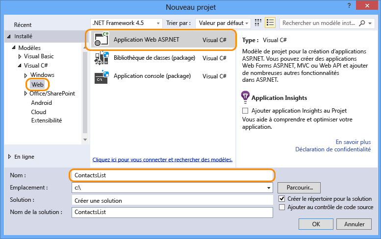
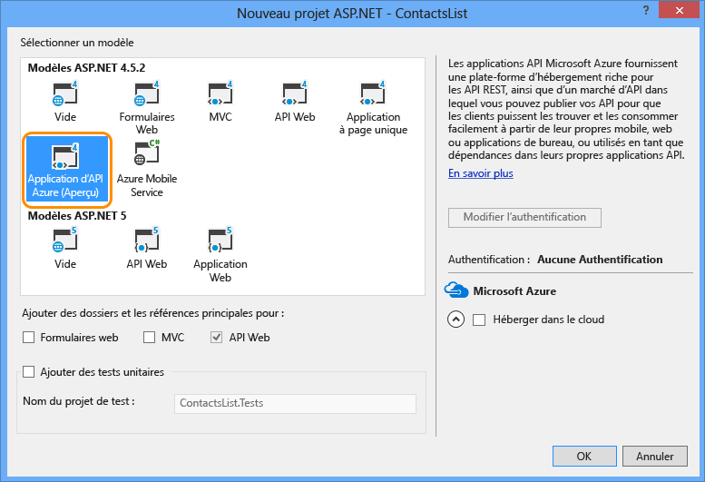

1. Ouvrez Visual Studio 2015 ou Visual Studio 2013.
2. Sélectionnez **Fichier > Nouveau > Projet**.
3. Sélectionnez le modèle **Application web ASP.NET**.
4. Vérifiez que la case à cocher **Ajouter Application Insights au projet** est désactivée.
5. Entrez un nom pour le projet.
   
    
6. Cliquez sur **OK**.
7. Dans la boîte de dialogue **Nouveau projet ASP.NET**, sélectionnez le modèle de projet **Application API Azure**.
   
    
8. Cliquez sur **OK** pour créer le projet.

Visual Studio crée un projet d’API web configuré pour le déploiement sous forme d’application API.

<!---HONumber=Oct15_HO3-->