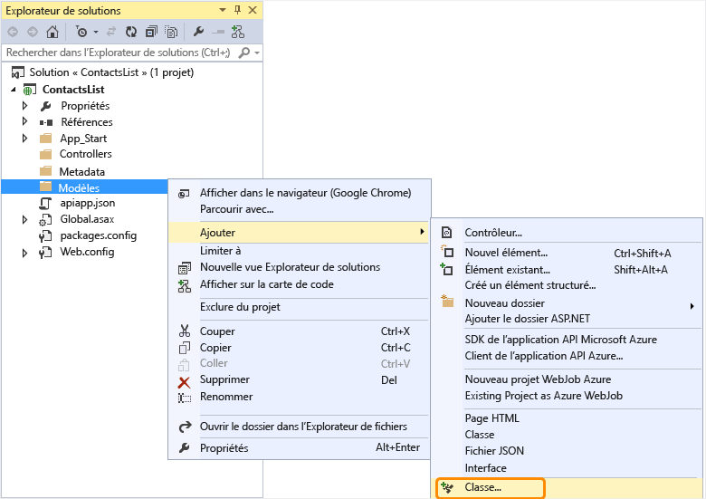
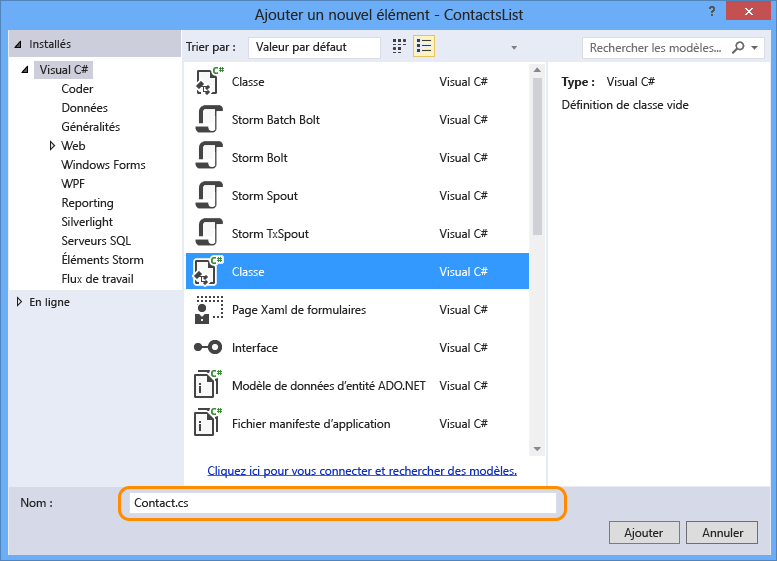
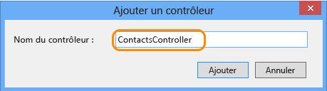

## Ajouter le code de l’API web

Dans les étapes suivantes, vous ajoutez du code pour une méthode HTTP Get simple qui retourne une liste codée de contacts codée en dur.

1. Dans l’Explorateur de solutions, cliquez avec le bouton droit sur le dossier **Modèles**, puis sélectionnez **Ajouter -> Classe**. 

	

2. Nommez le nouveau fichier *Contact.cs*.

	

3. Cliquez sur **Ajouter**.

4. Une fois le fichier *Contact.cs* créé, remplacez tout son contenu par le code suivant.

		namespace ContactsList.Models
		{
			public class Contact
			{
				public int Id { get; set; }
				public string Name { get; set; }
				public string EmailAddress { get; set; }
			}
		}

5. Cliquez avec le bouton droit sur le dossier **Contrôleurs** et sélectionnez **Ajouter > Contrôleur**.

	

6. Dans la boîte de dialogue **Ajouter une génération de modèles automatique**, sélectionnez l’option **Contrôleur d’API web 2 - Vide** et cliquez sur **Ajouter**.

	

7. Nommez le contrôleur **ContactsController** et cliquez sur **Ajouter**.

	

8. Une fois le fichier ContactsController.cs créé, remplacez tout son contenu par le code suivant.

		using ContactsList.Models;
		using System;
		using System.Collections.Generic;
		using System.Linq;
		using System.Net;
		using System.Net.Http;
		using System.Threading.Tasks;
		using System.Web.Http;
		
		namespace ContactsList.Controllers
		{
		    public class ContactsController : ApiController
		    {
		        [HttpGet]
		        public IEnumerable<Contact> Get()
		        {
		            return new Contact[]{
						new Contact { Id = 1, EmailAddress = "barney@contoso.com", Name = "Barney Poland"},
						new Contact { Id = 2, EmailAddress = "lacy@contoso.com", Name = "Lacy Barrera"},
	                	new Contact { Id = 3, EmailAddress = "lora@microsoft.com", Name = "Lora Riggs"}
		            };
		        }
		    }
		}

## Activer l’interface utilisateur Swagger

Par défaut, les projets d’application API sont activés avec la génération automatique des métadonnées [Swagger](http://swagger.io/ "Informations officielles relatives à Swagger"), et si vous avez utilisé le menu **Kit de développement logiciel (SDK) d’application API Azure** pour convertir un projet d’API web, une page de test de l’API est également activée par défaut.

Toutefois, le modèle de nouveau projet d’application API Azure désactive la page de test API. Si vous avez créé votre projet d’application API en utilisant le modèle de projet d’application API, vous devez effectuer les étapes suivantes pour activer la page de test.

**Remarque :** si vous déployez l'application API en tant qu'application *publique anonyme* et que l'interface utilisateur Swagger est activée, toute personne sera en mesure d'utiliser cette interface pour découvrir et appeler vos API.

1. Ouvrez le fichier *App\_Start/SwaggerConfig.cs* et recherchez **EnableSwaggerUI** :

	

2. Annulez les marques de commentaire sur les lignes de code suivantes :

	        })
	    .EnableSwaggerUi(c =>
	        {

3. Lorsque vous avez terminé, le fichier doit ressembler à ceci :

	

## Tester l’API web

Pour afficher la page de test des API, procédez comme suit.

1. Exécutez l’application localement (Ctrl+F5) et accédez à `/swagger`. 

	

2. Cliquez sur le bouton **Essayer**. Vous constatez que l’API fonctionne et retourne le résultat attendu.

	

<!---HONumber=August15_HO6-->