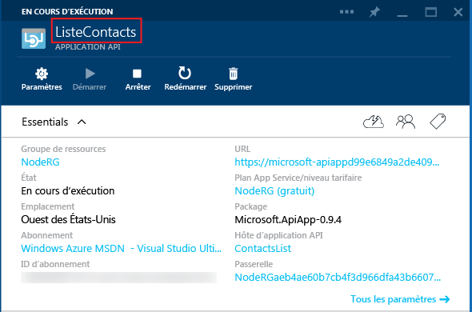
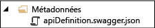

## Métadonnées d’une application API
Cette section fournit des informations supplémentaires sur les métadonnées des applications API que vous pouvez personnaliser.

La plupart des propriétés du fichier *apiapp.json*, ainsi que les fichiers du dossier *Metadata*, affectent la façon dont le package d’application API est présenté dans Azure Marketplace. Les sections suivantes expliquent quelles propriétés et quels fichiers affectent les applications API quand vous déployez votre code directement dans une application API de votre abonnement Azure.

### ID d’application API
La propriété `id` détermine le nom de l’application API. Par exemple :

        "id": "ContactsList",

### Espace de noms
Définissez la propriété `namespace` avec le domaine de votre client Azure Active Directory. Pour rechercher votre domaine, ouvrez votre navigateur sur le [portail classique Azure](https://manage.windowsazure.com/), accédez à **Active Directory**, puis sélectionnez l’onglet **Domaines**. Par exemple :

        "namespace": "contoso.onmicrosoft.com",

### Définition d’API Swagger dynamique
Si l’application API peut renvoyer une définition d’API [Swagger](http://swagger.io/) dynamique, stockez l’URL relative d’une requête GET qui renvoie le JSON de la définition d’API dans la propriété `endpoints.apiDefinition`. Par exemple :

        "endpoints": {
            "apiDefinition": "/swagger/docs/v1"
        }

> **Remarque :** si vous utilisez Swashbuckle pour générer une définition API Swagger, les surcharges de la méthode HTTP provoquées dans vos contrôleurs API Web donneront lieu à la création de doublons dans les ID d’opération. Pour plus d’informations, consultez l’article [Personnalisation des identificateurs d’opération générés avec Swashbuckle](../articles/app-service-api/app-service-api-dotnet-swashbuckle-customize.md).
> 
> 

### Définition d’une API Swagger statique
Pour fournir un fichier de définition d’API [Swagger](http://swagger.io/) 2.0 statique, stockez le fichier dans le dossier *Metadata* et nommez le fichier *apiDefinition.swagger.json*

Laissez `endpoints.apiDefinition` en dehors du fichier *apiapp.json* ou définissez sa valeur à null. Si vous incluez à la fois une URL `endpoints.apiDefinition` et un fichier *apiDefinition.swagger.json*, l’URL sera prioritaire et le fichier sera ignoré.

<!---HONumber=Oct15_HO3-->