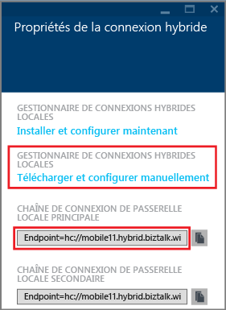
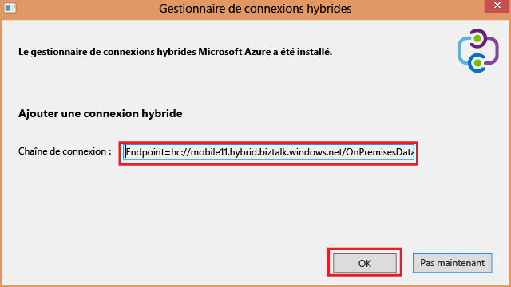
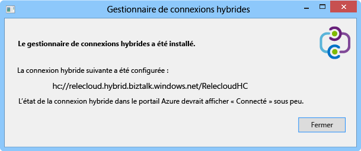
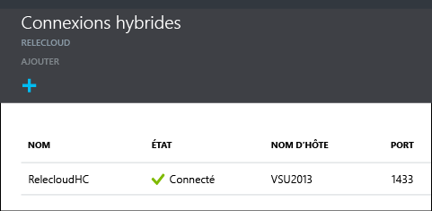

1. Dans le panneau **Connexions hybrides**, cliquez sur la connexion hybride que vous avez créée, puis sur **Configuration de l’écouteur**.
   
    
2. Le volet **Propriétés de la connexion hybride** s'ouvre. Sous **Gestionnaire de connexions hybrides locales**, choisissez **télécharger et configurer manuellement**, enregistrez le package HybridConnectionManager.msi téléchargé, puis copiez la chaîne de connexion de la passerelle.
   
    
3. À partir d'une invite de commandes administrateur, tapez la commande suivante pour démarrer le programme d'installation :
   
        start HybridConnectionManager.msi
4. Une fois le programme d’installation lancé, cliquez sur **Pas maintenant**, accédez au dossier %ProgramFiles%\Microsoft\HybridConnectionManager, exécutez HCMConfigWizard.exe, puis cliquez sur **Oui** dans la boîte de dialogue **Contrôle de compte d’utilisateur**.
5. Collez la chaîne de connexion hybride copiée précédemment, puis cliquez sur **OK**. 
   
    
6. Une fois l'installation terminée, cliquez sur **Fermer**.
   
    
   
    Dans le panneau **Connexions hybrides**, la colonne **Statut** indique à présent **Connecté**. 
   
    

