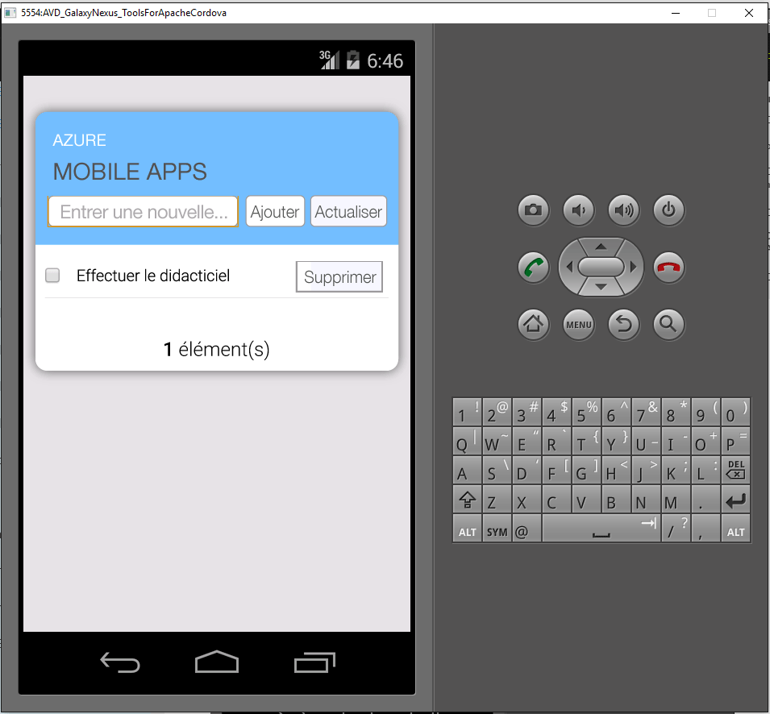

1. Visitez le [portail Azure]. Cliquez sur **Parcourir tout** > **Applications mobiles** > serveur principal que vous venez de créer. Dans les paramètres de l’application mobile, cliquez sur **Démarrage rapide** > **Cordova**. Sous **Configurer votre application client**, sélectionnez **Création d'une application**, puis cliquez sur **Télécharger**. Un projet Cordova complet pour une application préconfigurée pour se connecter à votre serveur principal est téléchargé.

2. Décompressez le fichier ZIP téléchargé dans un répertoire sur votre disque dur, accédez au fichier de solution (.sln) et ouvrez-le à l’aide de Visual Studio.

5. Dans Visual Studio, choisissez la plateforme de solution (Android, iOS ou Windows) dans la liste déroulante située à côté de la flèche. Ensuite, sélectionnez un émulateur ou un périphérique de déploiement spécifique en cliquant sur le menu déroulant, sur la flèche verte. Notez que vous pouvez utiliser la plateforme Android par défaut et l’émulateur Ripple. Certains didacticiels plus avancés vous demanderont de sélectionner un émulateur ou un périphérique pris en charge.

6. Appuyez sur F5 ou cliquez sur la flèche verte pour générer et exécuter votre application Cordova. Si vous voyez apparaître dans l’émulateur une boîte de dialogue de sécurité demandant l’accès au réseau, acceptez.

7. Après le démarrage de l’application sur le périphérique ou l’émulateur, tapez un texte cohérent dans **Enter new text** (Entrer un nouveau texte), tel que _Suivre le didacticiel_, puis cliquez sur le bouton **Ajouter**. Cette action envoie une requête POST au serveur principal Azure déployé précédemment. Le backend insère les données de la requête dans la table SQL TodoItem et renvoie des informations sur les éléments récemment stockés à l’application mobile. L’application mobile affiche ces données dans la liste.

    
    
8. Répétez les trois étapes précédentes pour chaque plateforme de périphérique que vous prévoyez de prendre en charge.

[portail Azure]: https://portal.azure.com/

<!---HONumber=AcomDC_0817_2016-->