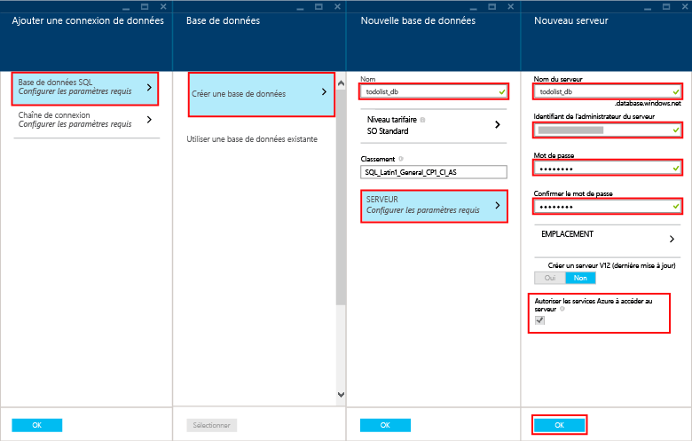

Pour créer une application mobile, procédez comme suit :

1. Connectez-vous au [portail Azure]. En bas à gauche de la fenêtre, cliquez sur **+NOUVEAU**. Faites défiler la page, jusqu'à ce que l'élément **Application mobile** s'affiche.

    

    Ce faisant, le panneau **Nouvelle application mobile** s'affiche.

2. Tapez le nom de votre application mobile. Il doit contenir au moins 8 lettres minuscules de a à z.

7. Sélectionnez une région. Dans ce didacticiel, nous utilisons **Sud-Centre des États-Unis**.

    > [AZURE.NOTE]Dans ce didacticiel, vous créez une instance et un serveur de base de données SQL. Vous pouvez réutiliser cette nouvelle base de données et la gérer comme une autre instance de base de données SQL. Si vous disposez déjà d'une base de données dans la même région que le serveur principal de la nouvelle application mobile, vous pouvez alors choisir **Utiliser la base de données existante** et sélectionner cette base de données. À cause des coûts supplémentaires liés à la bande passante et en raison des latences élevées, il est déconseillé d'utiliser une base de données dans une autre région.

3. Sélectionnez votre abonnement.

4. Créez un groupe de ressources portant le même nom que votre application mobile.

5. Dans **Paramètres de package**, sélectionnez **USERDATABASE** ; vous pouvez choisir une base de données existante ou en créer une. Pour créer une base de données, tapez le nom de la nouvelle **base de données**, créez un **serveur**, tapez le nom de ce serveur, puis choisissez un **nom de connexion**, qui correspond au nom de connexion de l'administrateur du nouveau serveur de base de données SQL, tapez et confirmez le mot de passe, puis cliquez sur le bouton OK pour terminer la procédure. Si vous sélectionnez une base de données existante, vous devez fournir un **mot de passe d'administrateur du serveur**.

    

6. Créez un plan d'hébergement web portant le même nom que votre application mobile.

    > [AZURE.NOTE]Tapez le nom du plan d'hébergement web sans le copier/coller. Si vous ne le tapez pas, la validation du nom dans ce champ est en échec. Le nom n'est pas tenu d'être exactement le même que celui du site web (mais il doit suivre les mêmes règles).

8. Sélectionnez un niveau de tarification. Dans ce didacticiel, nous utilisons le niveau **Standard 1**.

    À présent, la page des paramètres de votre nouvelle application mobile ressemble à ceci :

    

9. Cliquez sur le bouton **Créer** au bas du panneau. Le déploiement doit commencer et apparaître dans la fenêtre de notifications.

Vous avez créé un serveur principal d'applications mobiles, qui peut être utilisé par vos applications mobiles.

> [AZURE.NOTE]Après avoir créé votre application mobile, accédez au portail du serveur SQL que vous venez de créer (veillez à sélectionner le serveur et pas la base de données SQL Azure). À partir de là, cliquez sur l'élément Paramètres, développez l'élément Pare-feu, puis modifiez « Autoriser l'accès aux services Azure ». Si vous ne procédez pas ainsi, votre application ne fonctionnera pas.

<!-- URLs. -->
[portail Azure]: https://portal.azure.com/

<!---HONumber=August15_HO6-->