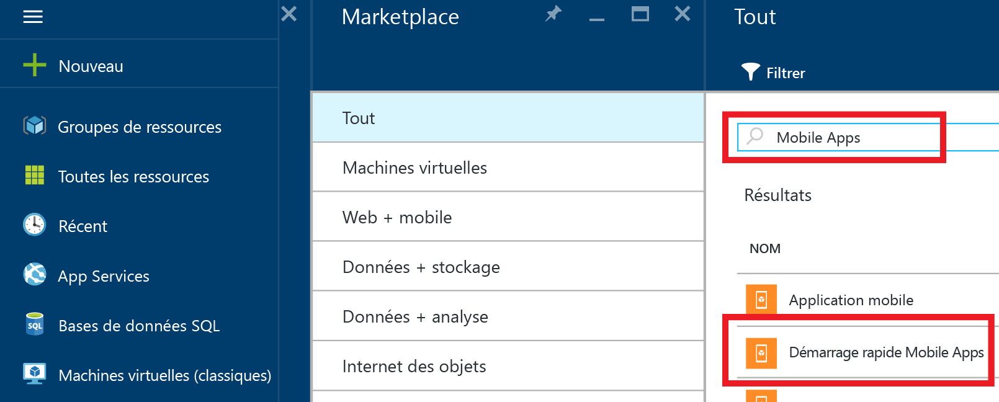

1. Connectez-vous au [Portail Azure].

2. Cliquez sur **+NOUVEAU** et saisissez **Mobile Apps** dans _Rechercher sur le Marketplace_. Sélectionnez **Démarrage rapide Mobile Apps**, puis cliquez sur **Créer**.

	

3. Pour **Groupe de ressources**, sélectionnez un groupe de ressources existant ou créez-en un (en utilisant le même nom que votre application).
 
4. Cliquez sur **Create**. Patientez quelques minutes jusqu’au déploiement du service, puis continuez.

<!-- URLs. -->
[Portail Azure]: https://portal.azure.com/

<!-------HONumber=AcomDC_0803_2016-->