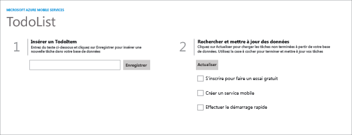

Voici les captures d’écran générées à partir de l’application terminée :

  Application Windows Store

  Application Windows Phone Store

Vous devez suivre ce didacticiel avant de pouvoir suivre tous les autres didacticiels Mobile App pour les applications du Windows Store et du Windows Phone Store.

<!----HONumber=Nov15_HO1-->