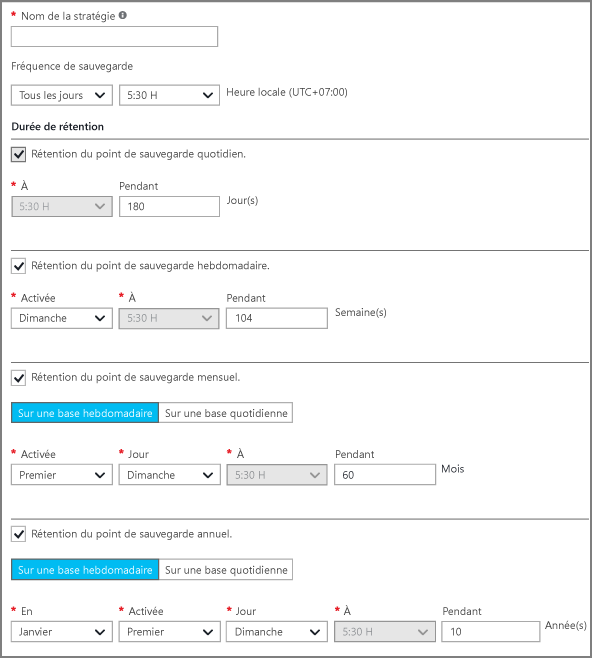
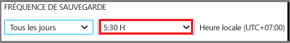
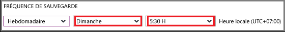

## Définition d’une stratégie de sauvegarde

Une stratégie de sauvegarde définit quand les instantanés de données sont pris ainsi que leur durée de conservation. Lors de la définition de la stratégie de sauvegarde d’une machine virtuelle, vous pouvez déclencher un travail de sauvegarde *une fois par jour*. Lorsque vous créez une stratégie, elle est appliquée à l’archivage. L'interface de la stratégie de sauvegarde ressemble à ceci :

Pour créer une stratégie :

1. Entrez un nom dans **Nom de la stratégie**.

2. Les instantanés de vos données peuvent être pris à intervalles quotidiens ou hebdomadaires. Utilisez le menu déroulant **Fréquence de sauvegarde** pour déterminer la fréquence de prise des instantanés de données (tous les jours ou toutes les semaines).

    - Si vous choisissez un intervalle quotidien, utilisez le contrôle en surbrillance pour sélectionner l'heure du jour à laquelle prendre l'instantané. Pour modifier l'heure, désélectionnez-la et choisissez-en une autre.

      

    - Si vous choisissez un intervalle hebdomadaire, utilisez les contrôles en surbrillance pour sélectionner le(s) jour(s) de la semaine et l’heure auxquels prendre l’instantané. Dans le menu du jour, sélectionnez un ou plusieurs jours. Dans le menu de l'heure, sélectionnez une heure. Pour modifier l'heure, désélectionnez-la et choisissez-en une autre.

    

3. Par défaut, toutes les options **Durée de rétention** sont sélectionnées. Désactivez la limite de plage de rétention que vous ne souhaitez pas utiliser. Ensuite, spécifiez le ou les intervalles à utiliser.

    Les durées de rétention mensuelle et annuelle vous permettent de prendre des instantanés selon un intervalle hebdomadaire ou quotidien.

    >[AZURE.NOTE] Lorsque vous protégez un ordinateur virtuel, un travail de sauvegarde s'exécute une fois par jour. L'heure d'exécution de la sauvegarde est le même pour chaque plage de rétention.

4. Après avoir défini toutes les options de la stratégie, cliquez sur **Enregistrer** en haut du panneau.

    La nouvelle stratégie est appliquée immédiatement au coffre.

<!---HONumber=AcomDC_0608_2016-->