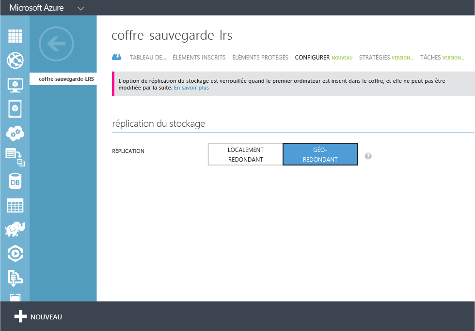
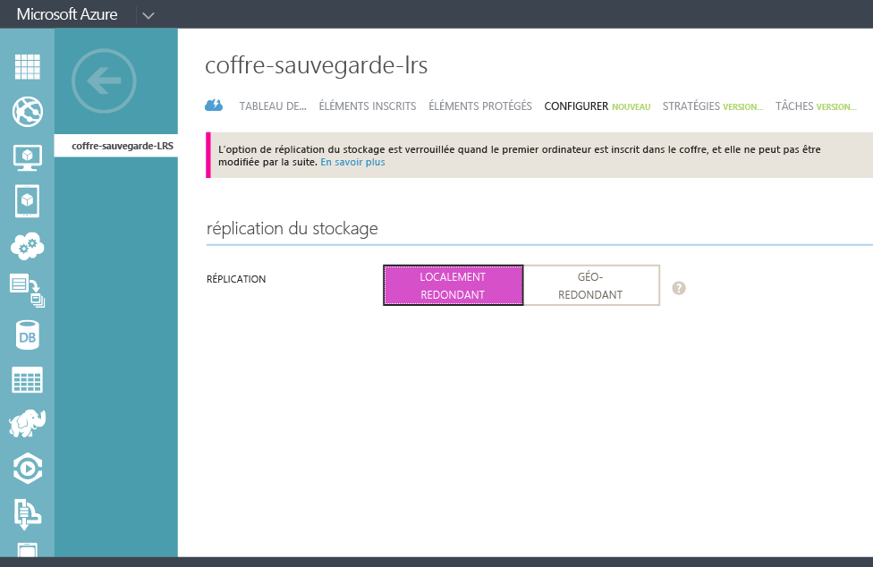

## Créer un archivage de sauvegarde
Pour sauvegarder des fichiers et données à partir de Windows Server ou de Data Protection Manager (DPM) dans Azure ou lors de la sauvegarde de machines virtuelles IaaS dans Azure, vous devez créer un archivage de sauvegarde dans la région géographique où vous voulez stocker les données.

La procédure suivante vous guidera tout au long de la création du coffre utilisé pour stocker des sauvegardes.

1. Connectez-vous au [portail de gestion](https://manage.windowsazure.com/)
2. Cliquez sur **Nouveau** > **Services de données** > **Recovery Services** > **Coffre de sauvegarde**, puis sélectionnez **Création rapide**.
   
    
3. Pour le paramètre **Nom** , entrez un nom convivial permettant d’identifier l’archivage de sauvegarde. Cette opération doit être unique pour chaque abonnement.
4. Pour le paramètre **Région** , sélectionnez la région géographique de l’archivage de sauvegarde. Le choix détermine la zone géographique vers laquelle vos données de sauvegarde sont envoyées. En choisissant une zone géographique proche de votre emplacement, vous pouvez réduire la latence du réseau lors de la sauvegarde dans Azure.
5. Cliquez sur **Créer un archivage** pour terminer le flux de travail. La création du coffre de sauvegarde peut prendre du temps. Pour vérifier l’état d’avancement de l’opération, vous pouvez contrôler les notifications au bas du portail.
   
    
6. Après avoir créé l’archivage de sauvegarde, un message vous indique que le coffre a été créé. Le coffre est également répertorié dans les ressources Recovery Services en tant que **Actif**.
   
    

### Azure Backup - Options de redondance de stockage
> [!IMPORTANT]
> Idéalement, vous identifiez votre option de redondance de stockage juste après la création de l’archivage et avant l’inscription d’un ordinateur dans l’archivage. Une fois qu’un élément a été inscrit dans l’archivage, l’option de redondance de stockage est verrouillée et ne peut pas être modifiée.
> 
> 

Déterminez la redondance du stockage Azure Backup principal en fonction des besoins de votre entreprise. Si vous utilisez Azure en tant que point de terminaison de stockage de sauvegarde principal (par exemple, vous sauvegardez vos données dans Azure à partir de Windows Server), choisissez l’option de stockage géo-redondant (par défaut). Elle se trouve sous l’option **Configurer** de votre coffre de sauvegarde.

#### Stockage géo-redondant (GRS).
Le stockage GRS effectue six copies de vos données. Avec le stockage GRS, vos données sont répliquées trois fois dans la région primaire et trois fois dans une région secondaire située à des centaines de kilomètres de la région primaire, ce qui confère aux données le plus haut niveau de durabilité disponible. En cas de défaillance au niveau de la région principale, en stockant les données dans GRS, Azure Backup garantit que vos données sont conservées dans deux régions distinctes.

#### Stockage localement redondant (LRS)
Le stockage localement redondant (LRS) effectue trois copies de vos données. Le stockage LRS est répliqué trois fois par installation et par région. Ce stockage protège vos données des défaillances matérielles normales, mais pas de la défaillance de l’intégralité d’une installation Azure.

Si vous utilisez Azure comme point de terminaison de stockage de sauvegarde tertiaire (par exemple, vous utilisez SCDPM pour disposer d’une copie de sauvegarde localement et utilisez Azure pour vos besoins de rétention à long terme), choisissez le stockage localement redondant sous l’option **Configurer** de votre archivage de sauvegarde. Cela vous permet de diminuer les coûts de stockage de données dans Azure tout en fournissant un niveau inférieur de durabilité de vos données pouvant être acceptables pour des copies tertiaires.

<!--HONumber=Nov16_HO3-->

