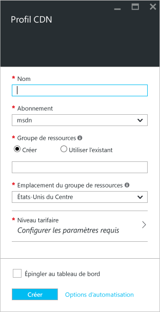
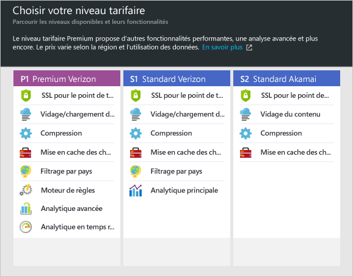

**Pour créer un profil CDN**

1. Dans le [portail Azure](https://portal.azure.com), cliquez sur **Nouveau** dans l’angle supérieur gauche. Dans le panneau **Nouveau**, sélectionnez **Médias + CDN**, puis **CDN**.

    Le panneau du nouveau profil CDN s'affiche.

    

2. Entrez un nom pour votre profil CDN.

3. Sélectionnez un **emplacement**. Il s'agit de l'emplacement Azure où seront stockées les informations de votre profil CDN. Cela n'a aucun impact sur les emplacements de point de terminaison CDN.

4. Sélectionnez ou créez un **groupe de ressources**. Pour plus d’informations sur les groupes de ressources, consultez [Vue d’ensemble d’Azure Resource Manager](resource-group-overview.md#resource-groups).

5. Sélectionner un **niveau de tarification**. Consultez la [Vue d’ensemble du réseau de distribution de contenu (CDN) Azure](cdn-overview.md#azure-cdn-features) pour obtenir une comparaison des niveaux de tarification.
    
    

6. Sélectionnez l’**abonnement** pour ce profil CDN.

7. Cliquez sur le bouton **Créer** pour créer le profil.

<!---HONumber=AcomDC_0706_2016-->