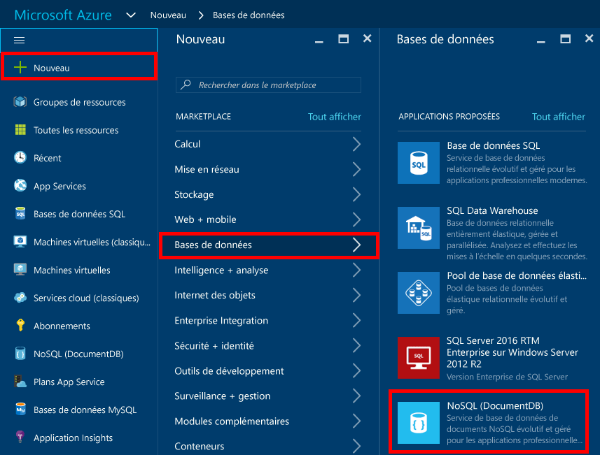
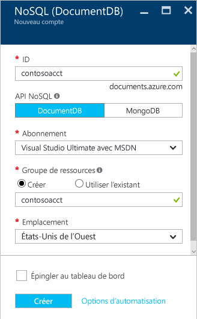
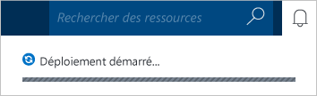
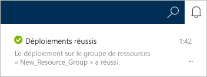
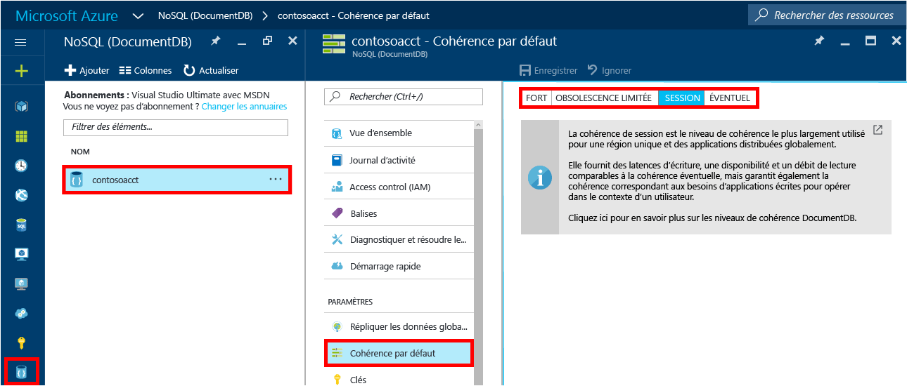

1. Connectez-vous au [portail Azure](https://portal.azure.com/).
2. Dans la barre de lancement, cliquez sur **Nouveau**, **Bases de données**, puis sur **NoSQL (DocumentDB)**.
   
     
3. Dans le panneau **Nouveau compte** , indiquez la configuration souhaitée pour le compte DocumentDB.
   
    
   
   * Dans la zone **ID**, entrez un nom pour identifier le compte DocumentDB.  Lorsque **l’ID** est validé, une coche verte s’affiche dans la case **ID**. La valeur de **ID** devient le nom d’hôte dans l’URI. Cet **ID** ne peut contenir que des minuscules, des chiffres, le caractère « - » et doit compter entre 3 et 50 caractères. Notez que *documents.azure.com* est ajouté au nom du point de terminaison de votre choix. Celui-ci devient le point de terminaison de votre compte DocumentDB.
   * Dans la zone **API NoSQL**, sélectionnez **DocumentDB**.  
   * Dans **Abonnement**, sélectionnez l’abonnement Azure à utiliser avec le compte DocumentDB. Si votre compte ne comporte qu’un seul abonnement, ce compte sera sélectionné par défaut.
   * Dans **Groupe de ressources**, sélectionnez ou créez un groupe de ressources pour votre compte DocumentDB.  Par défaut, un nouveau groupe de ressources est créé. Pour plus d’informations, consultez [Utilisation du portail Azure pour gérer vos ressources Azure](../articles/azure-portal/resource-group-portal.md).
   * Utilisez **Emplacement** pour indiquer l’emplacement géographique de l’hébergement de votre compte DocumentDB. 
4. Une fois les options du nouveau compte DocumentDB configurées, cliquez sur **Créer**. Pour vérifier l’état du déploiement, vérifiez le hub de notification.  
   
     
   
   
5. Une fois le compte DocumentDB créé, il est immédiatement utilisable avec les paramètres par défaut. Pour consulter les paramètres par défaut, cliquez sur l’icône **NoSQL (DocumentDB)** sur la barre de lancement, cliquez sur votre nouveau compte, puis cliquez sur **Cohérence par défaut** dans le menu de la ressource.

     

   La cohérence par défaut du compte DocumentDB est définie sur **Par session**.  Vous pouvez modifier la cohérence par défaut en cliquant sur **Cohérence par défaut** dans le menu de ressources. Pour en savoir plus sur les niveaux de cohérence proposés par DocumentDB, consultez [Niveaux de cohérence dans DocumentDB](../articles/documentdb/documentdb-consistency-levels.md).

[Procédure : Création d’un compte DocumentDB]: #Howto
[Étapes suivantes]: #NextSteps
[documentdb-manage]:../articles/documentdb/documentdb-manage.md

<!--HONumber=Nov16_HO2-->

