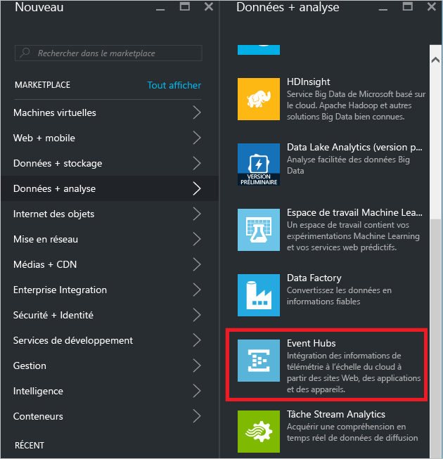
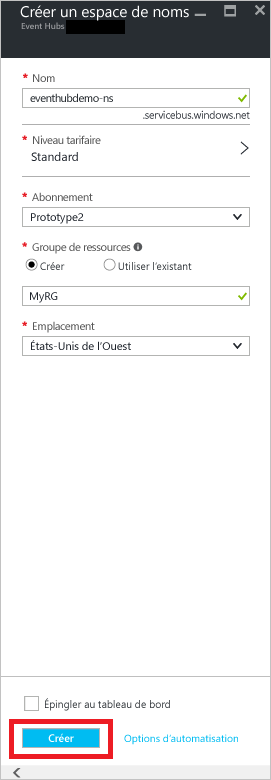
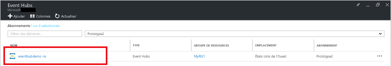
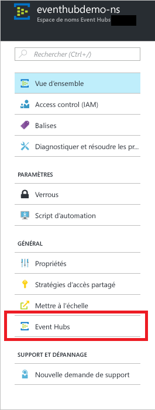
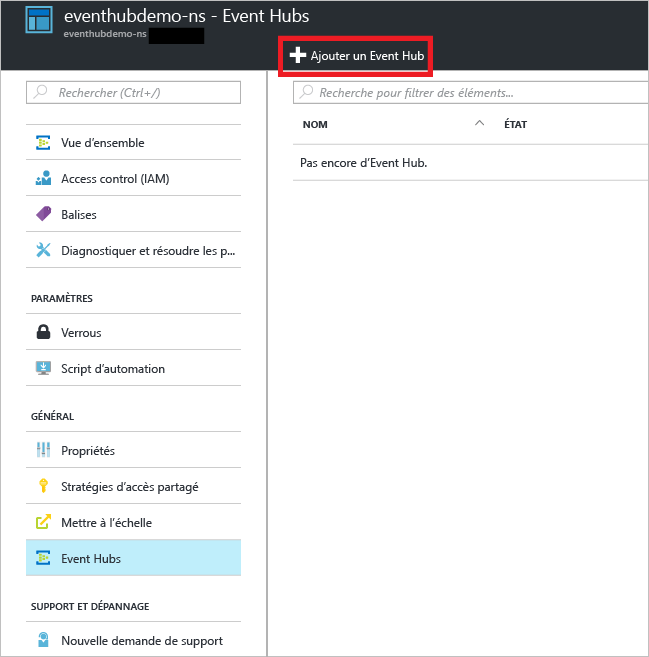
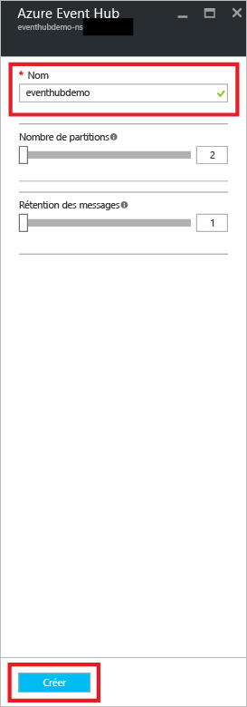
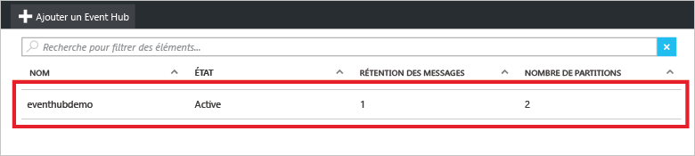
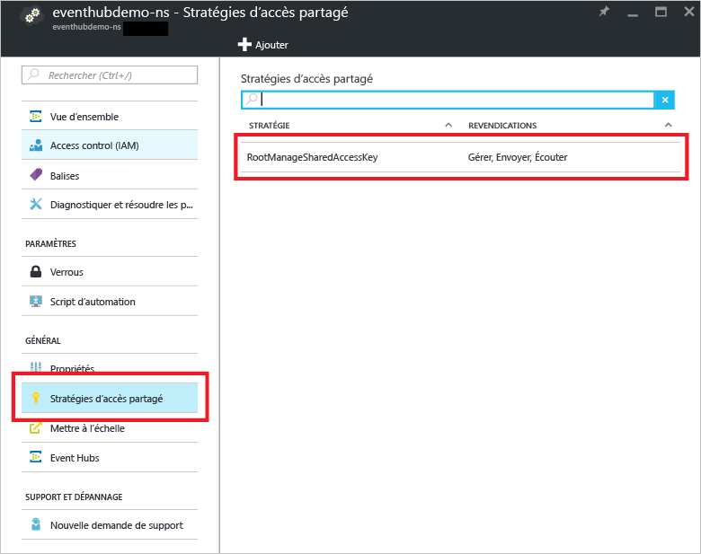
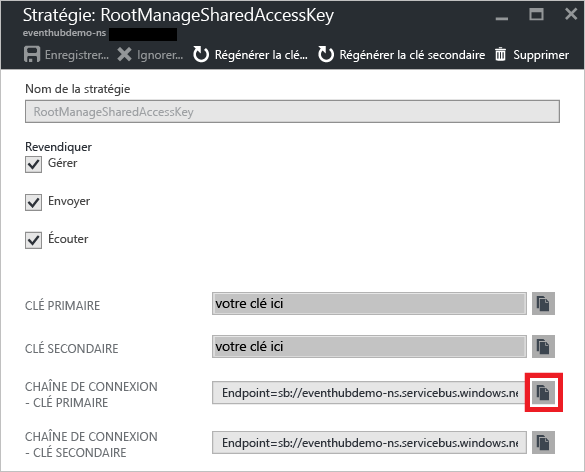

## Création d’un concentrateur d’événements
1. Connectez-vous au [portail Azure][portail Azure], puis cliquez sur **Nouveau** en haut à gauche de l’écran.
2. Cliquez sur **Données et analyses**, puis sur **Event Hubs**.
   
    
3. Dans le panneau **Créer un espace de noms** , entrez un nom d’espace de noms. Le système vérifie immédiatement si le nom est disponible.
   
    
4. Lorsque vous avez vérifié la disponibilité de l’espace de noms, sélectionnez le niveau tarifaire (Basique ou Standard). Choisissez également un abonnement Azure, un groupe de ressources et l’emplacement où créer la ressource. 
5. Cliquez sur **Créer** pour créer l’espace de noms.
6. Dans la liste d’espaces de noms Event Hubs, cliquez sur l’espace de noms créé.      
   
    
7. Dans le panneau de l’espace de noms, cliquez sur **Event Hubs**.
   
    
8. Cliquez sur **Ajouter un Event Hub**en haut du panneau.
   
    
9. Saisissez un nom pour votre Event Hub, puis cliquez sur **Créer**.
   
    
10. Dans la liste d’Event Hubs, cliquez sur le nom d’Event Hub nouvellement créé. 
    
     
11. Revenez au panneau de l’espace de noms (pas le panneau de l’Event Hub spécifique), cliquez sur **Stratégies d’accès partagé**, puis sur **RootManageSharedAccessKey**.
    
     
12. Cliquez sur le bouton Copier pour copier la chaîne de connexion **RootManageSharedAccessKey** dans le Presse-papiers. Enregistrez cette chaîne de connexion pour l’utiliser plus tard dans ce didacticiel.
    
     

Votre concentrateur d’événements est désormais créé et vous disposez des chaînes de connexion dont vous avez besoin pour envoyer et recevoir des événements.

[portail Azure]: https://portal.azure.com/

<!--HONumber=Nov16_HO2-->

