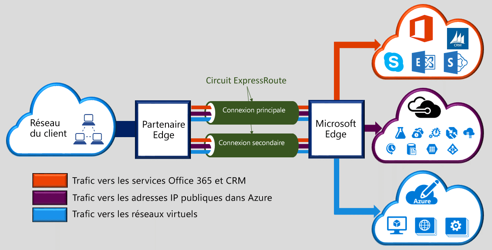

Microsoft Azure ExpressRoute vous permet d'étendre vos réseaux locaux au cloud de Microsoft via une connexion privée dédiée assurée par un fournisseur de connectivité. Grâce à ExpressRoute, vous pouvez établir des connexions aux services de cloud computing Microsoft, comme Microsoft Azure, Office 365 et CRM Online. La connectivité peut provenir d'un réseau universel (IP VPN), d’un réseau Ethernet point à point ou d’une interconnexion virtuelle via un fournisseur de connectivité dans un centre de colocalisation. Les connexions ExpressRoute ne sont pas établies par le biais de l'Internet public. Elles offrent ainsi de meilleurs niveaux de fiabilité, de rapidité, de latence et de sécurité que les connexions classiques sur Internet.

<!---HONumber=AcomDC_0727_2016-->