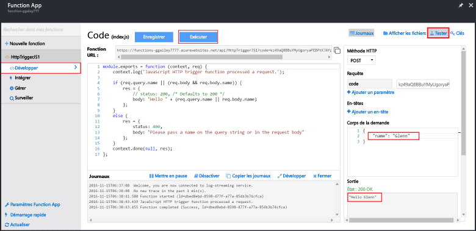

Comme les démarrages rapides Azure Functions contiennent du code fonctionnel, vous pouvez tester votre nouvelle fonction immédiatement.

1. Dans l’onglet **Développer**, examinez la fenêtre **Code** et notez que le code fourni attend une requête HTTP avec un *nom* transmis dans le corps du message ou dans une chaîne de requête. Lorsque la fonction s’exécute, cette valeur est renvoyée dans le message de réponse. L’exemple ci-dessous est une fonction JavaScript.
   
2. Cliquez sur **Tester** pour afficher le volet de requête HTTP de test intégré pour la fonction.
 
    

3. Dans la zone de texte **Corps de la demande**, remplacez la valeur de la propriété *name* par votre nom, puis cliquez sur **Exécuter**. Vous voyez que l’exécution est déclenchée par une requête HTTP de test, que des informations sont écrites dans les journaux et que la réponse « Hello... » s’affiche dans la **sortie**. 

4. Pour déclencher l’exécution de la même fonction à partir d’un outil de test HTTP ou d’une autre fenêtre de navigateur, copiez la valeur **URL de la fonction** de l’onglet **Développer** et collez-la dans la barre d’adresse de l’outil ou d’un navigateur. Ajoutez la valeur de chaîne de requête `&name=yourname` à l’URL et exécutez la requête. Notez que les mêmes informations sont écrites dans les journaux et que la même chaîne est contenue dans le corps du message de réponse.

    
