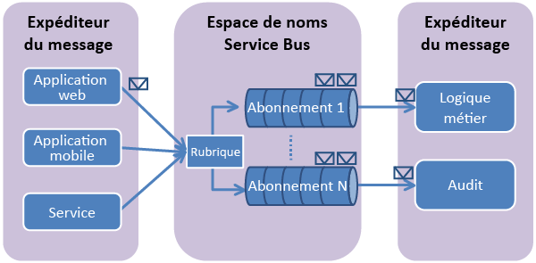

## Présentation des rubriques et des abonnements Service Bus
Les rubriques et les abonnements Service Bus prennent en charge un modèle de *communication de messagerie de publication et d’abonnement*. Lors de l’utilisation de rubriques et d’abonnements, les composants d’une application distribuée ne communiquent pas directement entre eux. Ils échangent plutôt des messages par le biais d’une rubrique, qui fait office d’intermédiaire.

Contrairement aux files d’attente Service Bus, où chaque message est traité par un seul consommateur, les rubriques et les abonnements fournissent une forme de communication « un-à-plusieurs », à l'aide d'un modèle de publication et d'abonnement. Il est possible d’inscrire plusieurs abonnements à une rubrique. Lorsqu’un message est envoyé à une rubrique, il est alors mis à disposition de chaque abonnement pour être géré ou traité indépendamment.

Un abonnement à une rubrique ressemble à une file d’attente virtuelle qui reçoit des copies des messages envoyés à la rubrique. Vous pouvez éventuellement inscrire des règles de filtre pour une rubrique par abonnement, ce qui vous permet de filtrer ou de restreindre les messages d’une rubrique reçus en fonction des abonnements à une rubrique.

Les rubriques et les abonnements Service Bus vous permettent de mettre votre infrastructure à l’échelle et de traiter de très nombreux messages parmi un grand nombre d’utilisateurs et d’applications.

## Créer un espace de noms
Pour commencer à utiliser les rubriques et les abonnements Service Bus dans Azure, vous devez d’abord créer un *espace de noms de service*. Ce dernier fournit un conteneur d'étendue pour l'adressage des ressources Service Bus au sein de votre application.

Pour créer un espace de noms :

1. Connectez-vous au [portail Azure][portail Azure].
2. Dans le volet de navigation gauche du portail, cliquez sur **Nouveau**, puis sur **Enterprise Integration** et sur **Service Bus**.
3. Dans la boîte de dialogue **Créer un espace de noms**, entrez un nom d’espace de noms. Le système vérifie immédiatement si le nom est disponible.
4. Lorsque vous avez vérifié la disponibilité de l’espace de noms, sélectionnez le niveau tarifaire (Basique, Standard ou Premium).
5. Dans le champ **Abonnement**, sélectionnez un abonnement Azure dans lequel créer l’espace de noms.
6. Dans le champ **Groupe de ressources**, choisissez un groupe de ressources existant dans lequel l’espace de noms sera utilisé, ou créez-en un nouveau.
7. Dans **Emplacement**, sélectionnez le pays ou la région où votre espace de noms doit être hébergé.
   
    ![Créer un espace de noms][create-namespace]
8. Cliquez sur le bouton **Créer**. Le système crée l'espace de noms de service et l'active. Vous devrez peut-être attendre plusieurs minutes afin que le système approvisionne des ressources pour votre compte.

### Obtenir les informations d’identification
1. Dans la liste des espaces de noms, cliquez sur le nom de l’espace de noms que vous venez de créer.
2. Dans le panneau **Espace de noms Service Bus**, cliquez sur **Stratégies d’accès partagé**.
3. Dans le panneau **Stratégies d’accès partagé**, cliquez sur **RootManageSharedAccessKey**.
   
    ![informations de connexion][connection-info]
4. Dans le panneau **Policy: RootManageSharedAccessKey (Stratégie : RootManageSharedAccessKey)**, cliquez sur le bouton de copie situé en regard de **Clé primaire de la chaîne de connexion**, pour copier la chaîne de connexion dans le presse-papiers pour une utilisation ultérieure.
   
    ![connection-string][connection-string]

[portail Azure]: https://portal.azure.com
[create-namespace]: ./media/howto-service-bus-topics/create-namespace.png
[connection-info]: ./media/howto-service-bus-topics/connection-info.png
[connection-string]: ./media/howto-service-bus-topics/connection-string.png

<!---HONumber=AcomDC_0824_2016-->