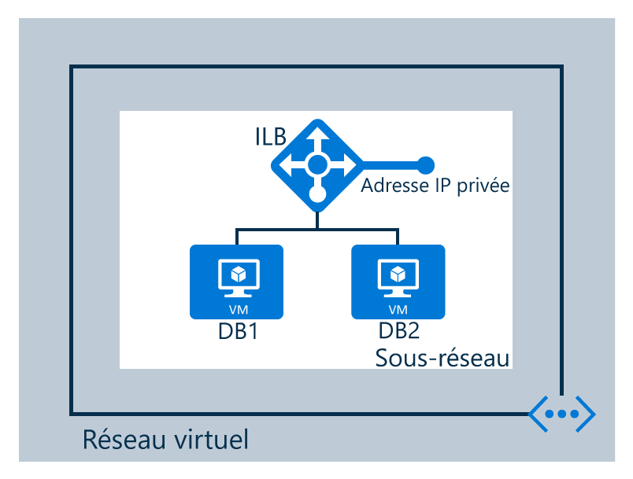

## Scénario

Vous créez un équilibreur de charge interne selon le scénario suivant

Un équilibreur de charge interne est configuré dans un Virtual Network - 2 machines virtuelles appelées DB1 et DB2  - points de terminaison   - équilibreur de charge interne 

<!---HONumber=AcomDC_1223_2015-->