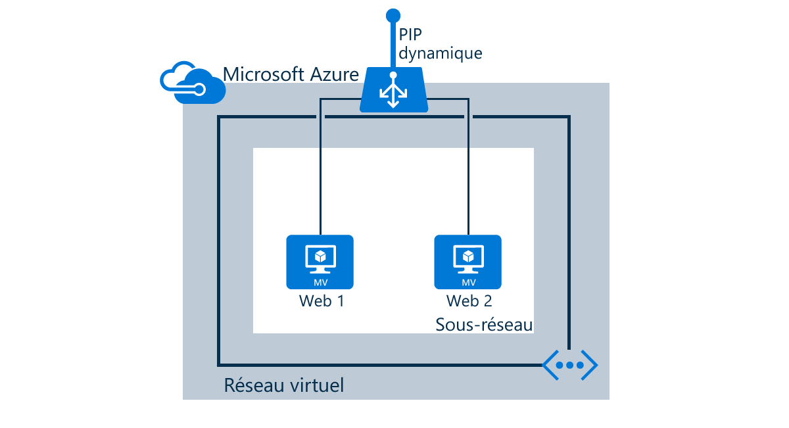

Les tâches suivantes seront effectuées dans ce scénario :

* Créer un équilibrage de charge recevant le trafic réseau sur le port 80 et envoyer un trafic d’équilibrage de charge vers les machines virtuelles « web1 » et « web2 »
* Créer des règles NAT pour l’accès Bureau à distance/SSH pour les machines virtuelles situées derrière l’équilibrage de charge
* Créer des sondes d’intégrité

<!---HONumber=AcomDC_0914_2016-->