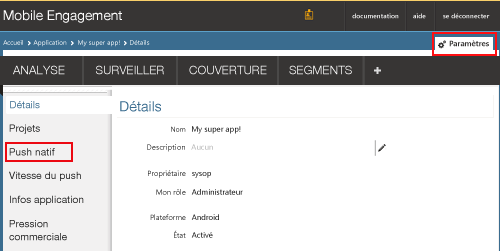
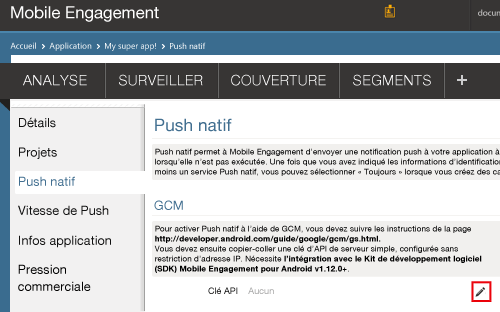
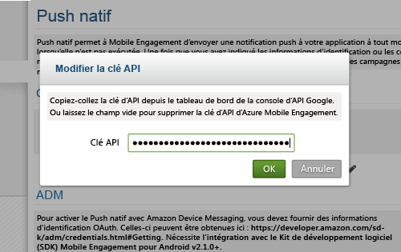
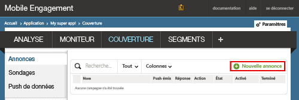
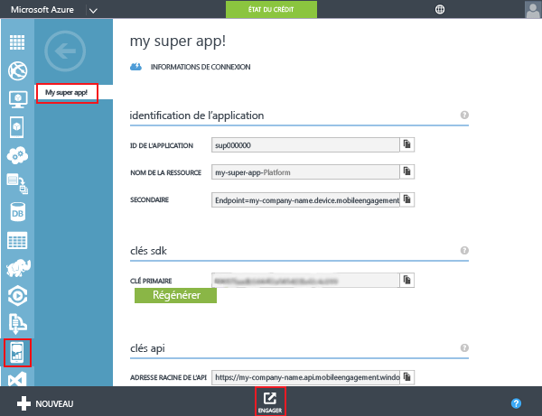
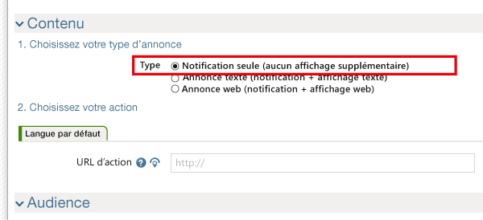
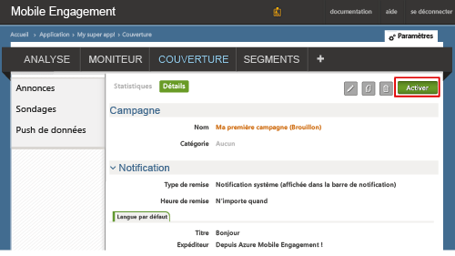

### Accorder à Mobile Engagement l’accès à votre clé d’API GCM
Pour permettre à Mobile Engagement d’envoyer des notifications Push en votre nom, vous devez lui accorder l’accès à votre clé d’API. Pour cela, vous devez configurer et entrer votre clé dans le portail Mobile Engagement.

1. Dans votre portail Azure Classic, vérifiez que vous êtes bien dans l’application que nous utilisons pour ce projet, puis cliquez sur le bouton **Engager** en bas de l’écran :
   
    
2. Cliquez ensuite sur **Paramètres** -> **Push natif** pour entrer votre clé GCM :
   
    
3. Cliquez sur l’icône **Modifier** en face de **Clé API** dans la section **Paramètres GCM**, comme indiqué ci-dessous :
   
    
4. Dans la fenêtre contextuelle, collez la clé du serveur GCM obtenue précédemment, puis cliquez sur **OK**.
   
    

## Envoi d’une notification vers votre application
Nous allons à présent créer une campagne simple qui envoie une notification Push à notre application.

1. Accédez à l'onglet **REACH** de votre portail Mobile Engagement.
2. Cliquez sur **Nouvelle annonce** pour créer votre campagne de notification Push.
   
    
3. Configurez le premier champ de votre campagne en exécutant les étapes suivantes :
   
    
   
    a. Nommez votre campagne.
   
    b. Définissez le **Type d’envoi** sur *Notification système > Simple* : il s’agit du type de notification Push Android simple qui comprend un titre et une petite ligne de texte.
   
    c. Sélectionnez l’**Heure de remise** sur *N’importe quand* pour permettre à l’application de recevoir une notification, qu’elle soit démarrée ou non.
   
    d. Dans le texte de notification, tapez le **Titre** qui apparaîtra en gras dans la notification Push.
   
    e. Tapez ensuite votre **message**.
4. Faites défiler l’écran vers le bas et, dans la section **Contenu**, sélectionnez **Notification uniquement**.
   
    
5. Vous avez terminé de définir la campagne de base la plus simple possible. Maintenant, faites défiler vers le bas de nouveau, puis cliquez sur le bouton **Créer** pour enregistrer votre campagne.
6. Dernière opération : cliquez sur **Activer** pour activer votre campagne et envoyer des notifications Push.
   
    

<!---HONumber=AcomDC_0330_2016-->