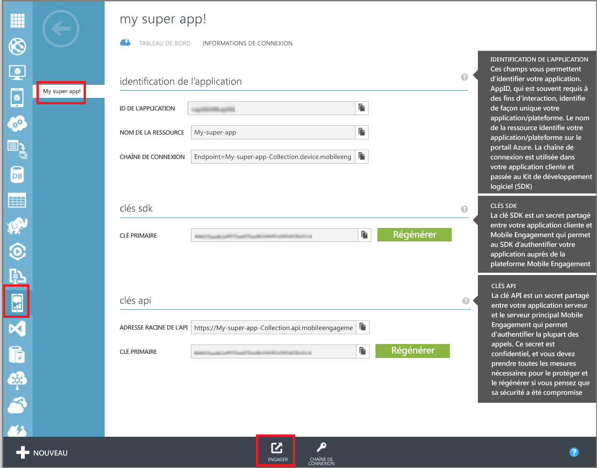
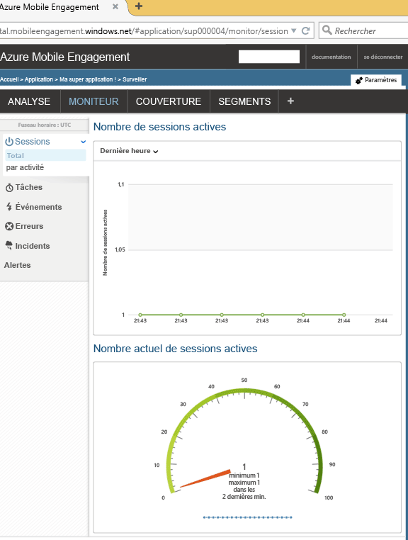

Cette section montre comment connecter votre application au serveur principal Mobile Engagement et ce, grâce à la fonctionnalité de surveillance en temps réel de Mobile Engagement.

1. Dans votre compte **Azure Mobile Engagement**, veillez à sélectionner l’application que vous souhaitez analyser et gérer dans le portail **Mobile Engagement**. Accédez au portail Mobile Engagement en cliquant sur le bouton **Engager** au bas de la page. 

	 

2. Vous accéderez au portail de Mobile Engagement. Si l’onglet Moniteur n’est pas sélectionné, cliquez sur **Analyser**.

3. Le moniteur est prêt à afficher en temps réel tous les appareils qui démarrent votre application.
	 
4. Démarrez votre application dans l’émulateur/le simulateur ou sur un périphérique connecté. Vous devez voir une session dans le moniteur si l'intégration est correcte, ce qui signifie que votre application est maintenant connectée au serveur principal de Mobile Engagement et envoie des données à celui-ci.
	
	 

<!---HONumber=AcomDC_1203_2015-->