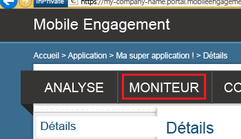

Cette section montre comment vérifier que votre application est connectée au serveur principal Mobile Engagement et ce, grâce à la fonctionnalité de surveillance en temps réel de Mobile Engagement.

1. Accédez au portail Mobile Engagement. Vérifiez que vous vous trouvez dans l’application utilisée pour ce projet, puis cliquez sur le bouton **Engager** situé en bas.

	 

2. Vous accéderez au portail de Mobile Engagement. Cliquez sur l’onglet **Surveiller**.
	 
	

3. Le moniteur est prêt à afficher en temps réel tous les appareils qui démarrent votre application.
	 
4. Démarrez votre application dans l’émulateur/le simulateur ou sur un périphérique connecté. Vous devez voir une session dans le moniteur si l'intégration est correcte, ce qui signifie que votre application est maintenant connectée au serveur principal de Mobile Engagement et envoie des données à celui-ci.
	
	 

<!---HONumber=Sept15_HO4-->