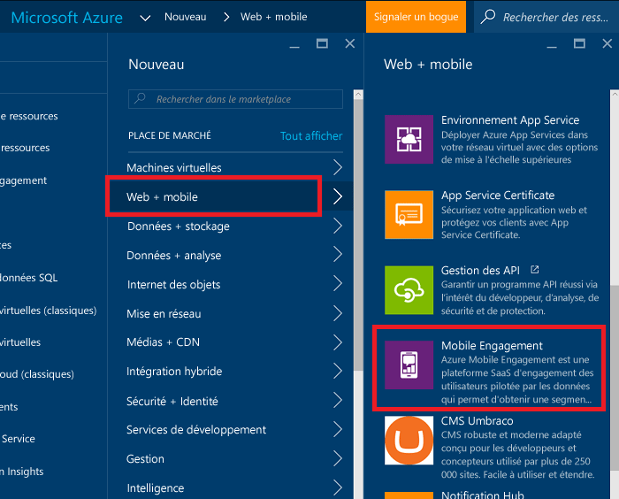
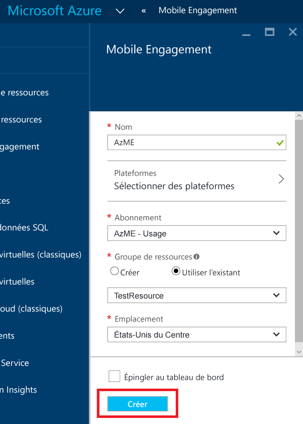
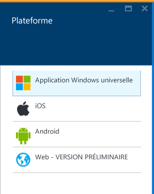
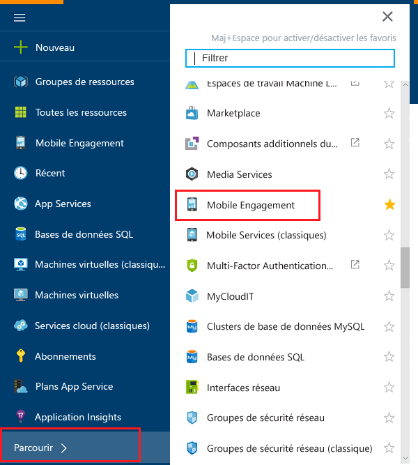
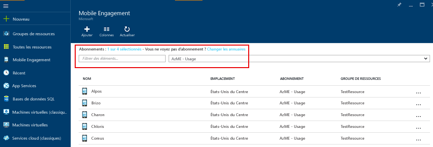
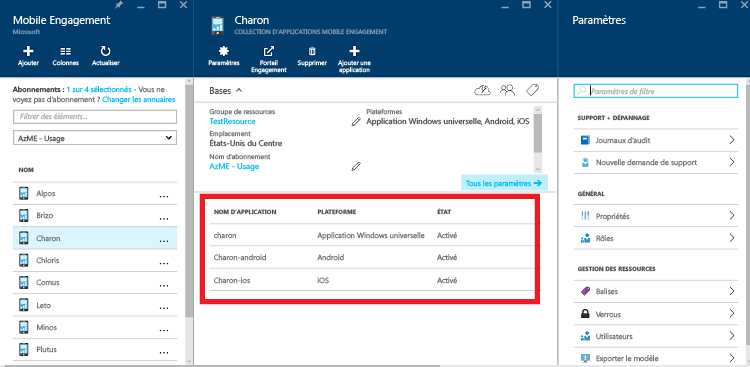
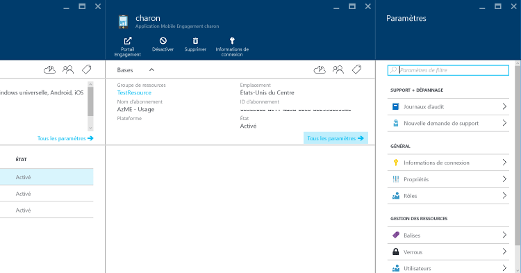
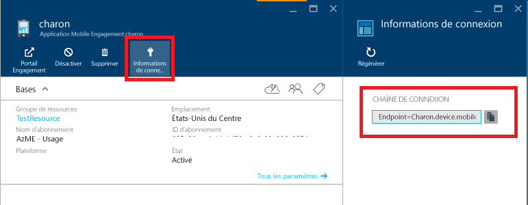

1. Connectez-vous au [Portail Azure](https://portal.azure.com).
2. Cliquez sur **Nouveau**, sur **Web + mobile**, puis sur **Mobile Engagement**.
   
    
3. Dans le panneau **New Mobile Engagement App Collection** (Nouvelle collection d’applications Mobile Engagement), vous allez créer une collection d’applications, et non plus une application comme dans le Portail Azure Classic. Entrez les informations suivantes :
   
    
   
   * **Nom**: Nom of your *collection d’applications* 
   * **Plateformes**: sélectionnez les plateformes cibles pour votre application dans le panneau Plateformes qui s’affiche. Par exemple, si vous souhaitez disposer d’une application destinée aux plateformes iOS et Android, sélectionnez ces deux plateformes ; deux applications seront alors créées sous cette collection d’applications. 
     
      
   * **Abonnement**: sélectionnez l’abonnement Azure. 
   * **Groupe de ressources**: sélectionnez le groupe de ressources Azure dans lequel vous souhaitez placer cette ressource Azure (Collection d’applications Mobile Engagement). Vous pouvez choisir de créer un nouveau groupe.  
   * **Emplacement** : région dans laquelle seront stockées les données concernant cette collection d’applications et cette application.
4. Parcourez les collections d’applications Mobile Engagement en cliquant sur **Parcourir** et en recherchant **Mobile Engagement**
   
    
5. Vous verrez une liste des collections d’applications Mobile Engagement. Assurez-vous que vous disposez du même abonnement Azure à l’emplacement auquel vous avez créé votre collection d’applications.
   
    
6. Cliquez sur la collection d’applications que vous avez créée à l’étape précédente pour ouvrir le panneau des ressources de collection d’applications qui présentera les différentes applications présentes dans cette collection d’applications. 
   
    
7. Cliquez sur l’application créée pour la plateforme que vous êtes en train de développer. 
   
    
8. Cliquez sur le bouton de commande **Informations de connexion** dans la partie supérieure pour ouvrir le panneau Informations de connexion et copiez la chaîne de connexion à partir de cet emplacement. 
   
    

