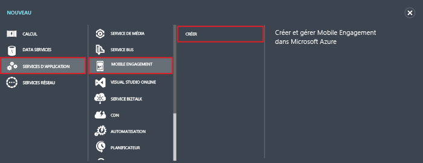
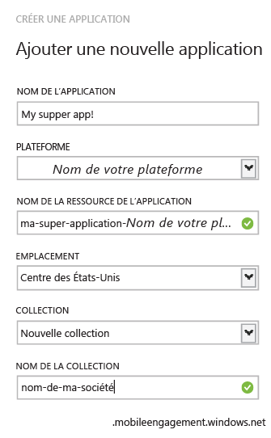
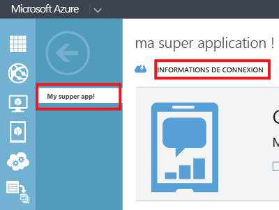

1. Connectez-vous au portail de gestion Azure et cliquez sur **+NEW** en bas de l’écran.

2. Cliquez sur **App Services**, **Mobile Engagement**, puis **Créer**.

   	

3. Dans la fenêtre indépendante qui s'affiche, entrez les informations suivantes :

   	

	- **Nom de l'application** : nom de votre application. 
	- **Plateforme** : plateforme cible pour l'application. Vous devez créer une application Mobile Engagement pour chaque plateforme cible pour votre application mobile. 
	- **Nom de la ressource d’application** : nom utilisé dans les API et les URL pour faire référence à l’application. 
	- **Emplacement** : centre de données/région où seront hébergées cette application et cette collection d’applications.
	- **Collection** : sélectionnez une collection créée précédemment ou sélectionnez « Nouvelle Collection ».
	- **Nom de collection** : correspond à votre groupe d'applications. Cela permet également de garantir que toutes vos applications font partie d'un groupe qui autorise les calculs agrégés de statistiques. Vous devez utiliser ici le nom de votre société ou service le cas échéant.

4. Sélectionnez l'application que vous venez de créer sous l'onglet **Applications**.

5. Ensuite, cliquez sur **Informations de connexion** pour afficher les paramètres de connexion que vous voulez ajouter à l'intégration de votre Kit de développement logiciel (SDK) dans votre application mobile.

   	

6. Copiez la **chaîne de connexion** : cela vous sert à identifier cette application dans votre code d'application et à vous connecter avec Mobile Engagement à partir de votre application.

   	

<!---HONumber=Oct15_HO3-->