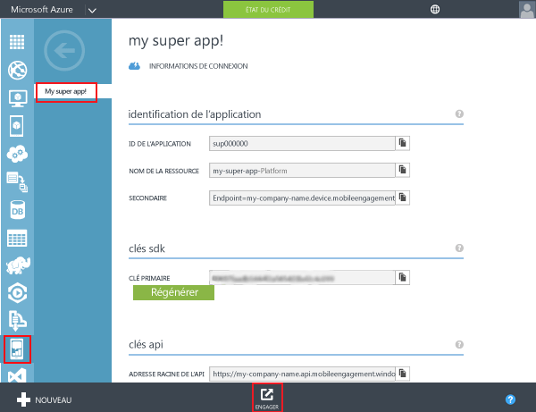
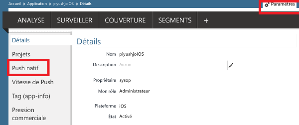
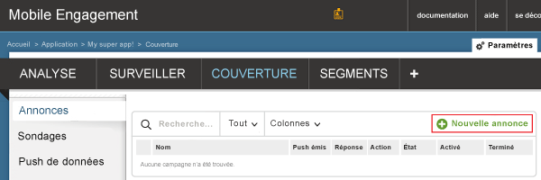
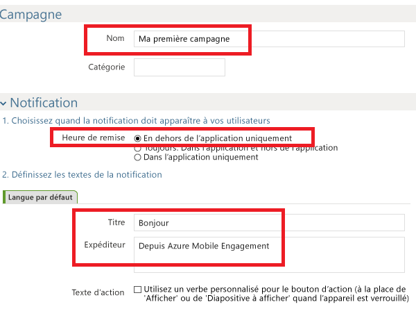
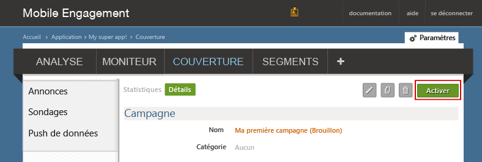

###Accordez à Mobile Engagement l'accès à votre certificat push

Pour autoriser Mobile Engagement à envoyer des notifications push à votre place, vous devez lui accorder l'accès à votre certificat. Pour ce faire, configurez votre certificat et entrez-le dans le portail Mobile Engagement. Assurez-vous d'obtenir votre certificat .p12 comme expliqué dans la [documentation d'Apple](https://developer.apple.com/library/prerelease/ios/documentation/IDEs/Conceptual/AppDistributionGuide/AddingCapabilities/AddingCapabilities.html#//apple_ref/doc/uid/TP40012582-CH26-SW6).

1. Accédez au portail Mobile Engagement. Vérifiez que vous vous trouvez dans l’application utilisée pour ce projet, puis cliquez sur le bouton **Activer** situé en bas :

	

2. Cliquez sur la page **Paramètres** de votre portail Engagement. Cliquez ensuite sur la section **Push natif** pour télécharger votre certificat p12 :

	

3. Sélectionnez votre p12, téléchargez-le et tapez votre mot de passe :

	

##Envoi d’une notification vers votre application

Nous allons maintenant créer une campagne simple de notification push qui enverra une notification push à notre application :

1. Accédez à l'onglet **Reach** dans votre portail Mobile Engagement.

2. Cliquez sur **Nouvelle annonce** pour créer votre campagne Push.

	

3. Configurez les premiers champs de votre campagne :

	

	- 	Entrez un **nom** pour votre campagne. 
	- 	Sélectionnez **Hors de l’application uniquement** pour l’**Heure de remise** : il s’agit du type simple de notification Push Apple qui comprend du texte.
	- 	Dans le texte de notification, tapez d'abord le **titre**, qui sera la première ligne de la notification push
	- 	Tapez ensuite votre **message**, qui sera la deuxième ligne

4. Faites défiler l’écran vers le bas et, dans la section Contenu, sélectionnez **Notification uniquement**.

	

5. Vous avez terminé de définir la campagne la plus simple possible. Maintenant, faites défiler vers le bas, puis cliquez sur le bouton **Créer** pour enregistrer votre campagne de notification Push.

6. Cliquez enfin sur **Activer** pour envoyer des notifications Push.

	

 

<!---HONumber=Oct15_HO1-->