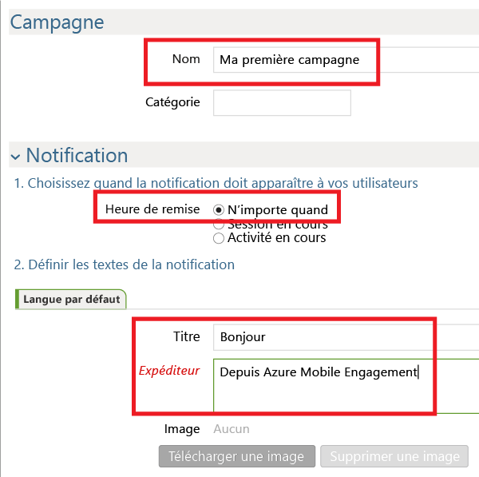
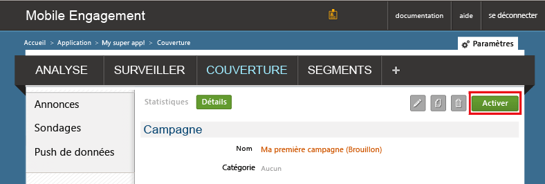

Nous allons à présent créer une campagne simple qui envoie une notification Push à notre application.

1. Accédez à l'onglet **REACH** de votre portail Mobile Engagement.

2. Cliquez sur **Nouvelle annonce** pour créer votre campagne de notification Push.

	

3. Configurez le premier champ de votre campagne en suivant les étapes suivantes :

	

	a. Entrez un **nom** pour votre campagne.

	b. Sélectionnez **Temps de remise** pour *Tout moment*.

	d. Dans le texte de notification, tapez le **Titre** qui apparaîtra en gras dans la notification Push.

	e. Tapez ensuite votre **message**.

4. Faites défiler l’écran vers le bas et, dans la section **Contenu**, sélectionnez **Notification uniquement**.

	

5. Vous avez terminé de définir la campagne de base la plus simple possible. Faites maintenant défiler vers le bas, puis cliquez sur le bouton **Créer** pour enregistrer votre campagne.

6. Dernière étape : cliquez sur **Activer** pour activer votre campagne et envoyer des notifications Push.

	

 

<!---HONumber=Sept15_HO4-->