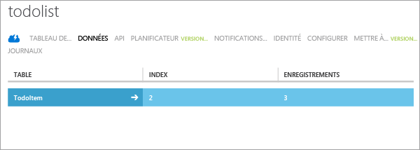

La dernière étape de ce didacticiel consiste à générer et à exécuter votre nouvelle application.

### Chargez le projet dans Studio Android et procédez à la synchronisation Gradle

1. Accédez à l’emplacement où vous avez enregistré les fichiers projet compressés, puis décompressez les fichiers sur votre ordinateur dans le répertoire de projets d’Android Studio.

2. Ouvrez Android Studio. Si vous travaillez avec un projet et qu’il s’affiche, fermez le projet (Fichier => Fermer le projet).

3. Sélectionnez **Ouvrir un projet Android Studio existant**, accédez à l’emplacement du projet, puis cliquez sur **OK.** Cette opération charge le projet et commence la synchronisation avec Gradle.

 	

4. Attendez que l’activité de synchronisation Gradle se termine. Si l’erreur « Impossible de trouver la cible » s’affiche, c’est que la version utilisée dans Android Studio ne correspond pas à celui de l’échantillon. Le moyen le plus simple de résoudre ce problème consiste à cliquer sur le lien **Installer les plateformes manquantes et le projet de synchronisation** dans le message d’erreur. Vous pouvez obtenir des messages d’erreur au sujet des versions supplémentaires et répéter simplement ce processus jusqu’à ce qu’aucune erreur n’apparaisse.
    - Il existe une autre façon de résoudre ce problème si vous souhaitez exécuter avec la version « plus récente et plus performante » d’Android. Vous pouvez mettre à jour **targetSdkVersion** dans le fichier *build.gradle* du répertoire *application* correspondant à la version déjà installée sur votre ordinateur. Vous pouvez l’identifier en cliquant sur l’icône **Gestion des kits de développement logiciels** et en affichant la version répertoriée. Appuyez ensuite sur l’option **Synchronisation du projet avec les fichiers Gradle**. Vous pouvez obtenir un message d’erreur concernant la version des outils de génération et corriger cela de la même façon.

### Exécution de l'application

Vous pouvez exécuter l’application en utilisant l’émulateur ou un périphérique réel.

1. Pour exécuter l’appareil depuis un appareil, connectez ce dernier à votre ordinateur avec un câble USB. Vous devez [configurer le périphérique pour le développement](https://developer.android.com/training/basics/firstapp/running-app.html). Si vous effectuez le développement sur un ordinateur Windows, vous devez également télécharger et installer un pilote USB.

2. Pour exécuter le projet dans l’émulateur Android, vous devez définir au moins un AVD (Android Virtual Device - appareil virtuel Android). Utilisez l’icône du gestionnaire AVD pour créer et gérer ces appareils.

3. À partir du menu **Exécuter**, cliquez sur **Exécuter** pour lancer le projet et choisissez un périphérique ou un émulateur dans la boîte de dialogue qui s’affiche.

4. Lorsque l’application apparaît, tapez un texte explicite, par exemple _Terminer le didacticiel_, puis cliquez sur **Ajouter**.

   	

   	Ceci envoie une demande POST vers le nouveau service mobile hébergé dans Azure. Les données de la requête sont insérées dans la table TodoItem. Les éléments stockés dans la table sont renvoyés par le service mobile et les données sont affichées dans la liste.

	> [AZURE.NOTE]Vous pouvez vérifier le code qui se trouve dans le fichier ToDoActivity.java et permet d'accéder au service mobile pour exécuter une requête et insérer des données.

8. De retour dans le portail de gestion, cliquez sur l'onglet **Données**, puis sur la table **TodoItems**.

   	

   	Cela vous permet de parcourir les données insérées par l'application dans la table.

   	

<!---HONumber=Oct15_HO3-->