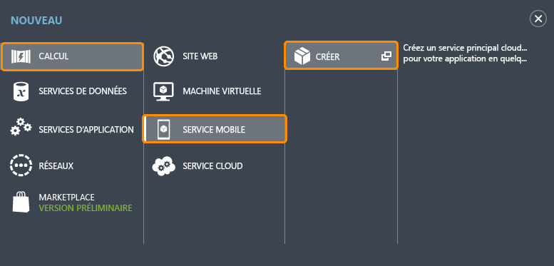
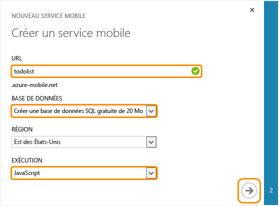



Suivez cette procédure pour créer un service mobile.

1.	Connectez-vous au [portail de gestion]. 

2.	En bas du volet de navigation, cliquez sur **+NEW**.

	

3.	Développez **Calcul** et **Service Mobile**, puis cliquez sur **Créer**.

	

	La boîte de dialogue **Nouveau service mobile** s'affiche.

4.	Sur la page **Créer un service mobile**, sélectionnez **Créer une base de données SQL gratuite de 20 Mo**, sélectionnez **.NET**, puis tapez un nom de sous-domaine pour le nouveau service mobile dans la zone de texte **URL** et patientez lors de la vérification du nom. Une fois la vérification du nom terminée, cliquez sur la flèche droite pour aller sur la page suivante.	

	

   	La page **Spécifier les paramètres de la base de données** s'affiche.

	> [AZURE.NOTE] Dans ce didacticiel, vous créez une instance et un serveur de base de données SQL. Vous pouvez réutiliser cette nouvelle base de données et la gérer comme une autre instance de base de données SQL. Si vous disposez déjà d'une base de données dans la même région que le nouveau service mobile, vous pouvez alors choisir **Utiliser la base de données existante** et sélectionner cette base de données. À cause des coûts supplémentaires liés à la bande passante et en raison des latences élevées, il est déconseillé d'utiliser une base de données dans une autre région.	

6.	Dans **Nom**, tapez le nom de la nouvelle base de données, puis le **Nom de connexion**, qui est le nom de connexion de l'administrateur pour le nouveau serveur de base de données SQL, tapez et confirmez le mot de passe, puis cliquez sur le bouton de vérification pour terminer le processus.

	

	> [AZURE.NOTE] Lorsque le mot de passe entré ne respecte pas les exigences de complexité ou en cas d'incohérence, un avertissement s'affiche. 
	>
	> Il est recommandé de noter le nom de connexion de l'administrateur et le mot de passe spécifié. Ces informations seront nécessaires à l'avenir pour utiliser l'instance ou le serveur de base de données SQL.

Vous avez créé un service mobile pouvant être utilisé par vos applications mobiles.

<!-- URLs. -->
[Portail de gestion]: https://manage.windowsazure.com/
<!--HONumber=42-->
