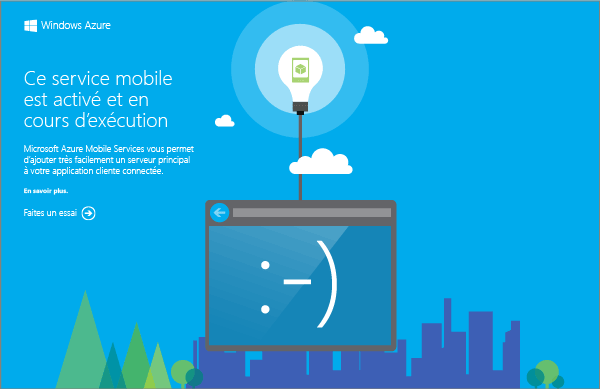

Le projet de service mobile que vous téléchargez vous permet d'exécuter votre nouveau service mobile sur votre ordinateur local ou sur votre machine virtuelle. Vous pouvez ainsi facilement déboguer le code de service avant même de le publier sur Azure.

Dans cette section, vous allez tester votre nouvelle application avec le service mobile exécuté localement.

1. Accédez à l'emplacement où vous avez enregistré les fichiers projet compressés, développez les fichiers sur votre ordinateur et ouvrez le fichier solution dans Visual Studio.

2. Appuyez sur la touche **F5** pour régénérer le projet et démarrer le service mobile localement.

	

	Une page web s’affiche une fois le service mobile correctement démarré.

3. Dans l'Explorateur de solutions de Visual Studio, cliquez avec le bouton droit sur votre projet d'application cliente, puis cliquez sur **Définir comme projet de démarrage** et appuyez sur la touche **F5** pour régénérer le projet et démarrer l'application.

	L'application démarre en se connectant à l'instance locale du service mobile.

4. Dans l'application, tapez un texte explicite, comme _Suivre le didacticiel_, dans **Insert a TodoItem**, puis cliquez sur **Enregistrer**.

	Une demande POST est alors envoyée au service mobile local. Les données de la requête sont insérées dans la table TodoItem. Les éléments stockés dans la table sont renvoyés par le service mobile et les données sont affichées dans la deuxième colonne de l'application.

<!---HONumber=58_postMigration-->