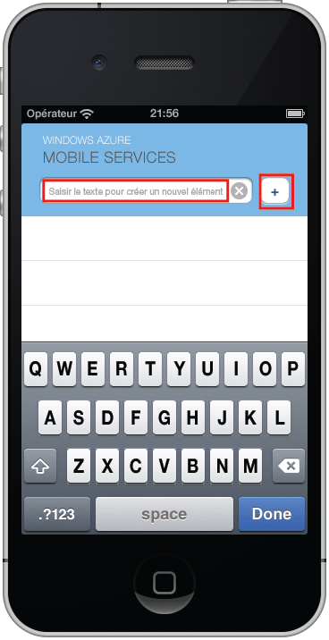

La dernière étape de ce didacticiel consiste à générer et à exécuter votre nouvelle application.

1. Accédez à l’emplacement où vous avez enregistré les fichiers projet compressés, développez les fichiers sur votre ordinateur et ouvrez le fichier projet à l’aide de Xcode.

2. Appuyez sur le bouton **Exécuter** pour créer le projet et démarrer l’application dans l’émulateur iPhone.

3. Dans l'application, tapez un texte explicite, comme _Suivre le didacticiel_, puis cliquez sur l'icône plus (**+**).

   	

   	Ceci envoie une demande POST vers le nouveau service mobile hébergé dans Azure. Les données de la requête sont insérées dans la table TodoItem. Les éléments stockés dans la table sont renvoyés par le service mobile et les données sont affichées dans la liste.

 	

<!---HONumber=62-->