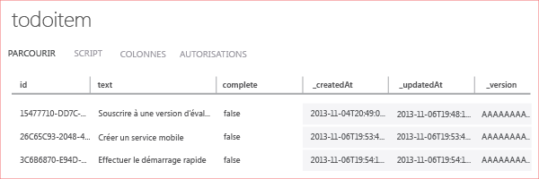

La dernière étape de ce didacticiel consiste à générer et à exécuter votre nouvelle application.

1. Accédez à l'emplacement où vous avez enregistré les fichiers projet compressés, développez les fichiers sur votre ordinateur et ouvrez le fichier solution dans Visual Studio.

2. Appuyez sur la touche **F5** pour régénérer le projet et démarrer l'application.

3. Dans l'application, tapez un texte explicite, comme *Suivre le didacticiel*, dans **Insert a TodoItem**, puis cliquez sur **Enregistrer**.

   	Ceci envoie une demande POST vers le nouveau service mobile hébergé dans Azure. Les données de la requête sont insérées dans la table TodoItem. Les éléments stockés dans la table sont renvoyés par le service mobile et les données sont affichées dans la deuxième colonne de l'application.

4. (Facultatif) Dans une solution Windows universelle, remplacez le projet de démarrage par défaut par l'autre application et réexécutez cette dernière.

	Notez que les données enregistrées à l'étape précédente sont chargées à partir du service mobile après le démarrage de l'application.
 
4. De retour dans le [portail Azure Classic](https://manage.windowsazure.com/), cliquez sur l’onglet **Données**, puis sur le tableau **TodoItems**.

   	Cela vous permet de parcourir les données insérées par l'application dans la table.

   	

<!---HONumber=AcomDC_1203_2015-->