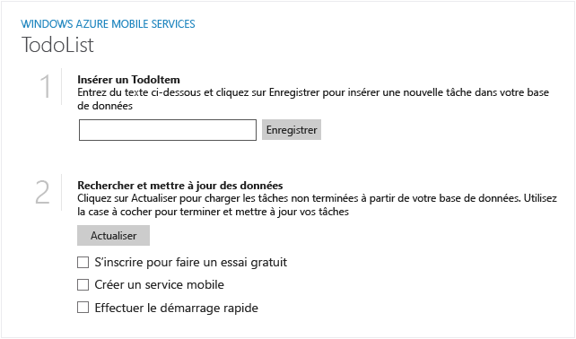

Voici les captures d’écran générées à partir de l’application terminée :

  Application Windows Store

  Application Windows Phone Store

Vous devez suivre ce didacticiel avant de pouvoir suivre tous les autres didacticiels Mobile Services pour les applications Windows Store et Windows Phone Store.

<!---HONumber=Oct15_HO3-->