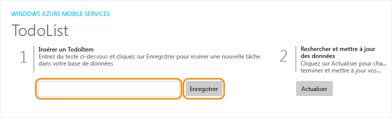


1. Appuyez sur la touche F5 pour régénérer le projet et démarrer l'application Windows Store.

2. Dans l'application, tapez un texte explicite, comme *Complete the tutorial*, dans **Insert a TodoItem**, puis cliquez sur **Enregistrer**.

	

	Ceci envoie une demande POST vers le nouveau service mobile hébergé dans Azure.

3. Arrêtez le débogage, remplacez le projet de démarrage par défaut dans la solution Windows universelle par l'application Windows Phone Store, puis appuyez à nouveau sur F5.

	
	
	Notez que les données enregistrées à l'étape précédente sont chargées à partir du service mobile après le démarrage de l'application.<!--HONumber=41-->
