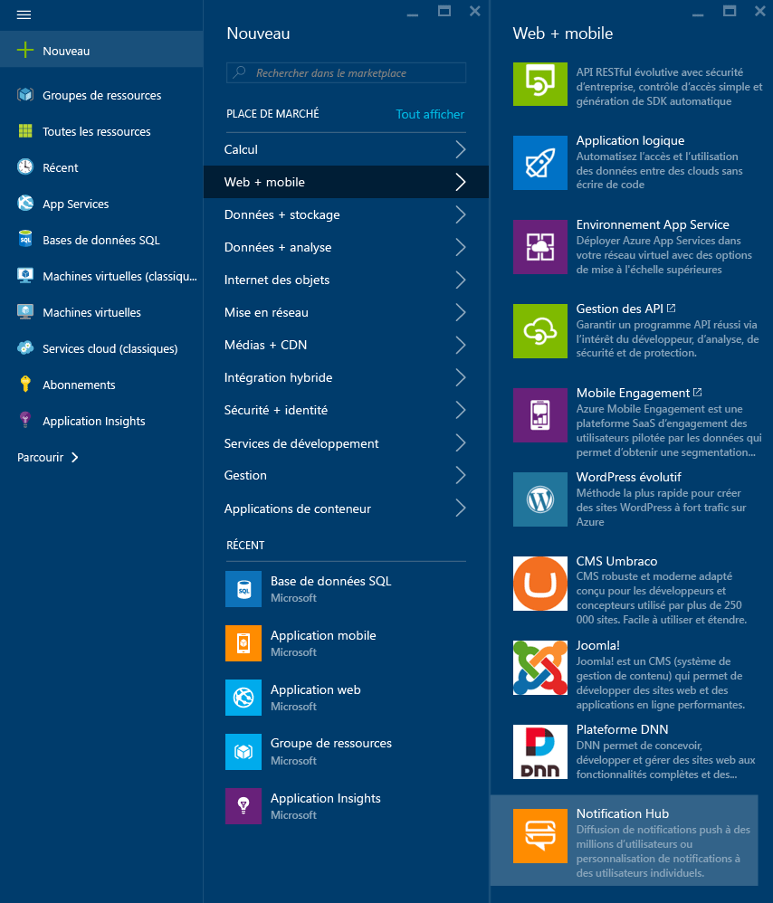
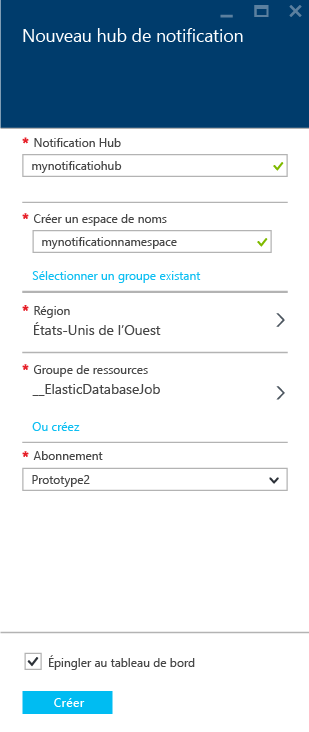
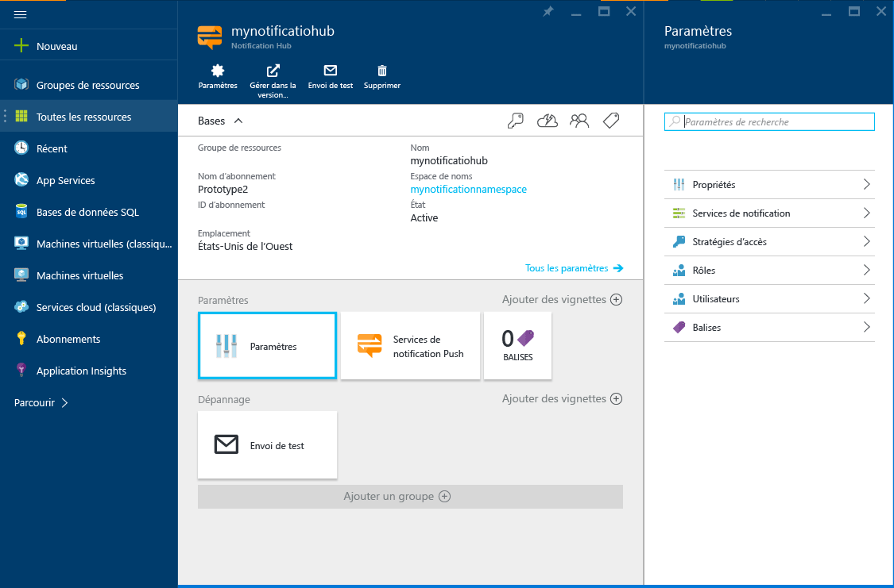
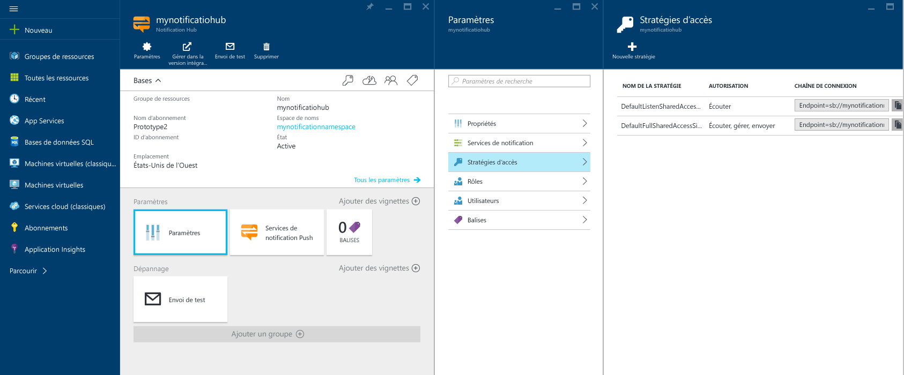

1. Connectez-vous au [portail Azure](https://portal.azure.com), puis cliquez sur **+NOUVEAU** en haut à gauche de l’écran.
2. Cliquez sur **Nouveau**, puis sur **Web + Mobile**. Faites défiler vers le bas si nécessaire et cliquez sur **Notification Hub**.
   
       
3. Veillez à spécifier un nom unique dans le champ **Hub de notification**. Sélectionnez votre **Région**, votre **Abonnement** et votre **Groupe de ressources** (le cas échéant).
   
    Si vous disposez déjà d’un espace de noms Service Bus dans lequel vous souhaitez créer le hub, sélectionnez-le dans l’option **Sélectionner** du champ **Espace de noms**. Sinon, vous pouvez utiliser le nom par défaut qui sera créé à partir du nom du hub tant que le nom d’espace de noms sera disponible.
   
    Une fois que vous êtes prêt, cliquez sur **Créer**.
   
       
4. Une fois l’espace de noms et le hub de notification créés, vous êtes redirigé vers la page correspondante du portail.
   
       
5. Cliquez sur **Paramètres** puis sur **Stratégies d’accès**. Prenez note des deux chaînes de connexion disponibles, car vous en aurez besoin pour gérer les notifications Push ultérieurement.
   
       

<!---HONumber=AcomDC_0413_2016-->