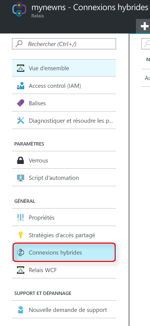
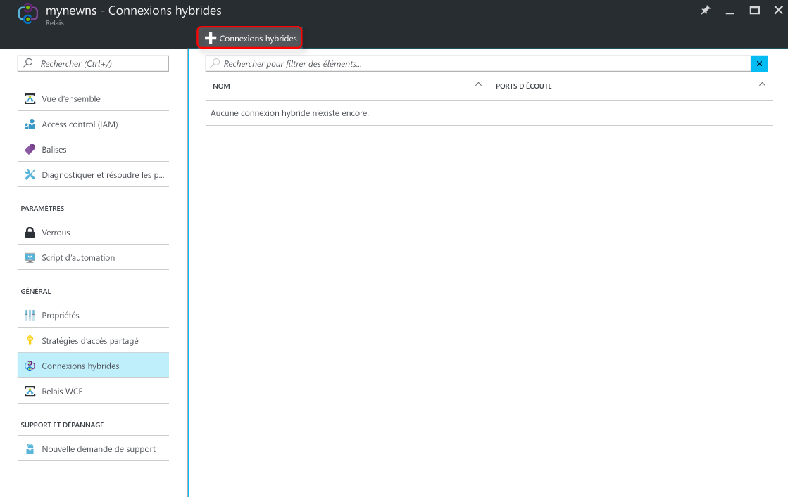
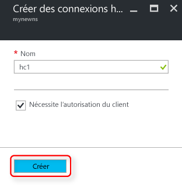

Vérifiez que vous avez déjà créé un espace de noms Relay, comme illustré [ici][namespace-how-to].

1. Connectez-vous au [Portail Azure](https://portal.azure.com).
2. Dans le volet de navigation de gauche du portail, cliquez sur **Relay**.
3. Sélectionnez l’espace de noms dans lequel vous souhaitez créer la connexion hybride. Dans ce cas, il s’agit de **mynewns1**.
   
    
4. Dans le panneau **Espace de noms du relais**, sélectionnez **Connexions hybrides**, puis cliquez sur **+ Connexion hybride**.
   
    
5. Entrez le **Nom de la connexion hybride** et laissez les valeurs par défaut des autres valeurs.
   
    
6. Au bas du panneau, cliquez sur **Créer**.

[namespace-how-to]: ../articles/service-bus-relay/relay-create-namespace-portal.md 

<!--HONumber=Nov16_HO2-->

