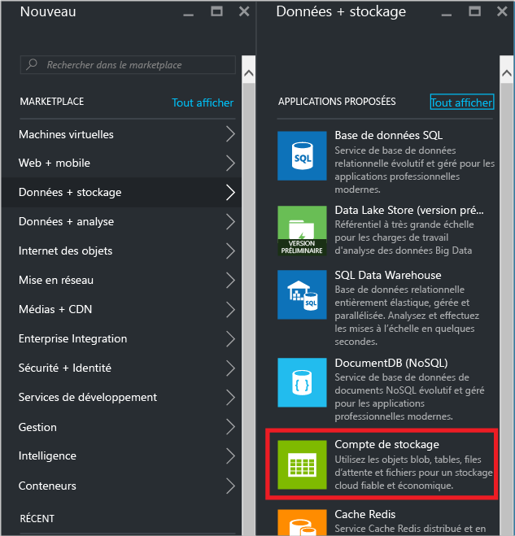
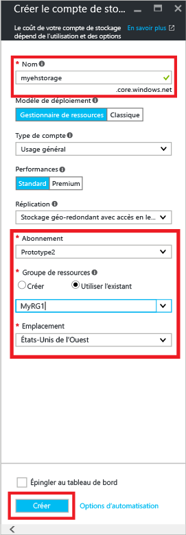
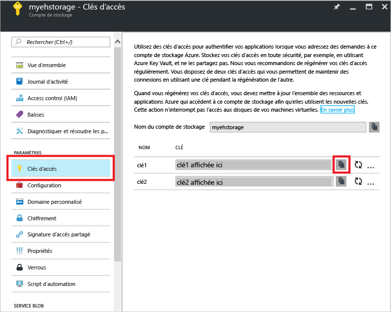
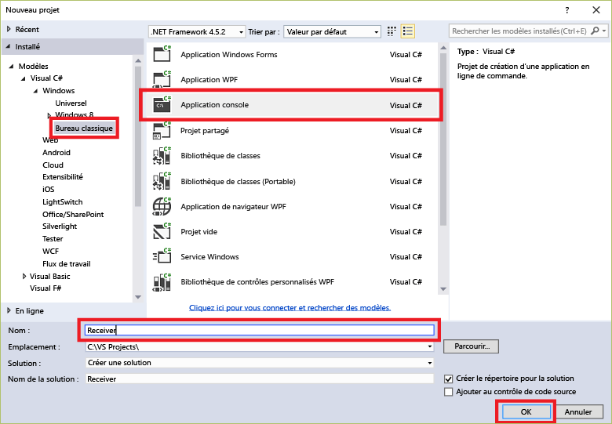
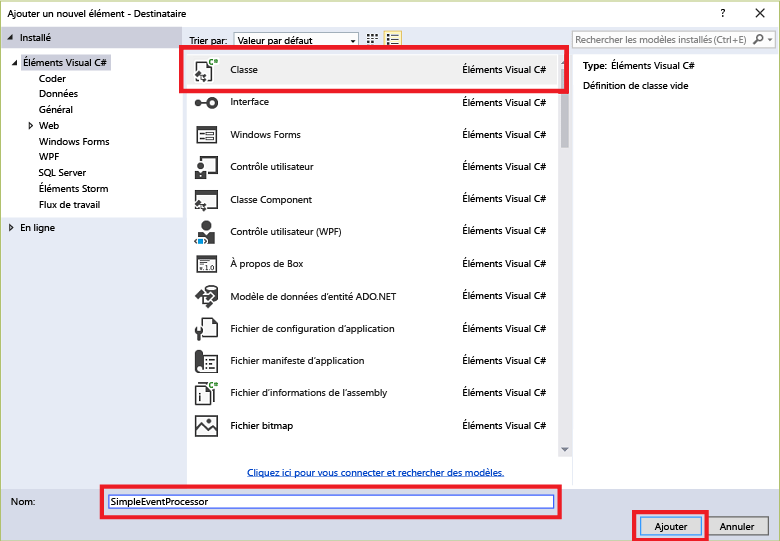

## <a name="receive-messages-with-eventprocessorhost"></a>Réception de messages avec EventProcessorHost
[EventProcessorHost][EventProcessorHost] est une classe .NET qui simplifie la réception d'événements provenant d'Event Hubs grâce à la gestion des points de contrôle permanents et des réceptions en parallèle d'Event Hubs. [EventProcessorHost][EventProcessorHost] permet de répartir des événements sur plusieurs récepteurs, même quand ils sont hébergés dans des nœuds différents. Cet exemple illustre l'utilisation de la classe [EventProcessorHost][EventProcessorHost] pour un récepteur unique. L’exemple de [traitement d’événement mis à l’échelle][Scaled out event processing] illustre l’utilisation [EventProcessorHost][EventProcessorHost] pour plusieurs récepteurs.

Pour utiliser [EventProcessorHost][EventProcessorHost], vous devez disposer d’un [compte Azure Storage][Azure Storage account] :

1. Connectez-vous au [portail Azure][Azure portal], puis cliquez sur **Nouveau** en haut à gauche de l’écran.
2. Cliquez sur **Données + stockage**, puis sur **Compte de stockage**.
   
    
3. Dans le panneau **Créer un compte de stockage** , tapez un nom pour votre compte de stockage. Choisissez un abonnement Azure, un groupe de ressources et l’emplacement où créer la ressource. Cliquez ensuite sur **Créer**.
   
    
4. Dans la liste des comptes de stockage, cliquez sur le compte de stockage nouvellement créé.
5. Dans le panneau du compte de stockage, cliquez sur **Clés d’accès**. Copiez la valeur de **key1** pour pouvoir l’utiliser ultérieurement au cours de ce didacticiel.
   
    
6. Dans Visual Studio, créez un projet d'application de bureau Visual C# à l'aide du modèle de projet **d’application de console** . Nommez le projet **Récepteur**.
   
    
7. Dans l’Explorateur de solutions, cliquez avec le bouton droit sur la solution, puis cliquez sur **Gérer les packages NuGet pour la solution**.
8. Cliquez sur l’onglet **Parcourir**, puis recherchez `Microsoft Azure Service Bus Event Hub - EventProcessorHost`. Vérifiez que le nom du projet (**Récepteur**) est spécifié dans la zone **Version(s)**. Cliquez sur **Installer**et acceptez les conditions d’utilisation.
   
    
   
    Visual Studio lance le téléchargement, l’installation et ajoute une référence au [Package NuGet Azure Service Bus Event Hub - EventProcessorHost](https://www.nuget.org/packages/Microsoft.Azure.ServiceBus.EventProcessorHost), avec toutes les dépendances associées.
9. Cliquez avec le bouton droit sur le projet **Récepteur**, cliquez sur **Ajouter**, puis cliquez sur **Classe**. Nommez la nouvelle classe **SimpleEventProcessor**, puis cliquez sur **Ajouter** pour créer la classe.
   
    
10. Ajoutez les instructions ci-après au début du fichier SimpleEventProcessor.cs :
    
     ```csharp
     using Microsoft.ServiceBus.Messaging;
     using System.Diagnostics;
     ```
    
     Insérez ensuite le code suivant dans le corps de la classe :
    
     ```csharp
     class SimpleEventProcessor : IEventProcessor
     {
         Stopwatch checkpointStopWatch;
    
         async Task IEventProcessor.CloseAsync(PartitionContext context, CloseReason reason)
         {
             Console.WriteLine("Processor Shutting Down. Partition '{0}', Reason: '{1}'.", context.Lease.PartitionId, reason);
             if (reason == CloseReason.Shutdown)
             {
                 await context.CheckpointAsync();
             }
         }
    
         Task IEventProcessor.OpenAsync(PartitionContext context)
         {
             Console.WriteLine("SimpleEventProcessor initialized.  Partition: '{0}', Offset: '{1}'", context.Lease.PartitionId, context.Lease.Offset);
             this.checkpointStopWatch = new Stopwatch();
             this.checkpointStopWatch.Start();
             return Task.FromResult<object>(null);
         }
    
         async Task IEventProcessor.ProcessEventsAsync(PartitionContext context, IEnumerable<EventData> messages)
         {
             foreach (EventData eventData in messages)
             {
                 string data = Encoding.UTF8.GetString(eventData.GetBytes());
    
                 Console.WriteLine(string.Format("Message received.  Partition: '{0}', Data: '{1}'",
                     context.Lease.PartitionId, data));
             }
    
             //Call checkpoint every 5 minutes, so that worker can resume processing from 5 minutes back if it restarts.
             if (this.checkpointStopWatch.Elapsed > TimeSpan.FromMinutes(5))
             {
                 await context.CheckpointAsync();
                 this.checkpointStopWatch.Restart();
             }
         }
     }
     ```
    
     Cette classe sera appelée par **EventProcessorHost** pour traiter les événements envoyés par le hub d'événements. Notez que la classe `SimpleEventProcessor` utilise un chronomètre pour appeler régulièrement la méthode de point de contrôle sur le contexte **EventProcessorHost** . Cette opération garantit que, en cas de redémarrage du récepteur, la perte de traitement de travail ne sera pas supérieure à cinq minutes.
11. Dans la classe **Program**, ajoutez l’instruction `using` suivante en haut du fichier :
    
     ```csharp
     using Microsoft.ServiceBus.Messaging;
     ```
    
     Remplacez ensuite la méthode `Main` dans la classe `Program` par le code suivant, en remplaçant le nom d’Event Hub et la chaîne de connexion au niveau de l’espace de noms, enregistrée précédemment, ainsi que la clé et le compte de stockage que vous avez copiés dans les sections précédentes : 
    
     ```csharp
     static void Main(string[] args)
     {
       string eventHubConnectionString = "{Event Hub connection string}";
       string eventHubName = "{Event Hub name}";
       string storageAccountName = "{storage account name}";
       string storageAccountKey = "{storage account key}";
       string storageConnectionString = string.Format("DefaultEndpointsProtocol=https;AccountName={0};AccountKey={1}", storageAccountName, storageAccountKey);
    
       string eventProcessorHostName = Guid.NewGuid().ToString();
       EventProcessorHost eventProcessorHost = new EventProcessorHost(eventProcessorHostName, eventHubName, EventHubConsumerGroup.DefaultGroupName, eventHubConnectionString, storageConnectionString);
       Console.WriteLine("Registering EventProcessor...");
       var options = new EventProcessorOptions();
       options.ExceptionReceived += (sender, e) => { Console.WriteLine(e.Exception); };
       eventProcessorHost.RegisterEventProcessorAsync<SimpleEventProcessor>(options).Wait();
    
       Console.WriteLine("Receiving. Press enter key to stop worker.");
       Console.ReadLine();
       eventProcessorHost.UnregisterEventProcessorAsync().Wait();
     }
     ```

> [!NOTE]
> Ce didacticiel utilise une seule instance de [EventProcessorHost][EventProcessorHost]. Pour augmenter le débit, il est recommandé d'exécuter plusieurs instances d'[EventProcessorHost][EventProcessorHost], comme illustré dans l'exemple de [traitement d'événement mis à l'échelle][Scaled out event processing]. Dans ces cas, les différentes instances se coordonnent automatiquement entre elles afin d’équilibrer la charge des événements reçus. Si vous souhaitez que plusieurs récepteurs traitent *tous* les événements, vous devez utiliser le concept **ConsumerGroup** . Lors de la réception des événements à partir de différents ordinateurs, il peut être utile de spécifier des noms pour les instances de [EventProcessorHost][EventProcessorHost] basées sur les ordinateurs (ou rôles) dans lesquels ils sont déployés. Pour plus d’informations sur ces sujets, consultez les rubriques [Vue d’ensemble d’Event Hubs][Event Hubs Overview] et [Guide de programmation Event Hubs][Event Hubs Programming Guide].
> 
> 

<!-- Links -->
[Event Hubs Overview]: ../articles/event-hubs/event-hubs-overview.md
[Event Hubs Programming Guide]: ../articles/event-hubs/event-hubs-programming-guide.md
[Scaled out event processing]: https://code.msdn.microsoft.com/Service-Bus-Event-Hub-45f43fc3
[Azure Storage account]: ../articles/storage/storage-create-storage-account.md
[EventProcessorHost]: /dotnet/api/microsoft.servicebus.messaging.eventprocessorhost
[Azure portal]: https://portal.azure.com

<!--HONumber=Dec16_HO2-->


