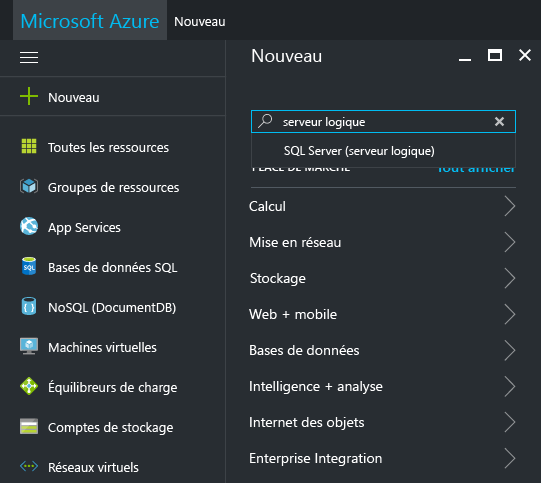
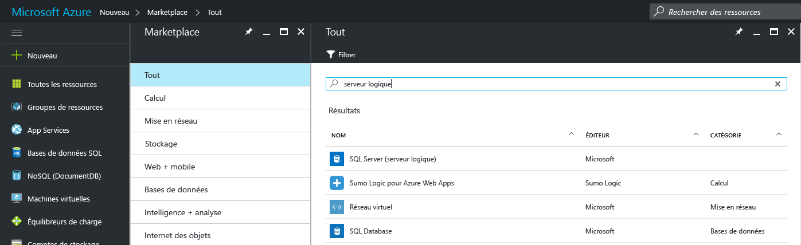
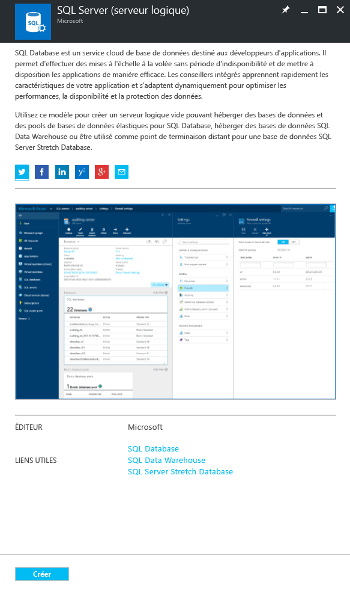
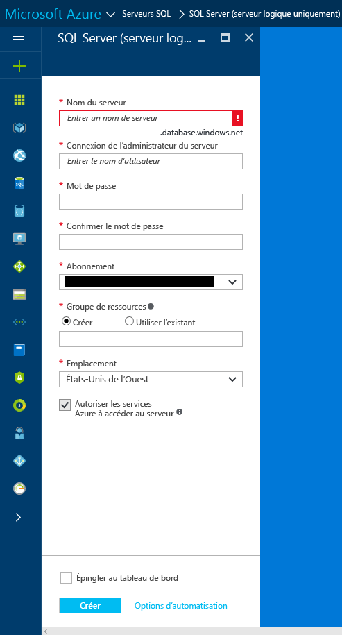
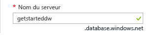
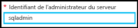
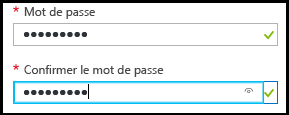
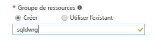

### Créer un serveur SQL logique dans le portail Azure

1. Cliquez sur **Nouveau**, recherchez **Serveur logique**, puis appuyez sur **ENTRÉE**.

    
2. Sélectionnez **Serveur SQL (serveur logique)** 

    
  
3. Cliquez sur **Créer** pour ouvrir le nouveau panneau Serveur SQL Server (serveur logique).

   <kbd>  </kbd> 
     <kbd> </kbd>
  
3. Dans la zone de texte Nom du serveur du panneau Serveur SQL (serveur logique), indiquez un nom valide pour le nouveau serveur logique. Une coche verte indique que vous avez fourni un nom valide.
    
    

    > [!IMPORTANT]
    > Le nom complet de votre nouveau serveur sera <votre_nom_serveur>.database.windows.net.
    >
    
4. Dans la zone de texte serveur de connexion administrateur du serveur, fournissez un nom d’utilisateur pour la connexion d’authentification SQL de ce serveur. Cette connexion est connue comme la connexion principale du serveur. Une coche verte indique que vous avez fourni un nom valide.
    
    
5. Dans les zones de texte **Mot de passe** et **Confirmer le mot de passe**, fournissez un mot de passe pour le compte de connexion principal du serveur. Une coche verte indique que vous avez fourni un mot de passe valide.
    
    
6. Sélectionnez un abonnement dans lequel vous êtes autorisé à créer des objets.

    
7. Dans la zone de texte Groupe de ressources, sélectionnez **Créer**, puis dans la zone de texte Groupe de ressources, fournissez un nom valide pour le nouveau groupe de ressources (vous pouvez également utiliser un groupe de ressources existant si vous en avez déjà créé un pour vous-même). Une coche verte indique que vous avez fourni un nom valide.

    

8. Dans la zone de texte **Emplacement**, sélectionnez un centre de données approprié à votre emplacement, tel que « Est de l’Australie ».
    
    
    
    > [!TIP]
    > La case à cocher **Autoriser les services Azure à accéder au serveur** ne peut pas être modifiée dans ce panneau. Vous pouvez modifier ce paramètre dans le panneau de pare-feu du serveur. Pour plus d'informations, consultez [Prise en main de la sécurité](../articles/sql-database/sql-database-get-started-security.md).
    >
    
9. Cliquez sur **Create**.

    

<!--HONumber=Jan17_HO3-->

