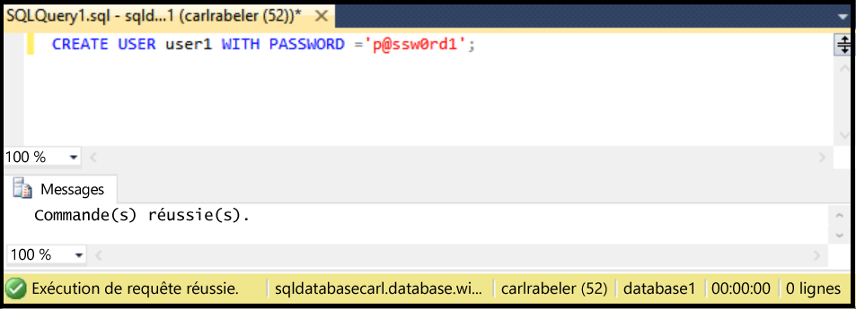

## <a name="create-new-database-user-using-ssms"></a>Création d'un utilisateur de base de données à l'aide de SSMS
Suivez la procédure ci-dessous pour créer un nouvel utilisateur de base de données dans une base de données existante à l’aide de SSMS. 

Ces étapes supposent que vous êtes connecté à la base de données SQL dans l’Explorateur d’objets à l’aide de SSMS, et connecté au serveur logique de votre base de données SQL en tant qu’administrateur principal au niveau du serveur ou avec un compte d’utilisateur disposant des privilèges pour créer un utilisateur. 

1. Dans l'Explorateur d'objets, développez le nœud Bases de données et sélectionnez la base de données dans laquelle vous souhaitez créer un compte utilisateur.
   
     
2. Cliquez avec le bouton droit sur la base de données sélectionnée, puis cliquez sur **Requête**.
   
     
3. Dans la fenêtre de la requête, modifiez et utilisez l'instruction Transact-SQL suivante pour créer un utilisateur contenu dans votre base de données utilisateur. 
   
    ```CREATE USER user1 WITH PASSWORD ='p@ssw0rd1';
    ```
   
     

