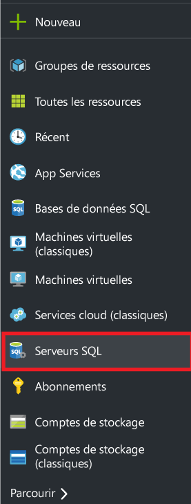
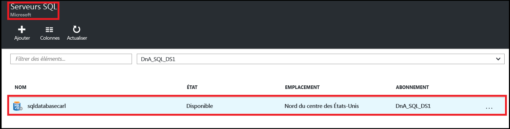
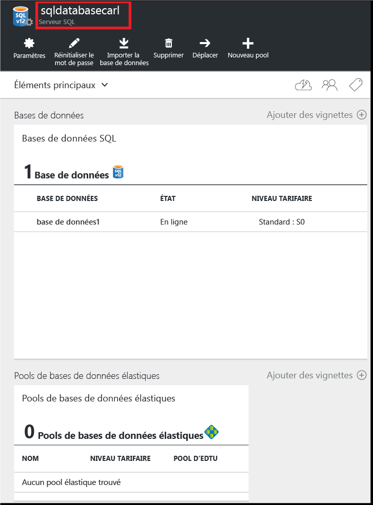
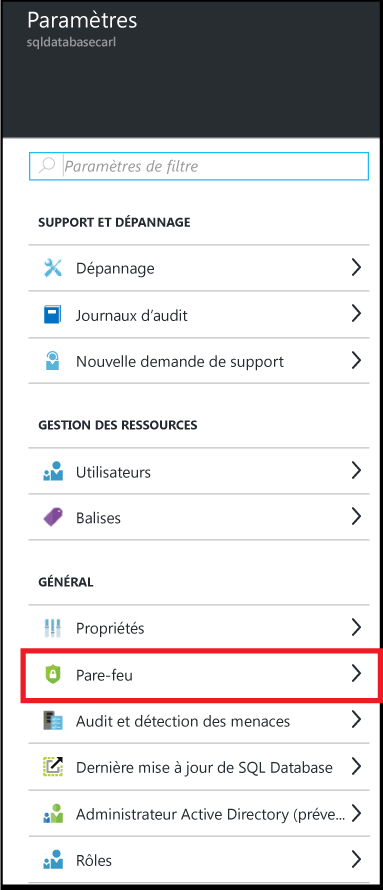
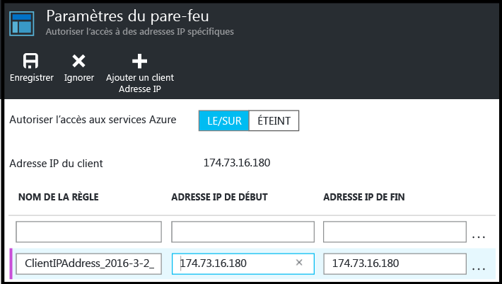
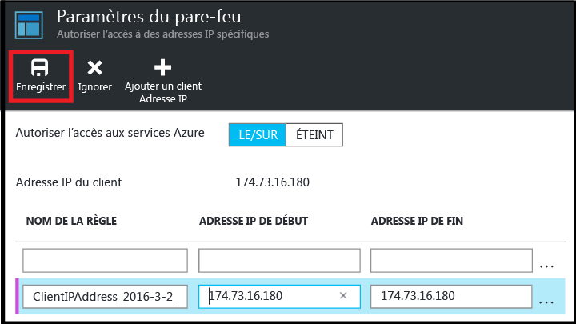

<!--
includes/sql-database-create-new-server-firewall-portal.md

Latest Freshness check:  2016-04-11 , carlrab.

As of circa 2016-04-11, the following topics might include this include:
articles/sql-database/sql-database-get-started-tutorial.md
articles/sql-database/sql-database-configure-firewall-settings

-->
## Création d’un pare-feu de base de données SQL Azure au niveau du serveur

Exécutez les étapes suivantes dans le portail Azure pour créer une règle de pare-feu au niveau du serveur qui autorise les connexions depuis une adresse IP individuelle (votre ordinateur client) ou une plage d’adresses IP entière à un serveur logique de base de données SQL.

1. Si ce n’est pas déjà fait, connectez-vous au [portail Azure](http://portal.azure.com).
2. Dans le panneau par défaut, cliquez sur **SQL Server**.

  	

2. Dans le panneau SQL Server, cliquez sur le serveur de base de données SQL sur lequel créer la règle de pare-feu.

 	
           
3. Passez en revue les propriétés de votre serveur.

 	
      
4. Dans le panneau paramètres, cliquez sur **Pare-feu**.

 	
    
5. Cliquez sur **Ajouter une adresse IP cliente** pour qu’Azure crée une règle pour votre adresse IP cliente.

      

6. Cliquez éventuellement sur l’adresse IP qui a été ajouté pour modifier l’adresse du pare-feu afin d’autoriser l’accès à une plage d’adresses IP.

      
    
7. Cliquez sur **Enregistrer** pour créer la règle de pare-feu au niveau du serveur.

     

	>[AZURE.IMPORTANT] Votre adresse IP du client est susceptible de changer de temps à autre, et vous ne serez peut-être pas en mesure d’accéder à votre serveur jusqu’à ce que vous créiez une nouvelle règle de pare-feu. Vous pouvez vérifier votre adresse IP à l’aide de [Bing](http://www.bing.com/search?q=my%20ip%20address), puis ajouter une adresse IP unique ou une plage d’adresses IP. Pour plus d’informations, voir l’article sur la [gestion des paramètres du pare-feu](sql-database-configure-firewall-settings.md#manage-existing-server-level-firewall-rules-through-the-azure-portal)

<!---HONumber=AcomDC_0427_2016-->