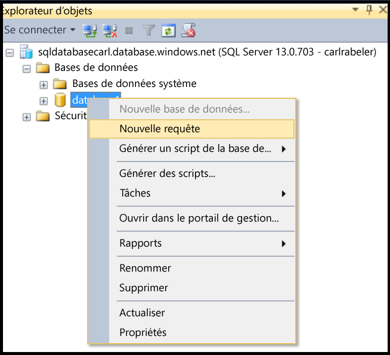
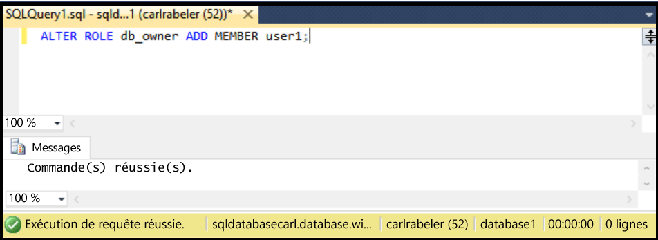

## Accorder des autorisations db_owner à un nouvel utilisateur de bases de données

Procédez comme suit pour accorder des autorisations db_owner à un utilisateur de base de données existant

Cette procédure suppose que vous êtes connecté à la base de données SQL dans l’Explorateur d’objets de SSMS, et connecté au serveur logique de votre base de données SQL en tant qu’administrateur principal au niveau du serveur ou avec un compte d’utilisateur disposant des privilèges pour accorder des autorisations aux utilisateurs.

1. Dans l'Explorateur d'objets, développez le nœud Bases de données et sélectionnez la base de données avec l'utilisateur auquel vous souhaitez accorder des autorisations dbo.

     

2. Cliquez avec le bouton droit sur la base de données sélectionnée, puis cliquez sur **Requête**.

     

3. Dans la fenêtre de la requête, modifiez et utilisez l'instruction Transact-SQL suivante pour accorder des autorisations dbo à un utilisateur spécifié.

    '''ALTER ROLE db_owner ADD MEMBER user1;

     

<!---HONumber=AcomDC_0504_2016-->