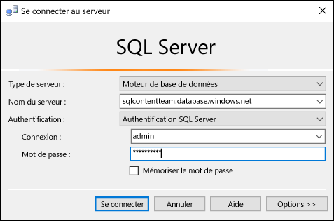
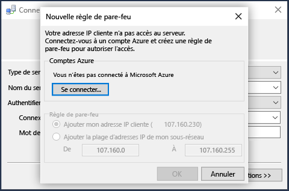

## Se connecter à la base de données SQL Azure à l’aide de l’authentification SQL Server
Les étapes suivantes indiquent comment se connecter à un serveur SQL Azure et à une base de données avec SSMS. Si vous ne disposez pas d’un serveur et d’une base de données, consultez [Créer une base de données SQL en quelques minutes](../articles/sql-database/sql-database-get-started.md) pour créer votre base de données.

1. Tapez **Microsoft SQL Server Management Studio** dans la zone de recherche de Windows pour démarrer SSMS, puis cliquez sur l’application de bureau.
2. Dans la fenêtre **Se connecter au serveur**, entrez les informations suivantes (si SSMS est déjà en cours d’exécution, cliquez sur **Connexion > Moteur de base de données** pour ouvrir la fenêtre **Se connecter au serveur**) :
   
   * **Type de serveur**: la valeur par défaut est le moteur de base de données ; ne modifiez pas cette valeur.
   * **Nom du serveur** : entrez le nom complet de votre serveur de base de données qui héberge votre base de données SQL Azure en respectant le format suivant : *&lt;nomserveur*.**database.windows.net**
   * **Type d’authentification** : cet article indique comment vous connecter à l’aide de **l’authentification SQL Server**. Pour plus d’informations sur la connexion avec Azure Active Directory, consultez [Connectez-vous à l’aide de l’authentification intégrée à Active Directory](../articles/sql-database/sql-database-aad-authentication.md#connect-using-active-directory-integrated-authentication), [Connectez-vous à l’aide de l’authentification par mot de passe Active Directory](../articles/sql-database/sql-database-aad-authentication.md#connect-using-active-directory-password-authentication) et [Connect using Active Directory Universal Authentication (Connectez-vous à l’aide de l’authentification universelle Active Directory)](../articles/sql-database/sql-database-ssms-mfa-authentication.md).
   * **Nom d’utilisateur**: entrez le nom d’un utilisateur ayant accès à une base de données sur le serveur (par exemple, *l’administrateur du serveur* que vous définissez lors de la création du serveur). 
   * **Mot de passe**: entrez le mot de passe pour l’utilisateur spécifié (par exemple, le *mot de passe* que vous configurez lors de la création du serveur).
     
       
3. Cliquez sur **Connecter**.
4. Par défaut, les nouveaux serveurs n’ont pas de [règles de pare-feu](../articles/sql-database/sql-database-firewall-configure.md) définies, si bien que la connexion est initialement refusée aux clients. Si votre serveur ne dispose pas encore d’une règle de pare-feu permettant la connexion de votre adresse IP spécifique, SSMS vous invite à créer une règle de pare-feu au niveau du serveur.
   
    Cliquez sur **Connexion** et créez une règle de pare-feu au niveau du serveur. Vous devez être administrateur Azure pour créer une règle de pare-feu au niveau du serveur.
   
       
5. Une fois connecté à votre base de données SQL Azure, **l’Explorateur d’objets** s’ouvre et vous pouvez alors accéder à votre base de données pour [effectuer des tâches administratives ou interroger des données](../articles/sql-database/sql-database-manage-azure-ssms.md).
   
     

## Dépannage des échecs de connexion
Les causes les plus courantes des échecs de connexion sont les erreurs dans le nom du serveur et les problèmes de connectivité réseau. Rappelez-vous que <*nom_serveur*> est le nom du serveur et non de la base de données, et que vous devez fournir le nom du serveur complet : `<servername>.database.windows.net`

Vérifiez par ailleurs que le nom d’utilisateur et le mot de passe ne contiennent pas d’erreurs de frappe ni d’espaces superflues (les noms d’utilisateurs ne sont pas sensibles à la casse mais les mots de passe le sont). 

Vous pouvez également définir explicitement le protocole et le numéro de port avec le nom du serveur comme suit : `tcp:servername.database.windows.net,1433`

Les problèmes de connectivité réseau peuvent également entraîner des délais d’attente et des erreurs de connexion. Le simple fait de réessayer (lorsque vous savez que le nom du serveur, les identifiants et les règles de pare-feu sont corrects) peut permettre de réussir à se connecter.

Pour plus de détails sur les problèmes de connectivité, consultez [Diagnostiquer, résoudre et empêcher les erreurs de connexion SQL et les erreurs temporaires de Base de données SQL](../articles/sql-database/sql-database-connectivity-issues.md).

