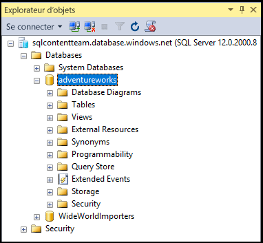

## Connexion à une base de données SQL Azure à l'aide d'une connexion du principal au niveau du serveur

Utilisez les étapes suivantes pour vous connecter à une base de données SQL Azure avec SSMS en utilisant une connexion du principal au niveau du serveur.

1. Tapez « Microsoft SQL Server Management Studio » dans la zone de recherche de Windows, puis cliquez sur l’application pour ordinateur pour démarrer SSMS.

2. Dans la fenêtre Se connecter au serveur, entrez les valeurs suivantes :

 - **Type de serveur** : la valeur par défaut est le moteur de base de données ; ne modifiez pas cette valeur.
 - **Nom du serveur** : entrez le nom du serveur qui héberge votre base de données SQL selon le format *&lt;nomserveur>*.**database.windows.net**
 - **Type d'authentification** : si vous débutez, sélectionnez l'authentification SQL. Si vous avez activé Active Directory pour votre serveur logique de base de données SQL, vous pouvez sélectionner l'authentification par mot de passe Active Directory ou l'authentification intégrée Active Directory.
 - **Nom d'utilisateur** : si vous avez sélectionné l'authentification SQL ou l'authentification par mot de passe Active Directory, entrez le nom d'un utilisateur ayant accès à une base de données sur le serveur.
 - **Mot de passe** : si vous avez sélectionné l'authentification SQL ou l'authentification par mot de passe Active Directory, entrez le mot de passe pour l'utilisateur spécifié.
   
       

3. Cliquez sur **Connecter**.
 
4. Si l’adresse IP de votre client n'a pas accès au serveur logique de la base de données SQL, vous devrez vous connecter à un compte Azure et créer une règle de pare-feu au niveau du serveur. Si vous êtes un administrateur d'abonnement Azure, cliquez sur **Se connecter** pour créer une règle de pare-feu au niveau du serveur. Sinon, demandez à un administrateur Azure de créer une règle de pare-feu au niveau du serveur.
 
      
 
1. Si vous êtes un administrateur d'abonnement Azure et que vous devez vous connecter, lorsque la page de connexion apparaît, entrez les informations d'identification de votre abonnement puis connectez-vous.

      
 
1. Une fois votre connexion à Azure établie, passez en revue la règle de pare-feu au niveau du niveau du serveur proposée (vous pouvez la modifier afin d’autoriser une plage d'adresses IP), puis cliquez sur **OK** pour créer la règle de pare-feu et finaliser la connexion à la base de données SQL.
 
      
 
5. Si vos informations d'identification vous autorisent l’accès, l’Explorateur d'objets s'ouvre et vous pouvez désormais effectuer des tâches administratives ou interroger des données.
 
     
 
     
 ## Dépannage des échecs de connexion

Les échecs de connexion les plus courants sont dus à des erreurs dans le nom du serveur (rappelez-vous que <*nom\_serveur*> est le nom du serveur logique et non celui de la base de données), dans le nom d’utilisateur ou dans le mot de passe, ou quand le serveur n’autorise pas les connexions pour des raisons de sécurité.

<!---HONumber=AcomDC_0420_2016-->