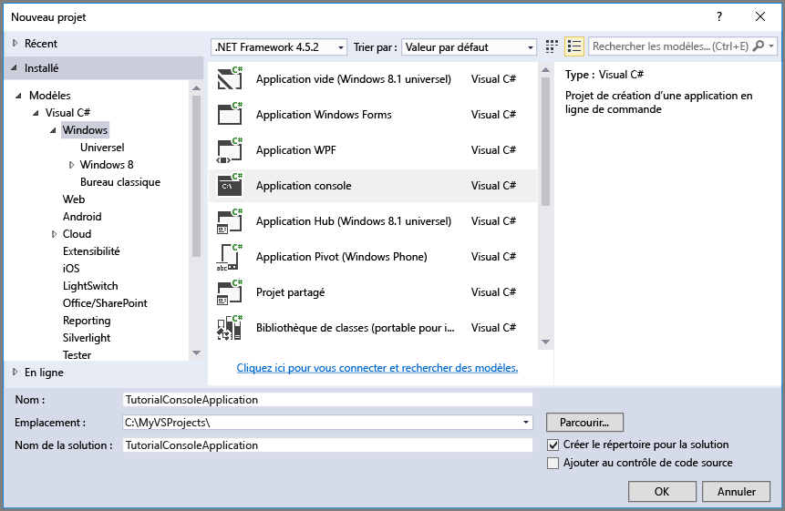

## Configuration de l'environnement de développement

Ensuite, configurez votre environnement de développement dans Visual Studio afin d’être prêt pour essayer les exemples de code fournis dans ce guide.

### Créer un projet d’application de console Windows

Dans Visual Studio, créez une application de console Windows, comme indiqué ici :

Tous les exemples de code figurant dans ce didacticiel peuvent être ajoutés à la méthode **Main()** dans `program.cs` dans votre application console.

Notez que vous pouvez utiliser la bibliothèque cliente d’Azure Storage à partir de n’importe quel type d’application .NET, notamment un service cloud Azure, une application web Azure, une application de bureau ou une application mobile. Dans ce guide, nous utilisons une application console pour plus de simplicité.

### Utiliser NuGet pour installer les packages requis

Il existe deux packages que vous devez installer dans votre projet pour terminer ce didacticiel :

- [Bibliothèque cliente Microsoft Azure Storage pour .NET](https://www.nuget.org/packages/WindowsAzure.Storage/) : ce package fournit un accès par programme aux ressources de données dans votre compte de stockage.
- [Bibliothèque Microsoft Azure Configuration Manager pour .NET](https://www.nuget.org/packages/Microsoft.WindowsAzure.ConfigurationManager/) : ce package fournit une classe pour l’analyse d’une chaîne de connexion à partir d’un fichier de configuration, quel que soit l’emplacement d’exécution de votre application.

Vous pouvez utiliser NuGet pour obtenir ces deux packages. Procédez comme suit :

1. Cliquez avec le bouton droit sur votre projet dans l’**Explorateur de solutions**, puis sélectionnez **Manage NuGet Packages**.
2. Recherchez « WindowsAzure.Storage » en ligne, puis cliquez sur **Installer** pour installer la bibliothèque cliente Azure Storage et ses dépendances.
3. Recherchez « ConfigurationManager » en ligne, puis cliquez sur **Installer** pour installer Azure Configuration Manager.

>[AZURE.NOTE] Le package de bibliothèque cliente Azure Storage est également disponible dans le [Kit de développement logiciel (SDK) Azure pour .NET](https://azure.microsoft.com/downloads/). Toutefois, nous vous recommandons d’installer également la bibliothèque cliente Azure Storage à partir de NuGet pour vous assurer que vous avez toujours la dernière version de la bibliothèque cliente.
>
>Les dépendances ODataLib de la bibliothèque cliente de stockage pour .NET sont résolues avec les packages ODataLib (versions 5.0.2 et ultérieures) disponibles auprès de NuGet, mais pas avec les services de données WCF. Vous pouvez télécharger directement les bibliothèques ODataLib ou les référencer avec votre projet de code via NuGet. Les packages ODataLib utilisés par la bibliothèque cliente de stockage sont [OData](http://nuget.org/packages/Microsoft.Data.OData/5.0.2), [Edm](http://nuget.org/packages/Microsoft.Data.Edm/5.0.2) et [Spatial](http://nuget.org/packages/System.Spatial/5.0.2). Bien qu’elles soient utilisées par les classes de stockage de Table Azure, ces bibliothèques sont des dépendances requises pour la programmation avec la bibliothèque cliente de stockage.

### Déterminer votre environnement cible

Vous avez le choix entre deux environnements pour exécuter les exemples de ce guide :

- Vous pouvez exécuter votre code sur un compte Azure Storage dans le cloud. 
- Vous pouvez exécuter votre code sur l’émulateur de stockage Azure. L’émulateur de stockage est un environnement local qui émule un compte Azure Storage dans le cloud. L’émulateur est une option gratuite permettant de tester et déboguer votre code lors du développement de votre application. L’émulateur utilise un compte et une clé connus. Pour plus d’informations, voir [Utilisation de l’émulateur de stockage Azure pour le développement et le test](../articles/storage/storage-use-emulator.md).

Si vous ciblez un compte de stockage dans le cloud, copiez la clé d’accès primaire de votre compte de stockage à partir du portail Azure. Pour plus d’informations, voir [Affichage et copie de clés d’accès de stockage](../articles/storage/storage-create-storage-account.md#view-and-copy-storage-access-keys).

> [AZURE.NOTE] Vous pouvez cibler l’émulateur de stockage pour éviter les frais liés à l’utilisation des services de stockage Azure. Toutefois, si vous choisissez de cibler un compte de stockage Azure situé dans le cloud, les frais associés à l’utilisation de ce didacticiel seront négligeables.

### Configurer votre chaîne de connexion de stockage

La bibliothèque du client de stockage Azure pour .NET prend en charge l’utilisation d’une chaîne de connexion de stockage pour la configuration de points de terminaison et d’informations d’identification permettant d’accéder aux services de stockage. La meilleure façon de conserver votre chaîne de connexion de stockage est dans un fichier de configuration.

Pour plus d’informations sur les chaînes de connexion, voir [Configuration d’une chaîne de connexion dans Azure Storage](../articles/storage/storage-configure-connection-string.md).

> [AZURE.NOTE] Votre clé de compte de stockage est similaire au mot de passe racine pour votre compte de stockage. Veillez toujours à protéger votre clé de compte de stockage. Évitez de la communiquer à d’autres utilisateurs, de la coder en dur ou de l’enregistrer dans un fichier texte brut accessible à d’autres personnes. Régénérez votre clé à l’aide du portail Azure si vous pensez que sa confidentialité est compromise.

Pour configurer votre chaîne de connexion, ouvrez le fichier `app.config` depuis l’Explorateur de solutions dans Visual Studio. Ajoutez le contenu de l’élément `<appSettings>` indiqué ci-dessous. Remplacez `account-name` par le nom de votre compte de stockage et `account-key` par votre clé d’accès au compte :

	<configuration>
	    <startup> 
	        <supportedRuntime version="v4.0" sku=".NETFramework,Version=v4.5.2" />
	    </startup>
  		<appSettings>
    		<add key="StorageConnectionString" value="DefaultEndpointsProtocol=https;AccountName=account-name;AccountKey=account-key" />
  		</appSettings>
	</configuration>

Par exemple, votre paramètre de configuration sera semblable à :

	<add key="StorageConnectionString" value="DefaultEndpointsProtocol=https;AccountName=storagesample;AccountKey=nYV0gln6fT7mvY+rxu2iWAEyzPKITGkhM88J8HUoyofvK7C6fHcZc2kRZp6cKgYRUM74lHI84L50Iau1+9hPjB==" />

Pour cibler l’émulateur de stockage, vous pouvez utiliser un raccourci qui correspond à la clé et au nom de compte connus. Dans ce cas, le paramètre de votre chaîne de connexion sera :

	<add key="StorageConnectionString" value="UseDevelopmentStorage=true;" />

<!---HONumber=AcomDC_0601_2016-->