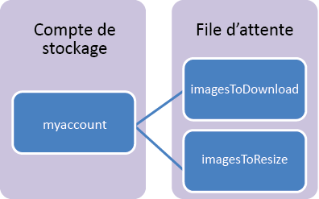

## Présentation du stockage de files d'attente

Les files d’attente de stockage Azure sont un service permettant de stocker un grand nombre de messages accessibles depuis n’importe où dans le monde via des appels authentifiés avec HTTP ou HTTPS. Un simple message de file d’attente peut avoir une taille de 64 Ko et une file d’attente peut contenir des millions de messages, jusqu’à la limite de capacité totale d’un compte de stockage.

Voici quelques utilisations courantes des files d’attente de stockage :

-   Création d'un journal des travaux en souffrance de travail à traiter de manière asynchrone
-   Transmission de messages d’un rôle web Azure à un rôle de travail Azure

## Concepts du service de File d’attente

Le service de file d’attente contient les composants suivants :

- **Format d’URL :** les files d’attente sont adressables à l’aide du format d’URL suivant : http://`<storage account>`.queue.core.windows.net/`<queue>` 
      
	L'URL suivante désigne une file d'attente du schéma :
		
		http://myaccount.queue.core.windows.net/images-to-download

- **Compte de stockage :** tout accès au stockage Azure s'effectue via un compte de stockage. Pour plus d’informations sur la capacité du compte de stockage, consultez la page [Objectifs de performance et évolutivité du stockage Azure](../articles/storage/storage-scalability-targets.md).

- **File d’attente :** une file d’attente contient un ensemble de messages. Tous les messages doivent être dans une file d’attente. Notez que le nom de la file d’attente doit être en minuscules. Pour plus d'informations sur l’affectation de noms à des files d’attente, consultez [Affectation de noms pour les files d'attente et les métadonnées](https://msdn.microsoft.com/library/azure/dd179349.aspx).

- **Message :** message dans n’importe quel format d’une taille maximale de 64 Ko. La durée maximale pendant laquelle un message peut rester dans la file d’attente est de 7 jours.

<!---HONumber=AcomDC_0413_2016-->