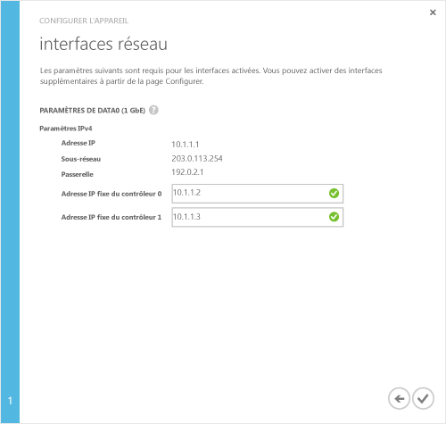

<!--author=alkohli last changed: 9/17/15-->

#### Pour mener à bien la configuration minimale d’un appareil StorSimple
1. Sélectionnez l’appareil et cliquez sur **Création rapide**. Cliquez sur **Terminer la configuration de l’appareil** pour démarrer l'Assistant Configurer l’appareil.
2. Dans l'Assistant Configurer l’appareil, dans la boîte de dialogue **Paramètres de base** , procédez comme suit :
   
   1. Entrez un **Nom convivial** pour votre appareil. Le nom de l’appareil par défaut reflète des informations telles que le modèle de l’appareil et son numéro de série. Vous pouvez attribuer un nom convivial allant jusqu'à 64 caractères pour gérer l’appareil.
   2. Définissez le **fuseau horaire** en fonction de l'emplacement géographique de l’appareil déployé. Votre appareil utilise ce fuseau horaire pour toutes les opérations planifiées.
   3. Sous **Paramètres DNS**, entrez une adresse pour votre **Serveur DNS secondaire**. Si vous utilisez le protocole IPv6, le champ est renseigné en fonction du préfixe IPv6 fourni dans l'interface Windows PowerShell. 
      Si le serveur DNS secondaire n'est pas configuré, vous ne pouvez pas enregistrer la configuration de votre appareil.
   4. Sous les interfaces iSCSI activées, activez au moins un réseau pour le protocole iSCSI. Vous devez activer au moins une interface réseau pour le cloud et posséder au moins une interface compatible avec le protocole iSCSI. Le réseau DATA 0 est automatiquement activé pour le cloud.
      
      
3. Cliquez sur l’icône en forme de flèche. 
4. Dans la boîte de dialogue **Interfaces réseau** , entrez des adresses IP fixes pour les contrôleurs 0 et 1. **Les adresses IP fixes des contrôleurs doivent être disponibles au sein du sous-réseau accessible par l'adresse IP de l’appareil.** Si l’interface du réseau DATA 0 est configurée pour le protocole IPv4, les adresses IP fixes doivent être fournies au format IPv4. Si vous avez fourni un préfixe pour la configuration du protocole IPv6, ces champs sont automatiquement remplis par des adresses IP fixes.

    

    Les adresses IP fixes du contrôleur sont utilisées pour traiter les mises à jour de l’appareil. Par conséquent, les adresses IP fixes doivent pouvoir être acheminées et capables de se connecter à Internet. Vous pouvez vérifier que vos adresses IP de contrôleur fixe sont routables à l’aide de l’applet de commande [Test-HcsmConnection][Test]. Dans l’exemple suivant, les adresses IP de contrôleur fixe sont routées à Internet et peuvent accéder aux serveurs Microsoft Update. 

     

1. Cliquez ensuite sur l'icône en forme de coche .
   Vous revenez à la page **Démarrage rapide** de l'appareil.
   
   > [!NOTE]
   > Vous pouvez modifier tous les autres paramètres de l’appareil à tout moment en accédant à la page **Configurer** .
   > 
   > 

<!--Link reference-->
[Test]: https://technet.microsoft.com/library/dn715782(v=wps.630).aspx