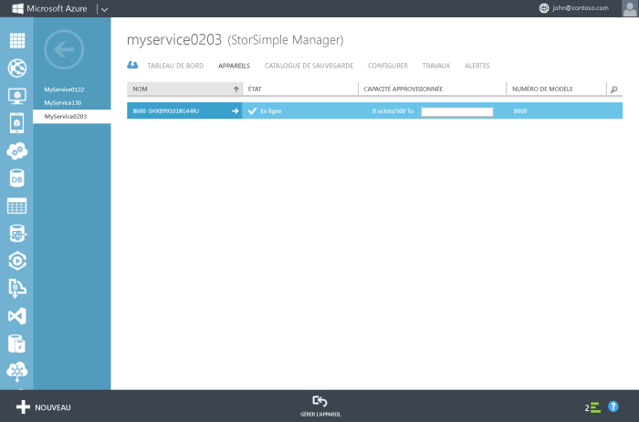

<!--author=alkohli last changed: 9/17/15-->

### Configuration et inscription de l’appareil

1. Accédez à l’interface Windows PowerShell sur la console série de votre appareil StorSimple. Consultez la page [Utilisation de PuTTY pour se connecter à la console en série de l’appareil](#use-putty-to-connect-to-the-device-serial-console) pour obtenir des instructions. **Veillez à suivre la procédure pas à pas, sans quoi vous ne pourrez pas accéder à la console.**

2. Dans la session qui s’ouvre, appuyez une fois sur Entrée pour lancer une invite de commandes.

3. Vous devez choisir la langue que vous souhaitez définir pour votre appareil. Spécifiez la langue, puis appuyez sur Entrée.

    

4. Dans le menu de console en série qui s’affiche, choisissez l’option 1 pour ouvrir une session offrant un accès complet.

    
  
     Suivez les étapes 5 à 12 pour configurer les paramètres réseau minimum requis pour votre appareil. **Ces étapes de configuration doivent être effectuées sur le contrôleur actif de l’appareil.** Le menu de la console en série indique l’état du contrôleur dans le message de bannière. Si vous n’êtes pas connecté au contrôleur actif, déconnectez-vous, puis connectez-vous à ce contrôleur.

5. À l’invite de commandes, tapez votre mot de passe. Le mot de passe par défaut de l’appareil est **Password1**.

6. Tapez la commande suivante : `Invoke-HcsSetupWizard`.

7. Un Assistant Installation s’affiche pour vous aider à configurer les paramètres réseau de l’appareil. Fournissez les informations suivantes :
   - Adresse IP de l’interface réseau DATA 0
   - Masque de sous-réseau
   - Passerelle
   - Adresse IP du serveur DNS principal
    
		Notez que le système valide les paramètres réseau après chaque étape du processus.
   
      >[AZURE.NOTE] Vous devrez peut-être attendre quelques minutes que les paramètres de masque de sous-réseau et de DNS soient appliqués. Si vous obtenez le message d’erreur « Vérifiez la connectivité du réseau sur Data 0 », vérifiez la connexion réseau physique sur l’interface réseau DATA 0 de votre contrôleur actif.

8. (Facultatif) Configurez votre serveur proxy web. Bien que la configuration du proxy web soit facultative, **si vous en utilisez un, vous pouvez uniquement le configurer ici**. Pour plus d’informations, consultez la section [Configuration du proxy web pour votre appareil](../articles/storsimple/storsimple-configure-web-proxy.md).

9. Configurez un serveur NTP principal pour votre appareil. Les serveurs NTP sont requis. En effet, votre appareil doit synchroniser les heures pour pouvoir s’authentifier auprès de vos fournisseurs de services cloud. Vérifiez que votre réseau autorise le trafic NTP à passer de votre centre de données à Internet. Si ce n’est pas possible, spécifiez un serveur NTP interne.
 
10. Pour des raisons de sécurité, le mot de passe administrateur de l’appareil expire après la première session, et vous devez le modifier maintenant. Lorsque vous y êtes invité, fournissez un mot de passe administrateur de l’appareil. Un mot de passe administrateur d’appareil valide doit comprendre entre 8 et 15 caractères. Le mot de passe doit contenir trois des éléments suivants : caractères en minuscules, en majuscules, numériques et spéciaux.

	 

11. La dernière étape de l’Assistant Installation inscrit votre appareil auprès du service StorSimple Manager. Pour cela, vous avez besoin de la clé d’inscription de service que vous avez obtenue à l’étape 2. Après avoir entré la clé d’inscription, vous devrez peut-être attendre 2 à 3 minutes avant que l’appareil ne soit inscrit.

      >[AZURE.NOTE]Vous pouvez appuyer sur Ctrl + C à tout moment pour quitter l’Assistant Installation. Si vous avez entré tous les paramètres réseau (adresse IP pour Data 0, masque de sous-réseau et passerelle), vos entrées sont conservées.

	

12. Une fois l’appareil inscrit, une clé de chiffrement de données de service s’affiche. Copiez-la et enregistrez-la en lieu sûr. **Cette clé et la clé d’enregistrement de service sont requises pour l’inscription d’appareils supplémentaires avec le service StorSimple Manager.** Reportez-vous à la section [Sécurité StorSimple](../articles/storsimple/storsimple-security.md) pour plus d’informations sur cette clé.
	
	

      >[AZURE.NOTE]Pour copier le texte à partir de la fenêtre de console de série, sélectionnez-le simplement. Vous devez ensuite pouvoir le coller dans le Presse-papiers ou dans un éditeur de texte. N’utilisez PAS Ctrl + C pour copier la clé de chiffrement de données de service. Cette combinaison de touches ferme l’Assistant Installation. Par conséquent, le mot de passe administrateur de l’appareil n’est pas modifié et l’appareil rétablit le mot de passe par défaut.

13. Quittez la console en série.

14. Revenez au portail de gestion et procédez comme suit :
  1. Double-cliquez sur le service StorSimple Manager pour accéder à la page **Démarrage rapide**.
  2. Cliquez sur **Afficher les appareils connectés**.
  3. Sur la page **Appareils**, vérifiez que l’appareil s’est bien connecté au service en vérifiant son état. L’état de l’appareil doit être **En ligne**.
   
    	 
  
	Si l’état de l’appareil est **Hors ligne**, attendez quelques minutes qu’il soit en ligne.
	      
	Si le périphérique est toujours déconnecté après quelques minutes, vous devez vous assurer que votre réseau de pare-feu a été configuré comme décrit dans la [configuration requise du réseau pour votre périphérique StorSimple](../articles/storsimple/storsimple-system-requirements.md).
	
	Si vous ne disposez pas d'une prise en charge HTTP 1.1, assurez-vous que le port 9354 est ouvert pour la communication sortante. Ce port est utilisé pour assurer la communication entre le service StorSimple Manager et votre appareil StorSimple
     
       

<!----HONumber=Sept15_HO3-->