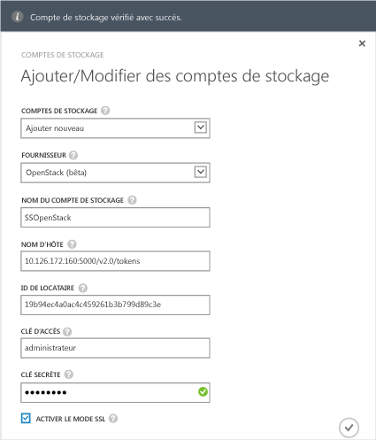

#### Pour ajouter un compte de stockage dans StorSimple 8000 Series Update 1.0

1. Sur la page d’accueil du service StorSimple Manager, sélectionnez votre service et double-cliquez dessus. La page **Démarrage rapide** s’affiche. Sélectionnez la page **Configurer**.

2. Cliquez sur **Ajouter/modifier un compte de stockage**.

3. Dans la boîte de dialogue **Ajouter/modifier un compte de stockage**, cliquez sur **Ajouter**.

4. Dans le champ **Fournisseur**, sélectionnez le fournisseur de services cloud approprié. Les fournisseurs pris en charge sont Azure, Amazon S3, Amazon S3 avec RRS, HP et OpenStack. Indiquez les informations d’identification et l’emplacement associés au compte de stockage de vos fournisseurs de services cloud. Les champs proposés pour les informations d’identification peuvent différer en fonction du fournisseur de services cloud indiqué.
  - Si vous avez sélectionné Azure comme fournisseur de services cloud, indiquez le **Nom** et la **Clé d’accès** principale pour votre compte de stockage Microsoft Azure. Pour un compte Azure, l’emplacement est automatiquement renseigné.

        

 - Si vous avez sélectionné Amazon S3 ou Amazon S3 avec RRS, indiquez un **Nom de compte de stockage** convivial, une **Clé d’accès** et une **Clé secrète**. Pour Amazon S3 et Amazon S3 avec RRS, les emplacements suivants sont pris en charge :

		- US Standard
		- US West (Oregon)
		- US West (Northern California)
		- EU (Ireland)
		- Asia Pacific (Singapore)
		- Asia Pacific (Sydney)
		- Asia Pacific (Tokyo)
		- South America (Sao Paulo)

        
	  		
 - Si vous avez sélectionné HP comme fournisseur de services cloud, indiquez un **Nom de compte de stockage** convivial, un **ID de locataire**, un **Nom d’utilisateur** et un **Mot de passe**. Pour HP, les emplacement suivants sont pris en charge :

		- US East
		- US West
	  
        
	  		
 - Si vous avez sélectionné **Openstack** comme fournisseur de services cloud, indiquez un **Nom d’hôte**, une **Clé d’accès** et une **Clé secrète**.

        > [AZURE.NOTE] For all the cloud service providers, excluding Azure, a friendly name is allowed. You can use different friendly names and create more than one storage account with the same set of credentials.

        

5. Sélectionnez **Activer le mode SSL** afin de créer un canal sécurisé pour la communication réseau entre votre appareil et le cloud. Décochez la case **Activer le mode SSL** uniquement si vous utilisez l’appareil dans un cloud privé.

      >[AZURE.NOTE]Si vous utilisez HP comme fournisseur, SSL est toujours activé.
  		
6. Cliquez sur l’icône en forme de coche . Un message vous informe que le compte de stockage a été créé.

7. Le compte de stockage qui vient d’être créé est affiché dans la page **Configurer**, sous **Comptes de stockage**. Cliquez sur **Enregistrer** pour enregistrer le nouveau compte de stockage. Cliquez sur **OK** lorsque vous êtes invité à confirmer l’opération.

<!---HONumber=62-->